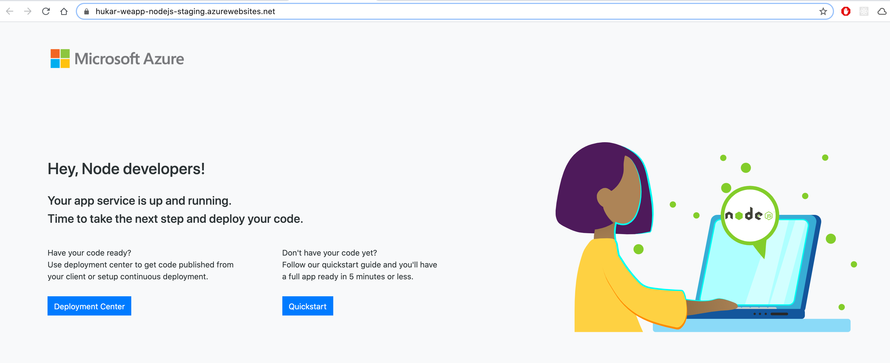

# 10 Slots de déploiement 

## Déploiement classique


`Staging Environment` environnement de pré-production, d'essai.

On a différent environnements par lesquelles l'application doit passer avant d'arriver en production.

Si on a une `version 2` disponible, elle doit faire le même chemin vers la production :


## Déploiement par Slots

 

Plutôt que de passer la `version 2` en environnement de production, on fait pointer l'environnement de production vers la `version 2` et l'environnement d'essai vers la `version 1`.

Si un bug nous oblige à retourner vers la version 1, il suffit de switcher de nouveau les pointeurs :

## Utiliser Deployment Slots

On va changer le contenu de `index.js` :

```js
var express = require('express');
var router = express.Router();

/* GET home page. */
router.get('/', function(req, res, next) {
  const data = {
    title: "",
    message: process.env.MESSAGE || 'devlopment environment',
  };
  res.render('index', data);
});

module.exports = router;
```

On va aussi mettre à jour le template `index.jade` :

```jade
extends layout

block content
  h1= title
  p Welcome to #{title}
  p #{message}
```

On `commit` mais on ne déploie pas.

## Définir les variables d'environnement dans le portail


Dans `configuration` on peut ajouter `new application setting`, c'est en fait une variable d'environnement.

On va ajouter deux variables :

`NODE_ENV=production`

`MESSAGE=this is production`


Pour `MESSAGE` on coche la case `Deployment slot setting`.

Puis sauvegarder les changements :


## Créer un nouveau `staging slot`

### dans VSCode

Par défaut on a un slot `production` :


Dans VSCode on va dans l'onglet Azure :


On donne un nom.


On choisie dans ce cas de cloner notre application.


On va l'ouvrir dans notre portail **Azure**.


On a maintenant une App service staging :


Avec sa propre `url`.



Mais l'application en `staging` n'est pas encore déployée.

### Modifier la variable d'environnement `MESSAGE`


## Déploiement

On a un nouveau dépôt `git` et  de nouvelles valeurs d'authentification (credentials) :


Une nouvel `url` `git` :


```
https://hukar-weapp-nodejs-staging.scm.azurewebsites.net:443/hukar-weapp-nodejs.git
```

et les credentials :


### On ajoute un nouveau remote

```bash
🦄 webapp git remote add staging https://null@hukar-weapp-nodejs-staging.scm.azurewebsites.net:443/hukar-weapp-nodejs.git
```

### On `push`

```bash
git push staging master
```

Il faut fournir les credentials du portail.


On retrouve notre application dans l'environnement de `staging`.