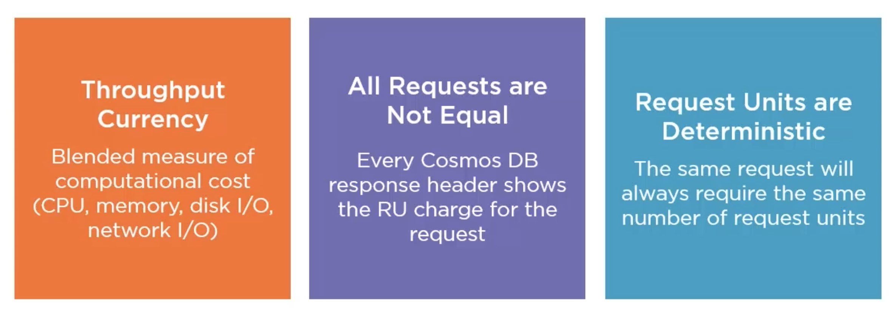

# 02 Le débit : `throughput`

### La latence

Combien de temps doit on attendre entre la requête et la réponse.

### Le débit

Le nombre de requête par seconde que la DB peut gérer.

## `RU` : Request Unit

C'est l'unité de mesure du débit.

Les `RU` mesure le coût d'une requête en tenant compte des divers facteurs hardware.

Toutes les requêtes n'ont pas le même prix, une écriture est plus chère qu'une lecture car implique plus de serveurs par exemple.

Une même requête coutera toujours un même nombre de `RU`, Les `Request Units` sont déterministes.

## Réserver des `RU`

On réserve des `Request Units` pour un `container`.

Si on dépasse notre réserve de débit, nos requêtes arrivent dans un goulot d'étranglement et une requête de rejet nous est adressée `HTTP 429` : `Too many request`.  

Une stratégie de ré-envoie peut être implémentée.

## Observer la consommation en `Request Units`

On peut facilement savoir combien de `RU` sont dépensés par une requête dans l'interface de `Cosmos DB` :

On voit ici `2.96 RUs`.

Maintenant `3.13 RUs` pour requête plus complexes.

Dans le portail on a accès à toutes les infos dans `Metrics` :

Tout en bas on peut voire `Number of request exceed capacity Http 429`, cela peut nous permettre de savoir s'il faut gérer ce cas de figure et/ou ajouter du débit.

## Outil : `Fiddler Everywhere`

Pour observer les requêtes.

On peut voire que Azure relance automatiquement la requête `Cosmos DB` avant d'envoyer une erreur `429`.

## Établir les coûts

Une estimation des coûts peut être réalisée en listant les requêtes et les items, en évaluant le nombre d'écriture et de lectures par seconde et en choisissant la politique l'indexation et de cohérence (`consistency`).

## Capacity calculator

https://cosmos.azure.com/capacitycalculator/

## Le prix

## Approvisionner le débit de la DB

On peut approvisionner :

- chaque `container` indépendamment.
- La base de données qui partagera son débit entre les différents `container`.
- Un mix des deux, en sachant que l'approvisionnement d'un `container` override celui de la `DB`.

`provision database throughput` n'est pas coché.

Ici on n'approvisionne le `container` indépendamment de la `DB`.

