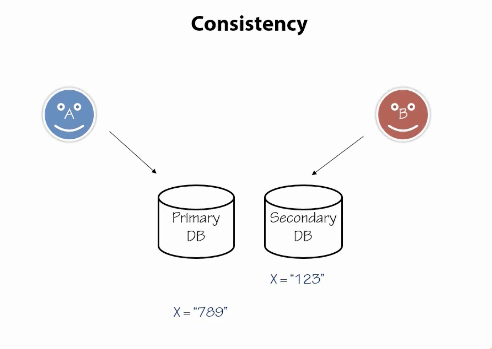
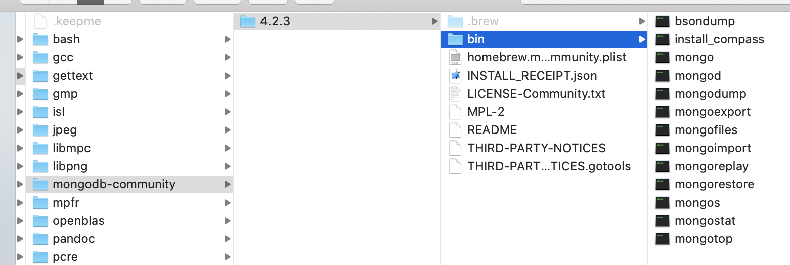
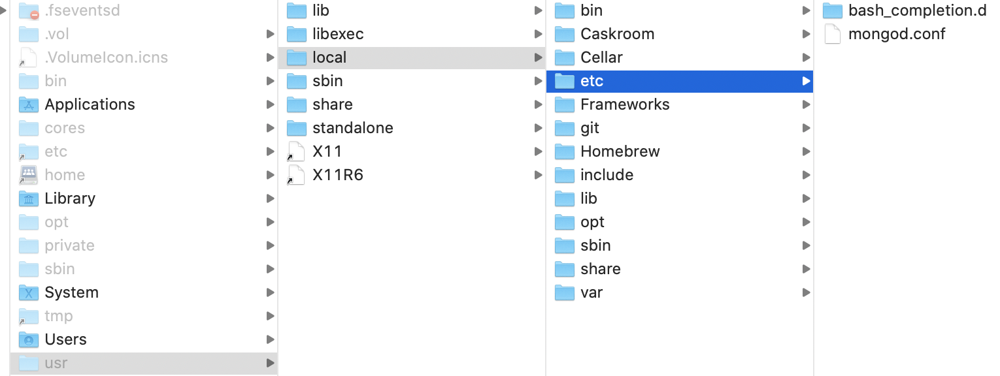
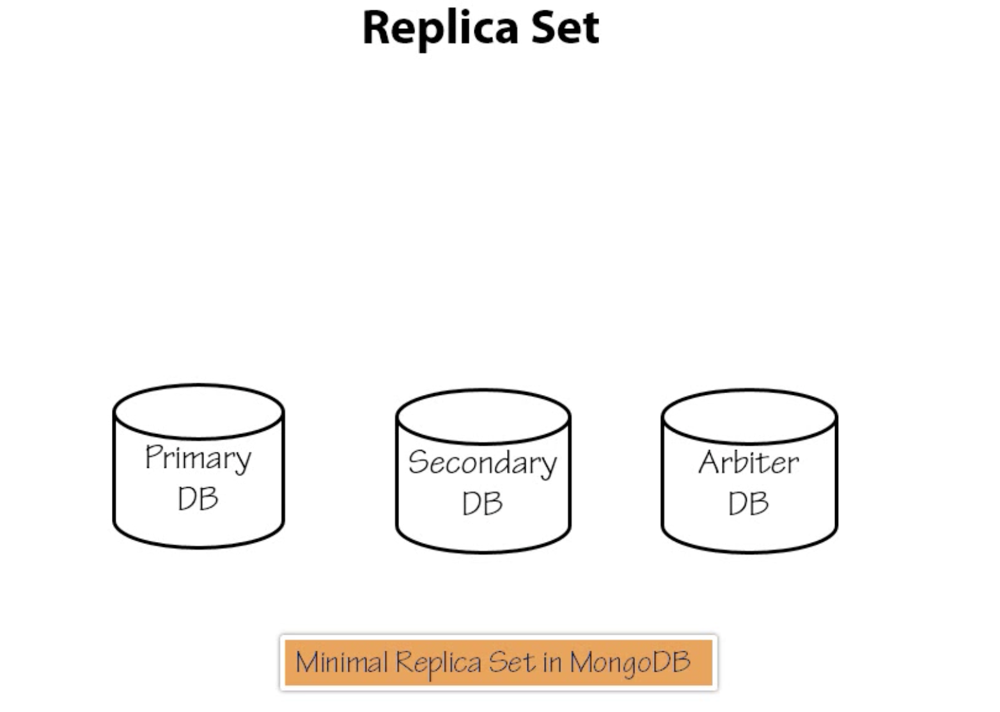

# 01 MongoDB introduction

Avec les bases de données relationnelles, la représentation des objets du code avec des tables peut sembler fort éloignée ou compliquée.

Avec `NoSQL`, il n'y a pas de différence entre les objets du code et les données stockées.

Avec `MongoDB` il n'y a ni schéma, ni table, ni relation.

Il y a des `collections` et des `documents`.

Une collection peut être *plafonnée* (taille mémoire fixe), dans le but d'accélérer les enregistrements.

Plusieurs stratégie de *`scalling`* (réplication) peuvent être choisie, préférant la cohérence ou bien la rapidité.



La cohérence (consistency) bloque l'application (lock) le temps de la réplication.

Une stratégie plus souple peut créé de l'incohérence (unconsistency), mais est non bloquante pour l'application.

### `MongoDB` est écrit en `C++`

## Installation de `MongoDB`

Mise à jour des formula de `brew`

```bash
brew update
```

Ajouter des `repositories` à `brew` : `tap`

```bash
brew tap mongodb/brew
```

Installer la version community

```bash
brew install mongodb-community@4.2
```

L'inscrire dans les services gérés par `brew`

```bash
brew services start mongodb-community@4.2
```

Lancer le `shell`

```bash
mongo
```

## Anatomie de `MongoDB`

Dans le dossier `/usr/local/cellar` on trouve le dossier de `MongoBD`



Il se compose essentiélement de quelques binaires :

`mongo` : le shell `MongoDB`

`mongod` : le service `MongoDB`

### `mongo.conf` la configuration

Dans le dossier `etc`



```bash
systemLog:
  destination: file
  path: /usr/local/var/log/mongodb/mongo.log
  logAppend: true
storage:
  dbPath: /usr/local/var/mongodb
net:
  bindIp: 127.0.0.1
```

#### `cellar` 

le cellier - la cave : dossier utilisé par `brew` pour installer les logiciels.

#### `etc`

`E`diting `T`ext `C`onfig : les fichiers de configuration.

#### `usr`

`U`nix `S`ystem `R`essources : contient les logiciels utiles.

Sur mac :

> Aujourd'hui, `/usr` contient des commandes utilisateur (dans `/usr/bin` pour les utilisateurs normaux et `/usr/sbin` pour les utilisateurs administratifs, comme `root`), des bibliothèques partagées (`/usr/lib`), des pages de manuel (`/usr/share/man`), des exécutables qui ne doivent pas être exécutés directement par les utilisateurs (`/usr/libexec`) et d'autres choses.
>
> Il propose également un sous-répertoire, `/usr/local`, pour y placer les programmes, bibliothèques et autres fichiers qui ne sont pas fournis avec le système d'exploitation de base.
>
> Traduit avec www.DeepL.com/Translator (version gratuite)

Les détails sur la structure de dossier avec la commande `man hier`.

#### `var`

Des données variables, les `logs` se trouve dans le dossier `var`.

## Les `logs` : `usr/local/var/log/mongodb`


`mongo.log`

```bash
# ...

2020-03-08T10:38:22.420+0100 I  NETWORK  [conn1] end connection 127.0.0.1:49591 (0 connections now open)
2020-03-08T10:47:50.414+0100 I  NETWORK  [listener] connection accepted from 127.0.0.1:51875 #2 (1 connection now open)
2020-03-08T10:47:50.415+0100 I  NETWORK  [conn2] received client metadata from 127.0.0.1:51875 conn2: { application: { name: "MongoDB Shell" }, driver: { name: "MongoDB Internal Client", version: "4.2.3" }, os: { type: "Darwin", name: "Mac OS X", architecture: "x86_64", version: "19.3.0" } }
```

## Voire les base de données `show dbs`

```bash
> show dbs
admin   0.000GB
config  0.000GB
local   0.000GB
```

## Sortir du `shell` : `exit` ou `ctrl + c`

```bash
> exit
```

## Changer de base de données

```bash
> db
test
```
Par défaut `mongodb` vous crée une `bdd` test.

```bash
> use foo
switched to db foo
> db
foo
```
Ce qui signifie que la `bdd` `foo` sera la base à l'jout de collections et de documents.

## Replica set



Avoir plusieurs serveurs permet de continuer le service après qu'un serveur est crashé.

`Primary DB` est le seul serveur avec le droit en écriture.

`Secondary DB` : un ou plusieurs serveur en lecture seul.

`Arbiter DB` : Un serveur arbitre en cas de crash pour élire le nouveau `Primary`. Ce serveur ne contient pas de données.

