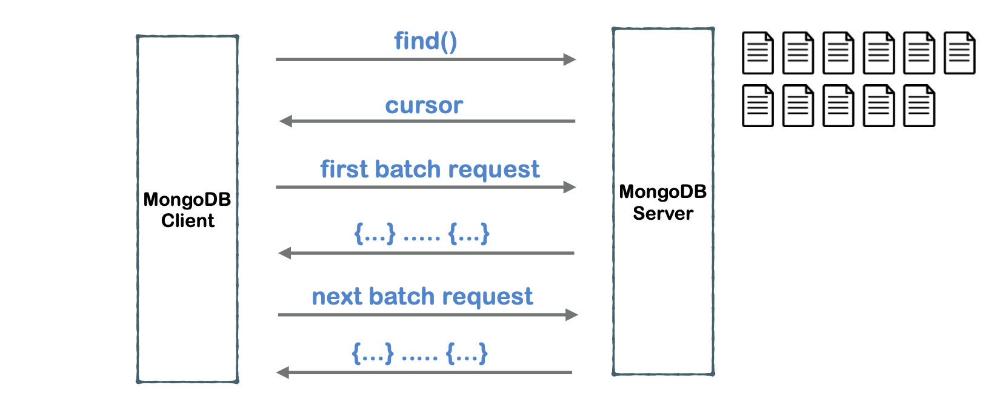

# 04 retrouver un `document`

## la méthode `find`

### `db.<collection>.find(<query>,<fields>)`

Retourne un `cursor`.

Le `cursor` est itéré à chaque fois que l'on veut un nouveau document.


## la méthode `findOne`

### `db.<collection>.findOne(<query>, <fields>)`

Retourne un object en `extended json`.


## `cursor`

Un `objet iterable` est parcouru par un `cursor`.

`batch size` (taille du lot) : définie combien de documents sont envoyé à la fois.



On voit qu'en réponse de `find` `mongo server` renvoie d'abord un `cursor`.

Ensuite en fonction de la taille du `batch`, les documents sont envoyés par lot (`batch`).


## Création de `100` enregistrements

```js
> [...Array(100)].forEach((val,ind) => db.cursor.insert({index: NumberInt(ind +1)}))
> db.cursor.count()
100
```

`[...Array(nb)]` permet d'obtenir un index pour chaque enregistrement car `Array(100)` ne crée pas les indexes.

```js
PRIMARY> db.cursor.find()
{ "_id" : ObjectId("5e7da600745c1d888f70438a"), "index" : 1 }
{ "_id" : ObjectId("5e7da600745c1d888f70438b"), "index" : 2 }
// ...
{ "_id" : ObjectId("5e7da601745c1d888f70439d"), "index" : 20 }
Type "it" for more
```

On obtient `20` documents. (mais ce n'est pas le `batch size` !)

### `db.<collection>.count()` renvoie le nombre de `documents`

## Itérer sur les suivants `it`

```js
PRIMARY> it
{ "_id" : ObjectId("5e7db2f1745c1d888f704402"), "index" : 21 }
{ "_id" : ObjectId("5e7db2f1745c1d888f704403"), "index" : 22 }
// ...
{ "_id" : ObjectId("5e7db2f1745c1d888f704415"), "index" : 40 }
Type "it" for more
```

Et ce jusqu'à la fin des `documents`

```js
PRIMARY> it
{ "_id" : ObjectId("5e7db2f3745c1d888f70443e"), "index" : 81 }
{ "_id" : ObjectId("5e7db2f3745c1d888f70443f"), "index" : 82 }
// ...
{ "_id" : ObjectId("5e7db2f4745c1d888f704451"), "index" : 100 }

PRIMARY> it
no cursor
```

## Différence entre `batch size` et `iterator size`

`iterator size` est le nombre de `documents` affichés, définie dans le client `mongo shell`, 

alors que `batch size` est le nombre de `documents` envoyés par le serveur `mongodb` en **une fois**, définie sur le serveur.


### Modifier la taille de `iterator size`

```js
PRIMARY> help
	// ...
	DBQuery.shellBatchSize = x   set default number of items to display on shell
	exit                         quit the mongo shell

PRIMARY> DBQuery.shellBatchSize = 10
10

PRIMARY> db.cursor.find()
{ "_id" : ObjectId("5e7db2f0745c1d888f7043ee"), "index" : 1 }
{ "_id" : ObjectId("5e7db2f0745c1d888f7043ef"), "index" : 2 }
// ...
{ "_id" : ObjectId("5e7db2f0745c1d888f7043f7"), "index" : 10 }
Type "it" for more
```

#### `DBQuery.shellBatchSize = nb`

### Modifier le taille de `batch size`

Par défaut la taille est de `101 documents`.

```js
PRIMARY> db.cursor.find().batchSize(10)
```

Il faudra donc `2` requête pour obtenir les `20` documents affichés par `mongo shell`.

#### ! ne pas mettre un `batch size` trop petit.

