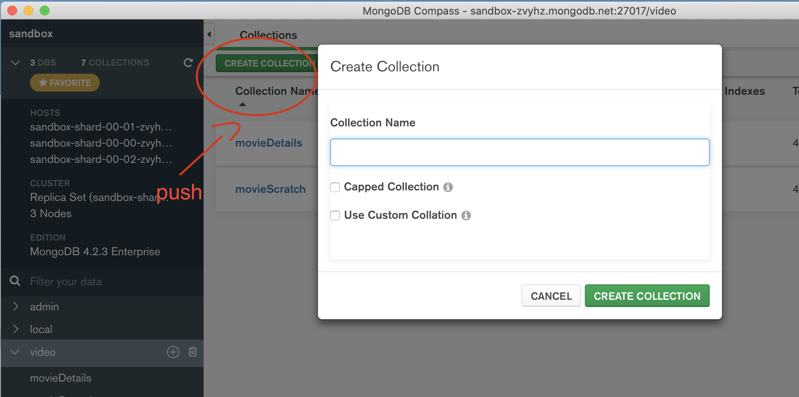
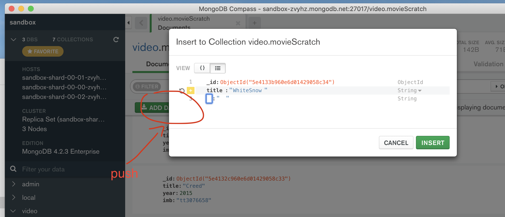
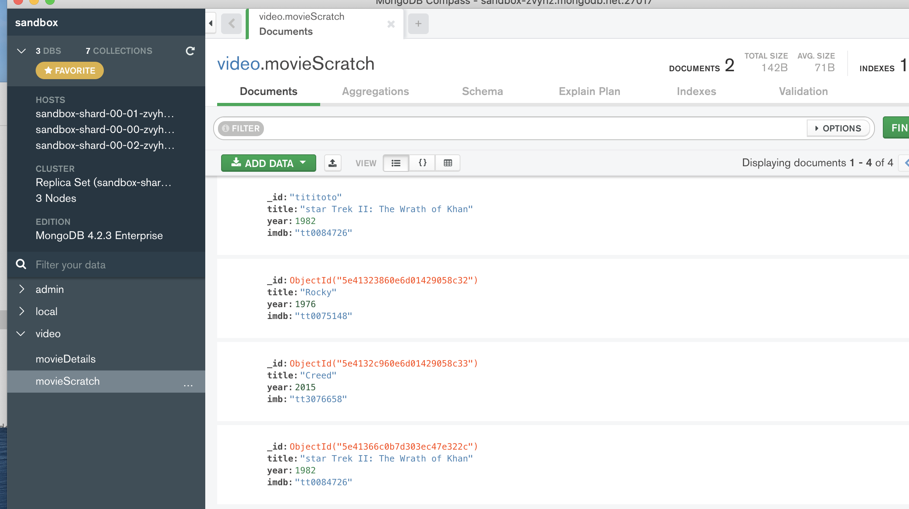

# 06 Créer un document

## Avec `mongo Compass`

D'abord on crée une collection :



Ensuite on insère des données :



## Avec `Mongo shell`

```bash
:PRIMARY> db.movieScratch.insertOne({title: "star Trek II: The Wrath of Khan", year: 1982, imdb: "tt0084726"}) 
{
	"acknowledged" : true,
	"insertedId" : ObjectId("5e41366c0b7d303ec47e322c")
}
```

### `insertOne({ ... })`

`Mongo` nous renvoie automatiquement un identifiant unique.

On peut renseigner soi-même `_id`:

```bash
:PRIMARY> db.movieScratch.insertOne({_id:"tititoto",title: "star Trek II: The Wrath of Khan", year: 1982, imdb: "tt0084726"})
{ "acknowledged" : true, "insertedId" : "tititoto" }
```



### `insertMany([ ... ])` insertion ordonnée

Pour ajouter plusieurs documents en même temps.

```bash
PRIMARY> show collections
movieDetails
movieScratch
```

```bash
PRIMARY> use movieScratch
switched to db movieScratch
```

Puis on insère les données (il y a une données en double):

```bash
PRIMARY> db.moviesScratch.insertMany(
...     [
...         {
...       "_id" : "tt0084726",
...       "title" : "Star Trek II: The Wrath of Khan",
...       "year" : 1982,
...       "type"
# ...
```

`Error`

```bash
"writeErrors" : [
		{
			"index" : 2,
			"code" : 11000,
			"errmsg" : "E11000 duplicate key error collection: movieScratch.moviesScratch index: _id_
```

`duplicate key error`

```bash
"nInserted" : 2,
```

Seulement les documents avant l'`id` en doublon sont insérés.

### `insertMany([ ... ], {ordered: false})` insertion non-ordonnée

Comme l'insertion n'est pas ordonnée, celle-ci ne va plus s'arrêter à la première erreur :

```bash
"nInserted" : 2,
```

Malgré 3 erreur de duplication de clé, les documents suivants vont être enregistrés.