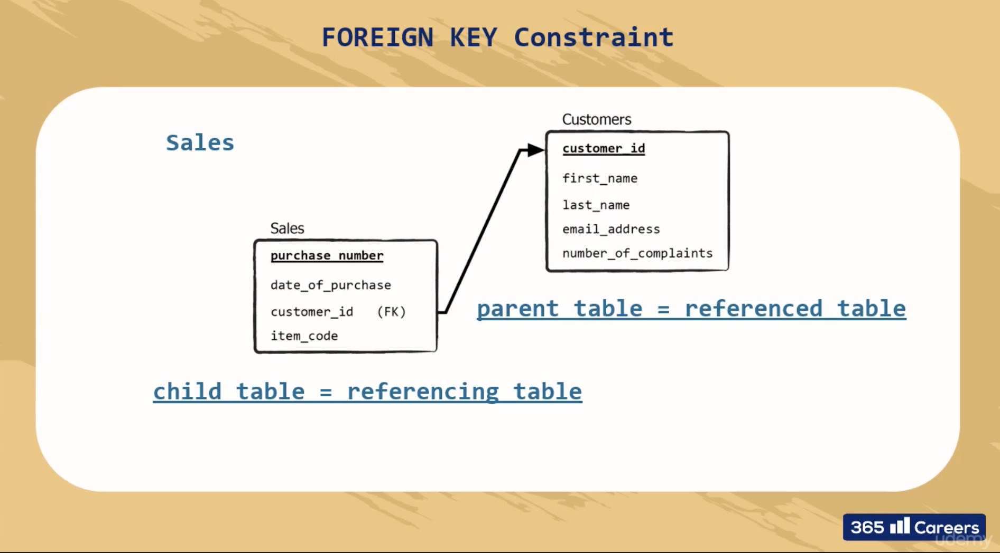

# Les contraintes

## `PRIMARY KEY` - la clé primaire

Deux syntaxes sont possibles :

```sql
CREATE TABLE customers (
	customer_id INT NOT NULL AUTO_INCREMENT,
    first_name VARCHAR(255) NOT NULL,
    last_name VARCHAR(255) NOT NULL,
    email_adress VARCHAR(255),
    number_of_complaints INT,
	PRIMARY KEY (customer_id)
);
```

Ou bien directement dans la ligne de déclaration de la colonne :

```sql
CREATE TABLE customers (
	customer_id INT NOT NULL PRIMARY KEY AUTO_INCREMENT,
    ...
```

### Ajouter une contrainte après la création 

```sql
ALTER TABLE items
ADD CONSTRAINT PRIMARY KEY (item_code)
```

#### `ALTER TABLE table_name ADD CONSTRAINT ...`

## `FOREIGN KEY` - la clé étrangère



La clé étrangère maintient la contrainte d'intégrité référentiel, sa valeur correspond à une valeur existante dans la table parent.


### ON DELETE CASCADE

Cette contrainte agit lorsque un enregistrement est supprimé dans la table parent.

Elle permet de supprimer tous les enregistrements de la table enfant dons la clé étrangère était la valeur de la clé primaire de l'enregistrement supprimé.

```sql
CREATE TABLE items (
	item_code VARCHAR(255),
    item VARCHAR(255),
    unit_price NUMERIC(10,2),
    company_id VARCHAR(255),
    PRIMARY KEY (item_code),
    FOREIGN KEY (company_id) REFERENCES companies (company_id) ON DELETE CASCADE
);
```

Deuxième syntaxe avec `ALTER TABLE` :

```sql
ALTER TABLE items
ADD FOREIGN KEY (company_id) REFERENCES companies (company_id) ON DELETE CASCADE;
```

### Supprimer une contrainte

On peut supprimer une contrainte sans supprimer la colonne :

```sql
ALTER TABLE table_name
DROP FOREIGN KEY foreigh_key_name;
```

C'est pour cela qu'un nom est donné systématiquement de manière automatique à toutes les contraintes.

On peut le voire dans la section DDL de SQL Workbench :

```sql
CREATE TABLE `items` (
  `item_code` varchar(255) NOT NULL,
  `item` varchar(255) DEFAULT NULL,
  `unit_price` decimal(10,2) DEFAULT NULL,
  `company_id` varchar(255) DEFAULT NULL,
  PRIMARY KEY (`item_code`),
  KEY `company_id` (`company_id`),
  CONSTRAINT `items_ibfk_1` FOREIGN KEY (`company_id`) REFERENCES `companies` (`company_id`) ON DELETE CASCADE
) ENGINE=InnoDB DEFAULT CHARSET=utf8
```

Ici c'est `items_ibfk_1`

##  `UNIQUE` la contrainte d'unicité

Toutes les valeurs de la colonne (ou un groupe de colonnes) ayant comme contrainte `UNIQUE` sont obligés d'être **unique**

```sql
ALTER TABLE customers
ADD UNIQUE KEY (first_name, last_name);
```

Ici la contrainte porte sur deux colonnes

```sql
INSERT INTO customers (first_name, last_name, email_adress, number_of_complaints) VALUES ('john', 'doe', 'jd@gmail.com', 0)
1 row(s) affected

INSERT INTO customers (first_name, last_name, email_adress, number_of_complaints) VALUES ('john', 'doe', 'jd@gmail.com', 0)
Error Code: 1062. Duplicate entry 'john-doe' for key 'first_name'

INSERT INTO customers (first_name, last_name, email_adress, number_of_complaints) VALUES ('Gym', 'doe', 'jd@gmail.com', 0)
1 row(s) affected
```

Les **clés uniques** dans mysql ont le même rôle que les **index**. Mais pas l'inverse !

#### Index

Un index permet une recherche plus rapide dans une table, cependant l'insertion est plus lente (création de l'index, les index doivent être mis à jour).

### Supprimer une clé `UNIQUE`

```sql
ALTER TABLE table_name
DROP INDEX unique_key_field;
```

Exemple :

```sql
ALTER TABLE customers
DROP INDEX first_name;
```

Les index sont des arbres B (BTREE), des arbres équilibrés.

#### ! On supprime une clé `UNIQUE` avec `DROP INDEX` et pas `DROP UNIQUE KEY`

```sql
ALTER TABLE customers
ADD UNIQUE KEY (email_adress)

ALTER TABLE customers
DROP INDEX email_adress
```

Avec `DROP` pas de parenthèses.

##  `DEFAULT` la contrainte de valeur par défaut

Pour l'attribut nombre_de_plainte, on peut imaginer qu'au début tous le monde à la valeur 0.

On pourrait écrire la contrainte directement à la création de la table : 

```sql
CREATE TABLE customers (
	...
    number_of_complaints int DEFAULT 0,
    ...
);
```

On peut aussi le fair par la suite avec un `ALTER TABLE` :

```sql
ALTER TABLE customers
CHANGE COLUMN number_of_complaints number_of_complaints INT DEFAULT 0;
```

### Supprimer la contrainte `DEFAULT`

```sql
ALTER TABLE customers
ALTER COLUMN number_of_complaints DROP DEFAULT;
```

## `NOT NULL` la contrainte de nullité

Pour placer la coi ntrainte `NOT NULL` à la création de la table :

```sql
CREATE TABLE companies (
	company_id VARCHAR(255),
    company_name VARCHAR(255) NOT NULL,
    headquarters_phone_number VARCHAR(255),
    PRIMARY KEY (company_id)
);
```

#### Pour retirer une contrainte `NOT NULL`

```sql
ALTER TABLE companies
MODIFY company_name VARCHAR(255) NULL;
```

#### Pour ajouter la contrainte `NOT NULL` à une colonne

```sql
ALTER TABLE companies
CHANGE COLUMN company_name company_name VARCHAR(255) NOT NULL;
```

#### ! `NULL` n'est pas une valeur mais une absence de valeur

