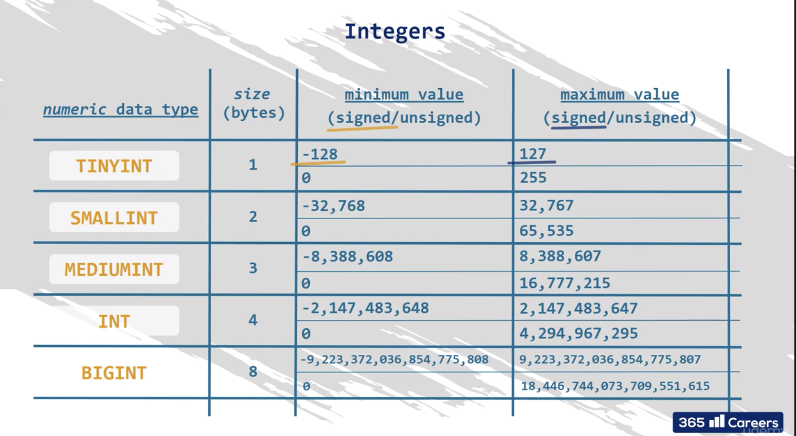

# Les types de données

## Les types chaine de caractères

Différence entre `char` et `varchar`

| string datat type            | Storage  | Exemple<br />length size (byte) | max size |                                                              |
| ---------------------------- | -------- | ------------------------------- | -------- | ------------------------------------------------------------ |
| Character `char`             | Fixed    | char(5)<br />bob (3) (5)        | 255      | 50% faster                                                   |
| Variable Character `varchar` | Variable | varchar(5)<br />bob (3) (3)     | 65 535   | Utilise moins de place si la chaine insérée est plus petite que la valeur maximum |

La valeur entre parenthèses (`varchar(255)` , `char(11)`) est la taille maximum

#### ! la valeur donné entre parenthèse peut avoir une incidence sur les performances variant d'une DB à l'autre

#### Enum

Ce sont des valeurs finis, SQL enverra une erreur pour toutes entrées qui n'est pas dans l'enum :

`enum('M', 'F', 'X')`

## Les types numériques

- entier
- virgule fixe (fixed-point)
- virgule flottante (floating-point)

### Integer / int



### Virgule fixe et virgule flottante (fixed / floating)

| Number | Precision | Scale |
| ------ | :-------: | :---: |
| 10.523 |     5     |   3   |
| 36.872 |     5     |   3   |

#### `decimal(5, 3)`

Les données à virgule fixe représente des valeurs **exact**

| `decimal(5, 3)` |               10.523               |
| --------------- | :--------------------------------: |
| 10.5            |               10.500               |
| 10.52367843     | 10.524 ! à l'arrondi (warning sql) |

`Numeric` = `decimal`

#### `numeric(p, s)`

p = precision nombre total de chiffre

s = scale nombre de chiffre derrière la virgule

Ce type est préféré pour la finance.

### Virgule flottante

| float(5,3)  |                                |
| ----------- | ------------------------------ |
| 10.52367843 | 10.524 (mais sans warning sql) |

La représentation en mémoire est différente.

Exemple:

```sql
CREATE TABLE numbers (a NUMERIC(10, 9), b NUMERIC(10, 9), c FLOAT(10, 9), d FLOAT(10, 9));

INSERT INTO numbers VALUES (0.2, 0.1, 0.2, 0.1);

SELECT a+b AS somme_numeric, c+d AS somme_float FROM numbers;
```


| Type   | nombre de chiffre |
| ------ | ----------------- |
| FLOAT  | 23                |
| DOUBLE | 53                |

## Type Date

### DATE

`DATE` représente une date sous le format `yyyy-mm-dd`

Il va du 1er janvier 1000 jusqu'au 31 decembre 9999

### DATETIME

Si on veut aussi retenir l'heure : `DATETIME` sous le format `yyyy-mm-dd hh:mm:ss`

### TIMESTAMP

UTC Coordinated Universal Time

Le nombre de seconde depuis le 1er janvier 1970 à 00h 00mn 00s

Utiliser pour les calculs de date

## BLOB

**B**inary **L**arge **OB**ject

Les fichiers binaires

