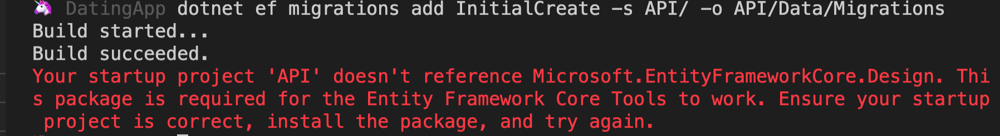

# 04.  Migrations  

## Installer l'outil `dotnet-ef`

```bash
dotnet tool install --global dotnet-ef --version 5.0.0-rc.2.20475.6
```


Si il est déjà installé, utiliser `update`.


## Créer une migration `dotnet ef migrations add`

`-s|--startup-project <PROJECT>`        Le projet de départ, par défaut le dossier courant.

`-o --outputdir <PATH>` Le dossier où sera créée la migration.

```bash
🦄 DatingApp dotnet ef migrations add InitialCreate -s API/ -o API/Data/Migrations
```




Il faut installer le package `Microsoft.EntityFrameworkCore.Design` dans `API`.

```bash
🦄 DatingApp dotnet add API/ package Microsoft.EntityFrameworkCore.Design --version 5.0.0-rc.2.20475.6
```


On obtient trois fichiers.

Le nom du fichier commence par un `timestamp`.

Le fichier qui va nous intéresser est `20201104091620_InitialCreate.cs` :

```csharp
using Microsoft.EntityFrameworkCore.Migrations;

namespace API.API.Data.Migrations
{
    public partial class InitialCreate : Migration
    {
        protected override void Up(MigrationBuilder migrationBuilder)
        {
            migrationBuilder.CreateTable(
                name: "users",
                columns: table => new
                {
                    Id = table.Column<int>(type: "INTEGER", nullable: false)
                        .Annotation("Sqlite:Autoincrement", true),
                    UserName = table.Column<string>(type: "TEXT", nullable: true)
                },
                constraints: table =>
                {
                    table.PrimaryKey("PK_users", x => x.Id);
                });
        }

        protected override void Down(MigrationBuilder migrationBuilder)
        {
            migrationBuilder.DropTable(
                name: "users");
        }
    }
}
```

Une méthode `Up` pour créer la `DB`.

Une méthode `Down` pour la supprimer.

Grace à la convention de nommage, `Id` est une clé primaire auto-incrémenté.


## Créer la `DB` : `dotnet ef database update`

`-p <PROJECT>` spécifie le projet.

```bash
🦄 DatingApp dotnet ef database update -p API/
```


Un fichier `datingapp.db` est créé, c'est la `DB` avec `SQLite`.


On obtient deux tables : `Users` et `EFMigrationsHistory` qui enregistre l'historisue des `Migration`.

## `SQLite` pour `VSCode`


Il est possible d'exécuter des requêtes `SQL` avec l'extension `SQLite VSCode`.


```sql
INSERT INTO `users` (UserName)
VALUES ("Titi"), ("Otto"), ("Ralfy"), ("Mounia");
```

