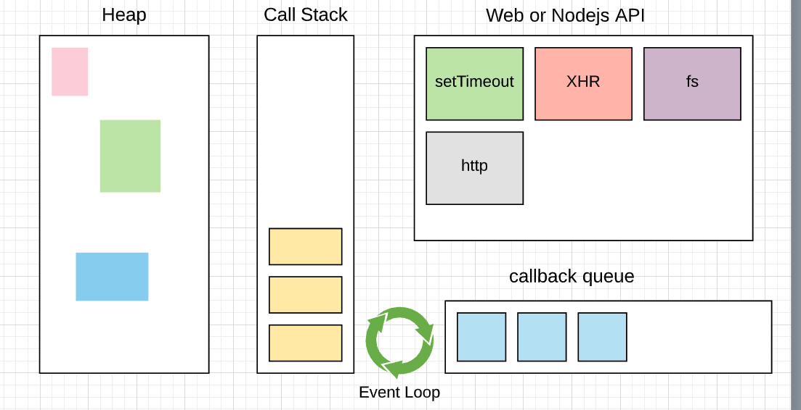

# Javascript asynchrone

## Event Loop : La boucle d'événement

Une boucle d'événement permet à Javascript d'être non-bloquant.

Single thread (tâche unique) == One Call Stack (pile d'appelle)

>  Chaque thread d'un même processus a sa propre Call Stack, le tas (heap) est lui partagé

## Schéma du runtime



## Promise

Une `promise` est un objet qui produira une valeur quelque part dans le futur.

Une `promise` a trois états :

- **fullfilled** complété
- **rejected** rejeté
- **pending** en attente

### Les callbacks

L'utilisation de `callbacks` pour un traitement différé, génère une `pyramid of doom`

```js
changePosition({30, 45}, () => {
  changePosition({5, 70}, () => {
    changePosition({35, 15}, () => {
      console.log("finish!");
    });
  });
});
```

### Avec les `promise`

```js
changePosition({30, 45})
	.then(() => changePosition({5, 70}))
	.then(() => changePosition({35, 15}))
	.then(() => console.log("finish!"));
```

### Exemple

```js
const promise = new Promise((resolve, reject) => {
    if (true) {
        resolve("stuff worked");
    } else {
        reject("error it broke");
    }
});

promise
    .then(result => `${result} (°-°)~`)
    .then(result2 => console.log(result2));
```

```bash
stuff worked (°-°)~
```

### `catch`

```js
promise
    .then(result => `${result} (°-°)~`)
    .then(result2 => {
        throw Error("big errrrrror !!");
        console.log(result2);
    })
    .catch(err => console.log(err.message));
```

```bash
big errrrrror !!
```

La clause `catch` peut se trouver n'importe où, mais alors elle ne s'applique plus aux `then` après elle.

```js
promise
    .then(result => `${result} (°-°)~`)
    .then(result2 => `${result2} ~(^.^)`)
    .catch(err => console.log(err.message))
    .then(result3 => {
  # si une erreur est lancée ici, elle ne sera pas interceptée par catch
        console.log(`${result3} =(°^°)=`);
    });
```

### Résoudre plusieurs promises `Promise.all`

```js
const promise = new Promise((resolve, reject) => {
    if (true) {
        resolve("stuff worked");
    } else {
        reject("error it broke");
    }
});

const promise2 = new Promise((resolve, reject) => {
    setTimeout(resolve, 100, "Hiii");
});
const promise3 = new Promise((resolve, reject) => {
    setTimeout(resolve, 1000, "POOKIE");
});
const promise4 = new Promise((resolve, reject) => {
    setTimeout(resolve, 3000, "Pousse la pookie ...");
});

Promise.all([promise, promise2, promise3, promise4]).then(values =>
    console.log(values)
);
```

```bash
[ 'stuff worked', 'Hiii', 'POOKIE', 'Pousse la pookie ...' ]
```

### Autre exemple avec `fetch`

Pour simuler `fetch` dans `nodejs`, on utilise `node-fetch` :

```js
const fetch = require("node-fetch");

const urls = [
    "https://jsonplaceholder.typicode.com/users",
    "https://jsonplaceholder.typicode.com/posts",
    "https://jsonplaceholder.typicode.com/albums"
];

Promise.all(urls.map(url => fetch(url).then(resp => resp.json())))
  .then(results => results.forEach(result => console.log(result)));
```

### Avec `catch`

```js
Promise.all(urls.map(url => fetch(url).then(resp => resp.json())))
    .then(results => results.forEach(result => console.log(result)))
    .catch(() => console.log("error"));
```

## `async` `await`

`async` et `await` sont construit au-dessus des `promise`.

`async` retourne une `promise`.

### Petit prompteur personnel

```js
const promiseFactory = (txt, i) => {
    return new Promise((resolve, reject) => {
        setTimeout(resolve, 150, txt[i]);
    });
};

async function display(txt) {
    for (let i = 0; i < txt.length; i++) {
        await promiseFactory(txt, i).then(result => console.log(result));
    }
}

display("once upon a time");

```

Chaque timer se déclenche à la fin du traitement du précédent.

On remet dans le flux synchrone un comportement asynchrone.

### Créer une pause dans l'exécution

```js
const pause = duration => {
    return new Promise((resolve, reject) =>
        setTimeout(resolve, duration, "OK")
    );
};
const main = async () => {
    console.log("start");

    await pause(3000).then(result => console.log(result));

    console.log("finish");
};

main();
```

```bash
start # on attend 3s
OK
finish
```

Ce comportement ne serait pas possible sans `async` et `await`.

On aurait alors :

```bash
start
finish # on attend 3s
OK
```

## `fetch`

Pour utiliser `fetch` dans **node js** :

```bash
npm install node-fetch
```

`fetch` renvoie une `promise`

```js
const fetch = require("node-fetch");

console.log(fetch("https://jsonplaceholder.typicode.com/albums"));
```

```bash
Promise { <pending> }
```

### Sans `async` et `await`

```js
const fetch = require("node-fetch");

fetch("https://jsonplaceholder.typicode.com/albums")
    .then(response => response.json())
    .then(console.log);
```

### Avec `async` et `await`

```js
const fetch = require("node-fetch");

async function fetchUsers() {
    const response = await fetch("https://jsonplaceholder.typicode.com/users");
    const data = await response.json();
    console.log(data);
}

fetchUsers();
```

### Avec `Promise.all` 

```js
const fetch = require("node-fetch");

const urls = [
    "https://jsonplaceholder.typicode.com/users",
    "https://jsonplaceholder.typicode.com/posts",
    "https://jsonplaceholder.typicode.com/albums"
];

Promise.all(
    urls.map(url => fetch(url).then(response => response.json()))
).then(responses => responses.forEach(console.log)).catch("oops");
```

### Avec `Promise.all` et `async` et `await`

```js
const fetch = require("node-fetch");

const urls = [
    "https://jsonplaceholder.typicode.com/users",
    "https://jsonplaceholder.typicode.com/posts",
    "https://jsonplaceholder.typicode.com/albums"
];

const getData = async () => {
    const [users, posts, albums] = await Promise.all(
        urls.map(url => fetch(url).then(response => response.json()))
    );
    console.log("users", users);
    console.log("posts", posts);
    console.log("albums", albums);
};

getData();
```

### gestion des erreurs `try catch`

```js
const fetch = require("node-fetch");

const urls = [
  // ici une erreur jsonplaceholde (r)
    "https://jsonplaceholde.typicode.com/users",
    "https://jsonplaceholder.typicode.com/posts",
    "https://jsonplaceholder.typicode.com/albums"
];

const getData = async () => {
    try {
        const [users, posts, albums] = await Promise.all(
            urls.map(url => fetch(url).then(response => response.json()))
        );
        console.log("users", users);
        console.log("posts", posts);
        console.log("albums", albums);
    } catch (err) {
        console.log("oups !");
    }
};

getData();
```

```bash
oups !
```

## `finally`

On peut ajouter une clause qui s'exécute quoi qu'il arrive : `finally`

```js
const fetch = require("node-fetch");

const urls = [
    "https://swapi.co/api/people/1/",
    "https://swapi.co/api/people/2/",
    "https://swapi.co/api/people/3/",
    "https://swapi.co/api/people/4/"
];

Promise.all(urls.map(url => fetch(url).then(response => response.json())))
    .then(persos => {
        console.log("personnage 1 : ", persos[0]);
        console.log("personnage 2 : ", persos[1]);
        console.log("personnage 3 : ", persos[2]);
        console.log("personnage 4 : ", persos[3]);
    })
    .catch(err => console.log("ughhh fix it !", err))
    .finally(() => console.log("extra"));
```

`console.log("extra")` sera toujours exécuté, même si la requête génère une erreur.

La clause `finally` est utile pour envoyer un mail, enregistrer un log ou afficher une message de feedback.

## `for await of`

Pour itérer sur un tableau de `promise` et les résoudre toutes en même.

```js
const fetch = require("node-fetch");

const urls = [
    "https://swapi.co/api/people/1/",
    "https://swapi.co/api/people/2/",
    "https://swapi.co/api/people/3/",
    "https://swapi.co/api/people/4/"
];

const getData2 = async () => {
    const arrayOfpromises = urls.map(url => fetch(url));

    for await (let request of arrayOfpromises) {
        const data = await request.json();
        console.log(data);
    }
};

getData2();
```

façon personnelle, je ne vois pas bien la différence :

```js
const getData2 = async () => {
    const arrayOfpromises = urls.map(url => fetch(url));

    arrayOfpromises.map(promise =>
        promise.then(result => result.json()).then(console.log)
    );
};

getData2();
```

