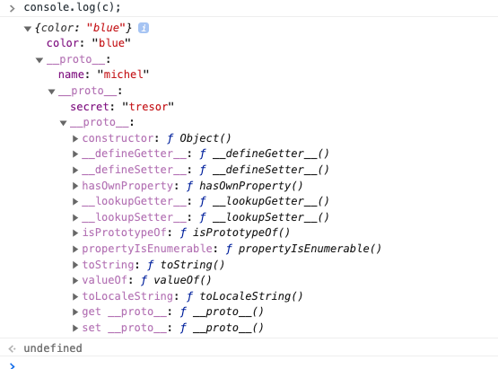

# Prototype

## Héritage par prototype

Un objet obtient les méthodes et les propriétés d'un autre objet dans sa chaîne de prototype :

```js
const a = { secret: "tresor" };

const b = { name: "michel" };

const c = { color: "blue" };

b.__proto__ = a;
c.__proto__ = b;

b.secret; //? tresor

c; //? { color: 'blue' }
c.__proto__; //? { name: 'michel' }
c.__proto__.__proto__; //? { secret: 'tresor' }
```

```js
console.log(c);
> {color: "blue"}
```

Voici la chaîne de prototype :



On voit que `__proto__` est un `getter` et un `setter`.

`Object` fini la chaîne des prototypes.

## `hasOwnProperty`

Ne sont considérer par `hasOwnProperty` que les propriété directes de l'objet, pas celles acquise par prototype.

```js
c.hasOwnProperty("color")
true
c.hasOwnProperty("name")
false
```

Les propriétés sont partagées par la chaîne d'héritage :

```js
b.secret = "cactus";
"cactus"
c.secret
"cactus"
```

Par contre dans l'autre sens :

```js
c.secret = "rosace"
"rosace"
b.secret
"cactus"
```

La modification va du parent vers l'enfant (l'héritier), mais pas l'inverse.

