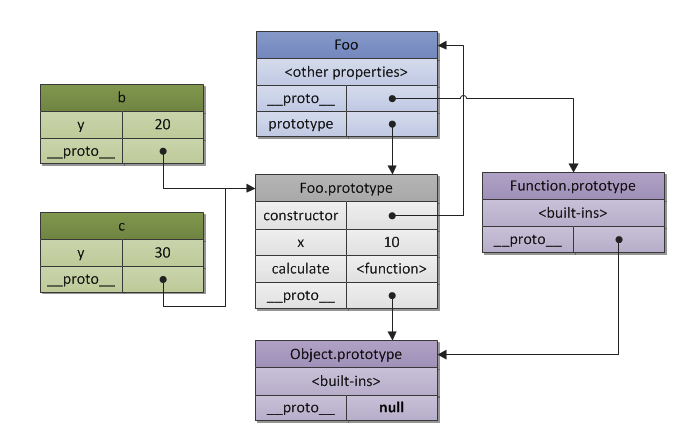
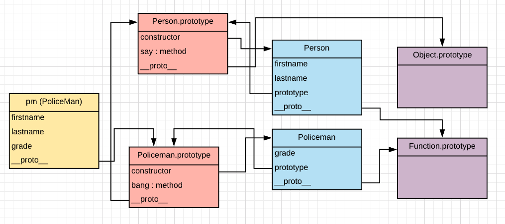

# L'héritage

## `Object.create` et `prototype`

```js
const EventEmitter = require("events");
const { event } = require("./config");

const myEvent = new EventEmitter();

const vehicule = Object.create(myEvent);
// const vehicule = {};
// vehicule.__proto__ = myEvent;

vehicule.on(event.DING, () => console.log("tiut tiut"));

vehicule.emit(event.DING);

```

Je viens de lire dans MDN que `__proto__` n'est pas conseillé pour modifier le prototype.


## Passer des données à un événement

```js
vehicule.on(event.DING, data => console.log("tiut tiut", data.cat));

vehicule.emit(event.DING, { cat: "minou" });
```

```bash
tiut tiut minou
```

En deuxième arguments de `.emit` on peut fournir une donnée.

On la récupère dans la fonction `callback` de `.on`.

## Hériter de `EventEmitter` avec une fonction constructeur

```js
const EventEmitter = require("events");
const util = require("util");

function Bot() {
    EventEmitter.call(this);
    this.name = "Bot";
}

util.inherits(Bot, EventEmitter);

Bot.prototype.say = function() {
    console.log(`Hey I'm ${this.name}`);
};

const b = new Bot();

b.say();

b.on("boom", function() {
    console.log(`What the f*** I'm ${this.name} and i ear BOOM`);
});

b.emit("boom");
```

```
Hey I'm Bot
What the f*** I'm Bot and i ear BOOM
```

On utilise ici `util.inherits`, c'est assez compliqué.

```js
EventEmitter.call(this);
```

Peut être vu comme :

```js
super(this)
```

On passe la valeur de `this` au constructeur du parent.

## Schéma de Dmitry Soshnikov

## Ralenti

```js
function Person(firstname, lastname) {
    this.firstname = firstname;
    this.lastname = lastname;
}

Person.prototype.say = function() {
    console.log(`Hello I'm ${this.firstname} - ${this.lastname}`);
};
```

On défini une fonction constructeur et on ajoute une méthode à son `prototype`.

```js
const p = {};

Person.apply(p, ["Michel", "Michelot"]);
```

On crée un objet vide `p`.

On exécute `Person` avec pour valeur de `this` l'objet `p` en lui passant `firstname` et `lastname`.

À cet étape `p` ressemble à ça ;

```js
{
  firstname: "Michel",
  lastname: "Michelot"
}
```

```js
p.__proto__ = Person.prototype;
```

Maintenant on a : 

```js
{
  firstname: "Michel",
  lastname: "Michelot",
  __proto__: Person.prototype
}
```

On peut donc appeler `say()`

```js
p.say() // Hello I'm Michel - Michelot
```

## Ralenti 2

```js
function Person(firstname, lastname) {
    this.firstname = firstname;
    this.lastname = lastname;
}

Person.prototype.say = function() {
    console.log(`Hello I'm ${this.firstname} - ${this.lastname}`);
};
```

On défini une fonction constructeur `Person`

```js
function Policeman(firstname, lastname, grade) 
    Person.call(this, firstname, lastname);
    this.grade = grade;
}
```

On appelle `Person.call`dans la focntion constructeur pour lier `this` avec les attributs de `Person`

```js
Policeman.prototype.bang = function() {
    console.log(
        `Hey I'm ${this.firstname} and my grade is ${this.grade} bang bang !`
    );
};

const pm = new Policeman("Bob", "Walker", "officer");

// pm.say();

pm.bang();
```

```
Hey I'm Bob,Walker and my grade is officer bang bang !
```

Cela fonctionne bien mais si on invoque une méthode du parent `Person` :

```js
pm.say();

pm.bang();
```

```
pm.say();
   ^

TypeError: pm.say is not a function
```

Il faut lier dans la chaîne de prototype `Person` à `Policeman` :



```js
// ...
Policeman.prototype.__proto__ = Person.prototype;

const pm = new Policeman("Bob", "Walker", "officer");

pm.say();

pm.bang();
```

```
Hello I'm Bob - Walker
Hey I'm Bob and my grade is officer bang bang !
```

Les propiétés sont copiées dans l'objet par le constructeur :

```js
pm.hasOwnProperty("lastname"); //? true
pm.hasOwnProperty("grade"); //? true
```

## Nouvelle syntaxe

```js
const EventEmitter = require("events");

class Bot extends EventEmitter {
    name = "Bot";

    say() {
        console.log(`hello I'm ${this.name}`);
    }
}

const b = new Bot();

b.say();

b.on("bim", function() {
    console.log(`Hey I'm ${this.name} and I ear bim`);
});

b.emit("bim");
```

```
hello I'm Bot
Hey I'm Bot and I ear bim
```

C'est beaucoup plus limpide.

## Pour l'exemple du `Policeman`

```js
class Person {
    constructor(firstname, lastname) {
        this.firstname = firstname;
        this.lastname = lastname;
    }

    say() {
        console.log(`Hello I'm ${this.firstname} - ${this.lastname}`);
    }
}

class Policeman extends Person {
    constructor(firstname, lastname, grade) {
        super(firstname, lastname);
        this.grade = grade;
    }

    bang() {
        console.log(
            `Hey I'm ${this.firstname} and my grade is ${this.grade} bang bang !`
        );
    }
}

const pm = new Policeman("Bib", "donuts", "inspector");

pm.say();
pm.bang();

```

Comment on passe les arguments au constructeur parent :

```js
constructor(firstname, lastname, grade) {
  super(firstname, lastname);
  this.grade = grade;
}
```

au lieu de :

```js
function Policeman(firstname, lastname, grade) 
    Person.call(this, firstname, lastname);
    this.grade = grade;
}

// plus 

Policeman.prototype.__proto__ = Person.prototype;
```

