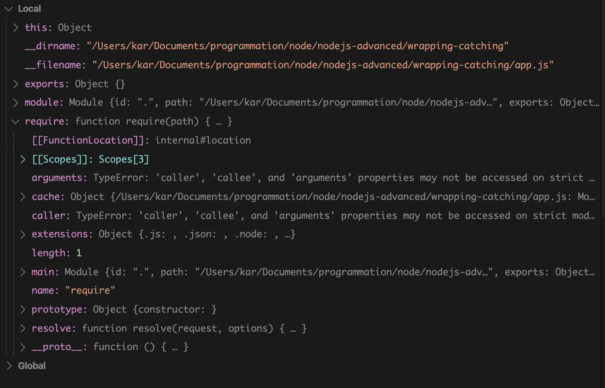

# 05 Wrapping caching modules

## Mauvaise utilisation de `exports`

`lib.js`

```js
exports = { a: 1 };

console.log("exports", exports);
console.log("module.exports", module.exports);
```

`app.js`

```js
const lib = require("./lib");  // retourne module.exports

console.log("return of require", lib);
```

```bash
exports { a: 1 }
module.exports {}
return of require {}
```

`exports = { a: 1}` réassigne une nouvelle référence à exports qui perd son lien vers `module.exports`

## Bonne utilisation de `exports`

### `exports` est un alias de `module.exports`.

`lib.js`

```js
exports.a = 1;

console.log("exports", exports);
console.log("module.exports", module.exports);
```

```bash
exports { a: 1 }
module.exports { a: 1 }
return of require { a: 1 }
```

Ou alors en réassignant `module.exports`

```js
module.exports = exports = { a: 1 };

console.log("exports", exports);
console.log("module.exports", module.exports);
```

```bash
exports { a: 1 }
module.exports { a: 1 }
return of require { a: 1 }
```

## Fonction `wrapper`

le code d'un fichier dans `node.js` est entouré (wrapper) par une fonction `wrapper :`

```bash
> require('module').wrapper
Proxy [
  [
    '(function (exports, require, module, __filename, __dirname) { ',
    '\n});'
  ],
  { set: [Function: set], defineProperty: [Function: defineProperty] }
]
```

Ce qui explique que 

```js
var g = 45;
```

Reste locale au fichier et non pas dans l'objet `global`. En fait on a ce  code :

```js
function (exports, require, module, __filename, __dirname) { 
	var g = 45;
}
```

On peut voire tous ces éléments dans le debugger de `VSCode`:



Ce sont des variables locales au fichier, avec des valeurs uniques au fichier.

Comme on est dans une fonction, on peut utiliser `arguments` qui est disponnible dans toutes les fonctions javascript :

`app.js`

```js
const lib = require("./lib");

console.log(arguments);
```

```bash
[Arguments] {
  '0': {},
  '1': [Function: require] {
    resolve: [Function: resolve] { paths: [Function: paths] },
    main: Module {
      id: '.',
      path: '/Users/kar/Documents/programmation/node/nodejs-advanced/wrapping-catching',
      exports: {},
      parent: null,
      filename: '/Users/kar/Documents/programmation/node/nodejs-advanced/wrapping-catching/app.js',
      loaded: false,
      children: [Array],
      paths: [Array]
    },
    extensions: [Object: null prototype] {
      '.js': [Function],
      '.json': [Function],
      '.node': [Function],
      '.mjs': [Function]
    },
    cache: [Object: null prototype] {
      '/Users/kar/Documents/programmation/node/nodejs-advanced/wrapping-catching/app.js': [Module],
      '/Users/kar/Documents/programmation/node/nodejs-advanced/wrapping-catching/lib.js': [Module]
    }
  },
  '2': Module {
    id: '.',
    path: '/Users/kar/Documents/programmation/node/nodejs-advanced/wrapping-catching',
    exports: {},
    parent: null,
    filename: '/Users/kar/Documents/programmation/node/nodejs-advanced/wrapping-catching/app.js',
    loaded: false,
    children: [ [Module] ],
    paths: [
      '/Users/kar/Documents/programmation/node/nodejs-advanced/wrapping-catching/node_modules',
      '/Users/kar/Documents/programmation/node/nodejs-advanced/node_modules',
      '/Users/kar/Documents/programmation/node/node_modules',
      '/Users/kar/Documents/programmation/node_modules',
      '/Users/kar/Documents/node_modules',
      '/Users/kar/node_modules',
      '/Users/node_modules',
      '/node_modules'
    ]
  },
  '3': '/Users/kar/Documents/programmation/node/nodejs-advanced/wrapping-catching/app.js',
  '4': '/Users/kar/Documents/programmation/node/nodejs-advanced/wrapping-catching'
}
```

On voit bien `exports` (vide dans `app.js`), `require` (`function`), `module`, `__filename` et `__direname`.

Ce sont des variables proprent au fichier `app.js`, pas des variables `global`.

Cette fonction retourne `module.exports`.

## `require.main`

L'objet `Module` représentant le script point d'entré chargé par `Node.js`. 

`stars.js`

```js
const print = (stars, header) => {
  console.log("*".repeat(stars));
  console.log(header);
  console.log("*".repeat(stars));
};

console.log("Dans stars require.main === module", require.main === module);

module.exports = print;
```

`app.js`

```js
const printStars = require("./stars");

console.log("Dans app require.main === module", require.main === module);

printStars(10, "Hi !!");
```

```bash
$node app.js

Dans stars require.main === module false # require.main étant le module représentant app.js
Dans app require.main === module true
**********
Hi !!
**********
```

Dans ce cas `app.js` étant le point d'entrée, `require.main` pointe vers son `module`.

### Utilisation du script en ligne de commande

Si on utilise directement le script en ligne de commande, et non pas comme import, son `require.main` pointe vers son propre `module` :

```js
const print = (stars, header) => {
  console.log("*".repeat(stars));
  console.log(header);
  console.log("*".repeat(stars));
};

if (require.main === module) {
  const stars = process.argv[2];
  const header = process.argv[3];
  print(stars, header);
} else {
  module.exports = print;
}
```

```bash
$ node stars.js 5 "hello"
*****
hello
*****
```

### `process.argv`

```js
console.log(process.argv);
```

```bash
[
  '/usr/local/bin/node',
  '/Users/kar/Documents/programmation/node/nodejs-advanced/wrapping-catching/stars.js',
  '5',
  'hello'
]
```

## `caching` système de cache

`ascii.js`

```js
console.log(`              
                           +
                          /_\\
                ,%%%______|O|
                %%%/_________\\
                \`%%| /\\[][][]|%
                ___||_||______|%&,__ hjw`);
```

`index.js`

```js
require("./ascii");
```

```bash
$ node index.js
              
                           +
                          /_\
                ,%%%______|O|
                %%%/_________\
                `%%| /\[][][]|%
                ___||_||______|%&,__ hjw
```

Maintenant si j'utilise deux fois `require`, est-ce que le dessin sera affiché deux fois ?

`index.js`

```js
require("./ascii");
require("./ascii");
```

```bash
$ node index.js
              
                           +
                          /_\
                ,%%%______|O|
                %%%/_________\
                `%%| /\[][][]|%
                ___||_||______|%&,__ hjw
```

Non le `console.log` n'est appelé qu'une seule fois car `require` met en cache se qu'il appelle.

On peut voire ce cache :

```js
console.log("require.cache", require.cache);
```

```js
require.cache [Object: null prototype] {
  '/Users/kar/Documents/programmation/node/nodejs-advanced/wrapping-catching/index.js': Module {
    // ...
  },
  '/Users/kar/Documents/programmation/node/nodejs-advanced/wrapping-catching/ascii.js': Module {
    // ...
  }
}
```

On peut même le vider :

`index.js`

```js
require("./ascii");
// console.log("require.cache", require.cache);
delete require.cache[
  "/Users/kar/Documents/programmation/node/nodejs-advanced/wrapping-catching/ascii.js"
];
require("./ascii");
```

```bash
$ node index.js
              
                           +
                          /_\
                ,%%%______|O|
                %%%/_________\
                `%%| /\[][][]|%
                ___||_||______|%&,__ hjw
              
                           +
                          /_\
                ,%%%______|O|
                %%%/_________\
                `%%| /\[][][]|%
                ___||_||______|%&,__ hjw
```

### Autre solution

Exporter une fonction et exécuter directement `require`

`ascii.js`

```js
module.exports = () => {
  console.log(`              
                           +
                          /_\\
                ,%%%______|O|
                %%%/_________\\
                \`%%| /\\[][][]|%
                ___||_||______|%&,__ hjw`);
};
```

`index.js`

```js
require("./ascii")();

require("./ascii")();
```

