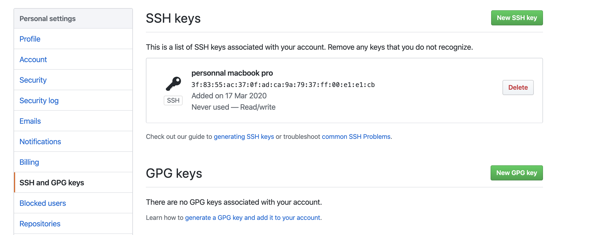
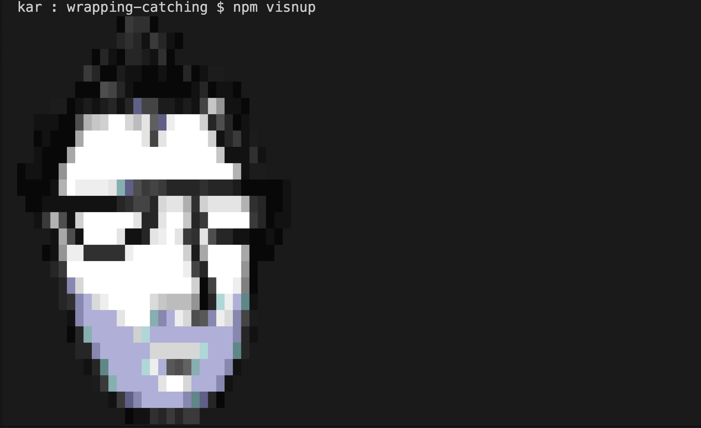
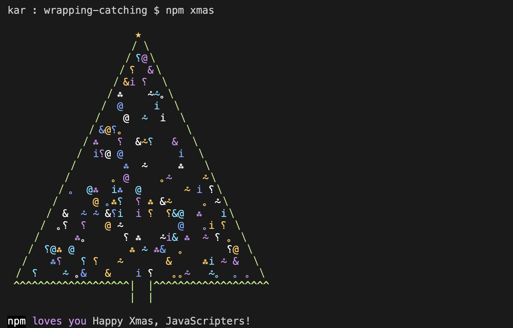

# 06 `npm`

## `npm ls`

liste les packages installés

```bash
$ npm ls
wrapping-catching@1.0.0 /Users/kar/Documents/programmation/node/nodejs-advanced/wrapping-catching
├── moment@2.24.0
└── uuid@7.0.2
```

## Connection avec `GitHub`

### Vérifier si on a déjà une clé `ssh`

```bash
$ cd .ssh
$ ls -la
total 0
drwx------   2 kar  staff    64 Mar 17 15:52 .
drwxr-xr-x+ 52 kar  staff  1664 Mar 17 15:52 ..
```

Il n'y en a pas.

### Générer une clé `ssh`

```bash
.ssh $ ssh-keygen -t rsa -b 4096 -C "k.meshoub@gmail.com"
```
```bash
Generating public/private rsa key pair.
Enter file in which to save the key (/Users/kar/.ssh/id_rsa): 
Enter passphrase (empty for no passphrase): 
Enter same passphrase again: 
```
```bs-ash
Your identification has been saved in /Users/kar/.ssh/id_rsa.
Your public key has been saved in /Users/kar/.ssh/id_rsa.pub.
The key fingerprint is:
SHA256:2vsRLL/25pFAVHJJnF6nsRZByFB9jod0U/Hpwzl17JE k.meshoub@gmail.com
```
```bash
The key's randomart image is:
+---[RSA 4096]----+
|          +B=*oo+|
|         . o* *oB|
|          .. o E*|
|         o  . O.B|
|        S +  . B.|
|       o o o .  o|
|      . . o o    |
|         ..o..   |
|        .oo+o    |
+----[SHA256]-----+
```

`passphrase` : `jaime2pizza`

### Résultat

```bash
$ ls
id_rsa		id_rsa.pub
```

### Ajouter sa clé `ssh` à `ssh-agent`

```bash
$ eval "$(ssh-agent -s)"
Agent pid 45524
```

### Création du fichier `.ssh/config`

```
Host *
  AddKeysToAgent yes
  UseKeychain yes
  IdentityFile ~/.ssh/id_rsa
```

### Ajouter la clé privée `ssh` au `ssh-agent` and enregistrer la `passphrase` dans le `keychain`

```bash
$ ssh-add -K ./id_rsa
Enter passphrase for ./id_rsa: 
Identity added: ./id_rsa (k.meshoub@gmail.com)
```

### copié la clé public dans le `clipboard`

```bash
$ pbcopy < ~/.ssh/id_rsa.pub
```

`pbcopy` prend l'entrée standard et la place dans le presse-papier.

`pbpaste` envoie le contenu du presse-papier (`clipboard`) dans l'entrée standard.

### Ajouter la clé dans son compte `Github`

Pour le `title`, par exemple `my personnal macbook`.



## Installer des packages depuis `Github`

```bash
npm i expressjs/express#4.14.0
```

```bash
npm ls --depth=0
```

```bash
wrapping-catching@1.0.0 /Users/kar/Documents/programmation/node/nodejs-advanced/wrapping-catching
└── express@4.14.0 (github:expressjs/express#9375a9afa9d7baa814b454c7a6818a7471aaef00)
```

`--depth=n` détermine la profondeur des packages à afficher.

## Lister les package `npm ls`

### lister les package installer de manière globale `npm ls -g`

```bash
$ npm ls -g --depth=0
/usr/local/lib
├── @types/core-js@2.5.3
├── @vue/cli@3.11.0
├── create-react-app@3.3.0
├── eslint@6.8.0
├── json-server@0.15.1
├── learnyounode@4.2.1
├── nodemon@2.0.2
└── npm@6.13.7
```

### Avoir plus d'informations `npm ll`

```bash
$ npm ll -g --depth=0

│ /usr/local/lib
│ 
├── create-react-app@3.3.0
│   Create React apps with no build configuration.
│   git+https://github.com/facebook/create-react-app.git
│   https://github.com/facebook/create-react-app#readme
├── nodemon@2.0.2
│   Simple monitor script for use during development of a node.js app.
│   git+https://github.com/remy/nodemon.git
│   http://nodemon.io
└── npm@6.13.7
    a package manager for JavaScript
    git+https://github.com/npm/cli.git
    https://docs.npmjs.com/
```

### Parser la liste en `json` : `--json`

```bash
npm ls -g --depth=0 --json
{
  "dependencies": {
    "create-react-app": {
      "version": "3.3.0",
      "from": "create-react-app",
      "resolved": "https://registry.npmjs.org/create-react-app/-/create-react-app-3.3.0.tgz"
    },
    "eslint": {
      "version": "6.8.0",
      "from": "eslint",
      "resolved": "https://registry.npmjs.org/eslint/-/eslint-6.8.0.tgz"
    },
    "nodemon": {
      "version": "2.0.2",
      "from": "nodemon",
      "resolved": "https://registry.npmjs.org/nodemon/-/nodemon-2.0.2.tgz"
    },
    "npm": {
      "version": "6.13.7",
      "from": "npm",
      "resolved": "https://registry.npmjs.org/npm/-/npm-6.13.7.tgz"
    }
  }
}
```

## `package.json`

```bash
npm i -S # (ou rien)
```

Installe les dépences de production.


```bash
npm i -D
```

Installe les dépendences de développement.


```bash
npm i -O # comme nodemon par exemple
```

Installe les dépendences optionnelles.

```json
{
  "name": "wrapping-catching",
  "version": "1.0.0",
  "description": "",
  "main": "index.js",
  "scripts": {
    "test": "echo \"Error: no test specified\" && exit 1"
  },
  "author": "hukar",
  "license": "ISC",
  "dependencies": {
    "express": "github:expressjs/express#4.14.0"
  },
  "devDependencies": {
    "uuid": "^7.0.2"
  },
  "optionalDependencies": {
    "nodemon": "^2.0.2"
  }
}
```

### `Update`

```bash
npm update [package_name]
```

Si le nom d'un package n'est pas spécifié, met toutes les dépendences à jour.

### Mettre à jour `npm`

```bash
npm i npm -g
```

## Semantic Versionning dans `package.json`

| code status                                   | Stage = étape                        | Règle                                                        | exemple version |
| --------------------------------------------- | ------------------------------------ | ------------------------------------------------------------ | --------------- |
| first release - première sortie               | Nouveau produit                      | on cpmmence par 1.0.0                                        | 1.0.0           |
| rétrocompatible<br />bug corrigé              | Patch release (sortie de correction) | incrémentation du troisième digit                            | 1.0.1           |
| rétrocompatible<br />nouvelle fonctionnalité  | Minor release                        | incrémentation du deuxième digit et mettre le dernier digit à 0 | 1.1.0           |
| Un changement qui casse la rétrocompatibilité | Major release                        | incrémentation du premier digit mise à 0 des deux digits suivant | 2.0.0           |


```json
"dependencies": {
  "my_dep": "^1.0.0", // minor realease 1 ou 1.x ou 1.*
  "another_dep": "~2.2.0", // patch release ou 2.2 ou 2.2.* ou 2.2.x
  "third_dep": "*"  // major release ou x
},
```

## rechercher des package non mis à jour `outdated`

```bash
$ npm outdated -g
Package           Current  Wanted  Latest  Location
@vue/cli           3.11.0  3.12.1   4.2.3  global
create-react-app    3.3.0   3.4.0   3.4.0  global
json-server        0.15.1  0.15.1  0.16.1  global
```

### mettre à jour `npm update`

```bash
$ npm update -g
$ npm outdated -g
Package      Current  Wanted  Latest  Location
@vue/cli      3.12.1  3.12.1   4.2.3  global
json-server   0.15.1  0.15.1  0.16.1  global
```

On voit que la mise à jour ont été faites vers les versions `Wanted` et pas `Latest`

### Où sont installé les package avec `npm i -g`

```bash
$ npm root -g
/usr/local/lib/node_modules
```

#### `npm root -g`

## Configurer `npm`

```bash
$ npm config list -l
```
```bash
; cli configs
long = true
metrics-registry = "https://registry.npmjs.org/"
scope = ""
user-agent = "npm/6.14.2 node/v12.11.0 darwin x64"

; default values
access = null
allow-same-version = false
also = null
always-auth = false
audit = true
audit-level = "low"
auth-type = "legacy"
before = null
bin-links = true
browser = null
ca = null
cache = "/Users/kar/.npm"
cache-lock-retries = 10
cache-lock-stale = 60000
cache-lock-wait = 10000
cache-max = null
cache-min = 10
cafile = undefined
cert = null
cidr = null
color = true
commit-hooks = true
depth = null
description = true
dev = false
dry-run = false
editor = "vi"
engine-strict = false
fetch-retries = 2
fetch-retry-factor = 10
fetch-retry-maxtimeout = 60000
fetch-retry-mintimeout = 10000
force = false
format-package-lock = true
fund = true
git = "git"
git-tag-version = true
global = false
global-style = false
globalconfig = "/usr/local/etc/npmrc"
globalignorefile = "/usr/local/etc/npmignore"
group = 20
ham-it-up = false
heading = "npm"
https-proxy = null
if-present = false
ignore-prepublish = false
ignore-scripts = false
init-author-email = ""
init-author-name = ""
init-author-url = ""
init-license = "ISC"
init-module = "/Users/kar/.npm-init.js"
init-version = "1.0.0"
json = false
key = null
legacy-bundling = false
link = false
local-address = undefined
loglevel = "notice"
logs-max = 10
; long = false (overridden)
maxsockets = 50
message = "%s"
; metrics-registry = null (overridden)
node-options = null
node-version = "12.11.0"
noproxy = null
offline = false
onload-script = null
only = null
optional = true
otp = null
package-lock = true
package-lock-only = false
parseable = false
prefer-offline = false
prefer-online = false
prefix = "/usr/local"
preid = ""
production = false
progress = true
proxy = null
read-only = false
rebuild-bundle = true
registry = "https://registry.npmjs.org/"
rollback = true
save = true
save-bundle = false
save-dev = false
save-exact = false
save-optional = false
save-prefix = "^"
save-prod = false
scope = ""
script-shell = null
scripts-prepend-node-path = "warn-only"
searchexclude = null
searchlimit = 20
searchopts = ""
searchstaleness = 900
send-metrics = false
shell = "/usr/local/bin/bash"
shrinkwrap = true
sign-git-commit = false
sign-git-tag = false
sso-poll-frequency = 500
sso-type = "oauth"
strict-ssl = true
tag = "latest"
tag-version-prefix = "v"
timing = false
tmp = "/var/folders/j3/8rc21sh96y7g9c995hv13v0m0000gn/T"
umask = 18
unicode = true
unsafe-perm = true
update-notifier = true
usage = false
user = 0
; user-agent = "npm/{npm-version} node/{node-version} {platform} {arch} {ci}" (overridden)
userconfig = "/Users/kar/.npmrc"
version = false
versions = false
viewer = "man"
```

### Modifier une valeur

```bash
npm config set property_name value
```

```bash
npm config set init-author-name "hukar"
npm config set init-author-email "k.meshoub@gmail.com"
```

```bash
save = true
```

c'est cette configuration qui permet de se passer de `-S` ou `--save`.

### `npm shrinkwrap`

Bloque `npm install` sur les exactes mêmes versions pour tous les packages.

### Utilitaires

```bash
npm home lodash
```
Ouvre la homepage du package sur le navigateur.

```bash
npm repo lodash
```
Ouvre la page du repo git.





