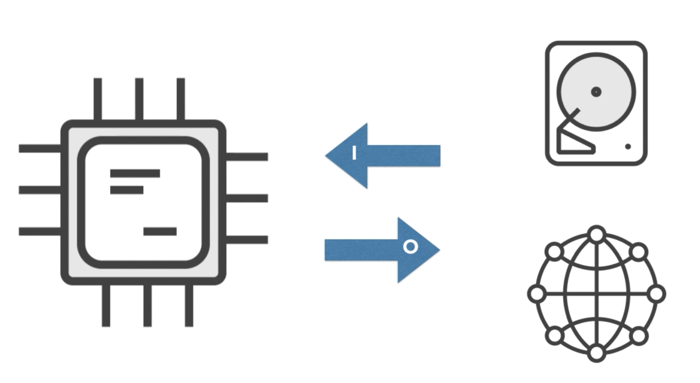
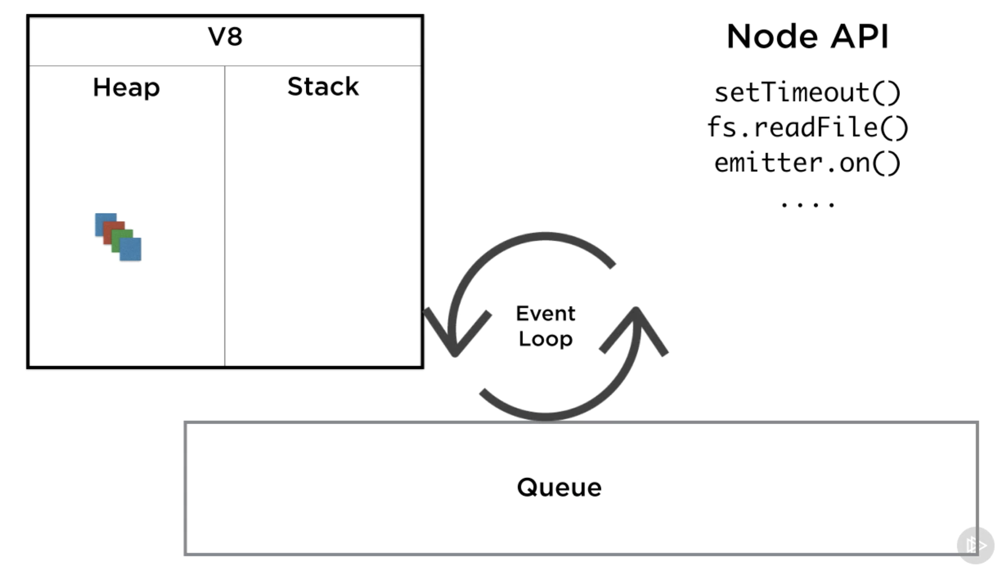
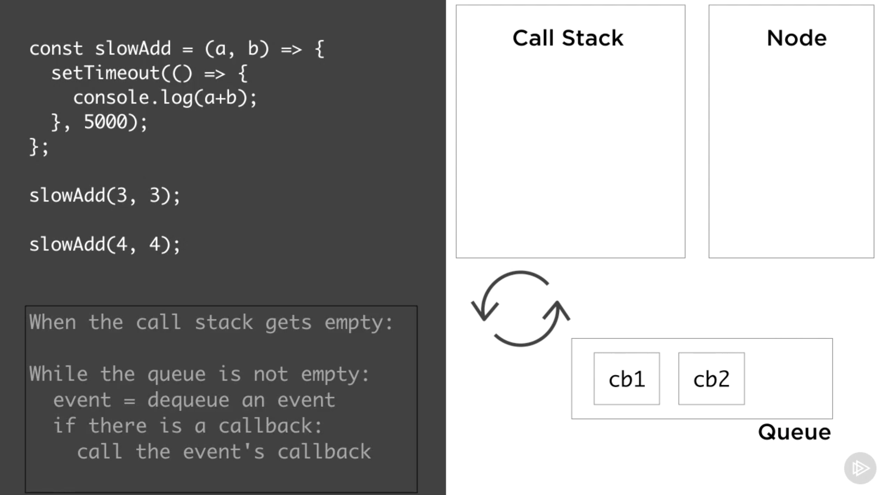

# 07 event loop

Le opérations lentes d'entrées / sorties sont géré avec un système d'événement et de fonction de rappel (`event` et `callback`).

## Opération I/O (input/output)

Ce sont toutes les opérations qui ont lieu entre le `CPU` et l'extérieur (mémoire, disques, clavier, ...).

Le `CPU` communique grâce aux signaux envoyés.

Dans le cadre de `Node.js` les `i/o` désigne la communication avec les disques ou le réseau.

Ce sont souvent ces opérations qui représentent une perte de temps.

`nginx` n'est pas `multi-threads` (contrairement à `apache` qui utilise une `thread` par requête), mais fonctionne un peu comme `Node.js` en **asynchrone**.

`Node.js` utilise `event-loop` pour gérer les requête lentes d'`i/o` sans bloquer le `runtime` principal.

## L'`event-loop`

### définition

L'entité gérant les événements extérieur, et les convertissant en invocation de fonction de rappel.

### définition 2

Une boucle piochant les événements de la queue d'événements et mettant leur focntion de rappel dans la pile d'appel.

Le `heap` (le tas) est simplement l'endroit où lamémoire pour stocker les objets ou le scope des fonctions est allouée.

Dans `v8` le code set dit bloquant, si un traitement est très long, il bloque la pile d'appel, l'`event-loop` permet d'éviter cela.

Quand la pile d'appelle est vide et tant que la `queue` n'est pas vide, on déplace la fonction de rappelle 

dans la pile d'appelle.

