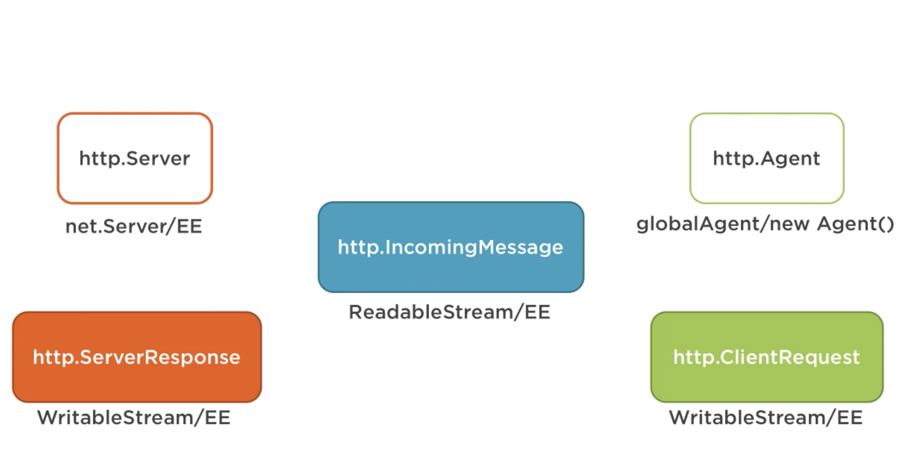

# `http request`



Ce sont les 5 classes principales de `http`.

`EE` : héritent de Event Emitter

## Exemple de `request`

```js
const http = require("http");

const req = http.request(
    {
        hostname: "www.google.com",
        method: "GET"
    },
    res => {
        console.log(res.statusCode);
        console.log(res.headers);


        // chunk est un buffer
        res.on("data", chunk => console.log(chunk.toString()));
    }
);

req.on("error", e => console.log(e));

req.end();
```

Les erreurs sont gérées comme un `event` avec un `listenner`.

## Un raccourci la méthode `get`

```js
const http = require("http");

const req = http.get(
    "http://www.google.com",
    res => {
        console.log(res.statusCode);
        console.log(res.headers);


        // chunk est un buffer
        res.on("data", chunk => console.log(chunk.toString()));
    }
);

req.on("error", e => console.log(e));
```

Pas besoin de `req.end()`.

### `request.agent`

```js
console.log(req.agent);
```

```bash
Agent {
  _events: [Object: null prototype] { free: [Function] },
  _eventsCount: 1,
  _maxListeners: undefined,
  defaultPort: 80,
  protocol: 'http:',
  options: { path: null },
  requests: {},
  sockets: { 'www.google.com:80:': [ [Socket] ] },
  freeSockets: {},
  keepAliveMsecs: 1000,
  keepAlive: false,
  maxSockets: Infinity,
  maxFreeSockets: 256
}
200
{
  date: 'Mon, 30 Mar 2020 15:55:58 GMT',
  expires: '-1',
  'cache-control': 'private, max-age=0',
  'content-type': 'text/html; charset=ISO-8859-1',
  p3p: 'CP="This is not a P3P policy! See g.co/p3phelp for more info."',
  server: 'gws',
  'x-xss-protection': '0',
  'x-frame-options': 'SAMEORIGIN',
  'set-cookie': [
    '1P_JAR=2020-03-30-15; expires=Wed, 29-Apr-2020 15:55:58 GMT; path=/; domain=.google.com; Secure',
    'NID=201=fgDA3grLtpkrtOq4v4-S0qdZk7x1XjdXhWHtQ2YJcVAj2R0Y9gGFTpadcf7DkUGyn_KN9scv8uXswPtntdrRkj9VINH3rFrVangHrS-uFDzlyh9quKyhS_xI24OVIQcE_h39Rch57LYk1HKDwbD3Xw8snLnPKuZ58l-dMTUAnlU; expires=Tue, 29-Sep-2020 15:55:58 GMT; path=/; domain=.google.com; HttpOnly'
  ],
  'accept-ranges': 'none',
  vary: 'Accept-Encoding',
  connection: 'close',
  'transfer-encoding': 'chunked'
}
```


## Les types de `http`

### dans l'exemple ci-dessus

`http.request` et `http.get` sont de type `http.ClientRequest`.

`res` est de type `http.IncomingMessage`.

`req.agent` est de type `httpAgent`.

### Dans un serveur

```js
// server: http.Server
const server = require("http").createServer()

server.on("request", (req, res) => {
    // req: http.IncomingMessage
    // res: http.serverResponse
    
    res.writeHead(200, { "Content-Type": "text/plain"});
    res.end("hello kitty\n");
})

server.listen(8080);
```


