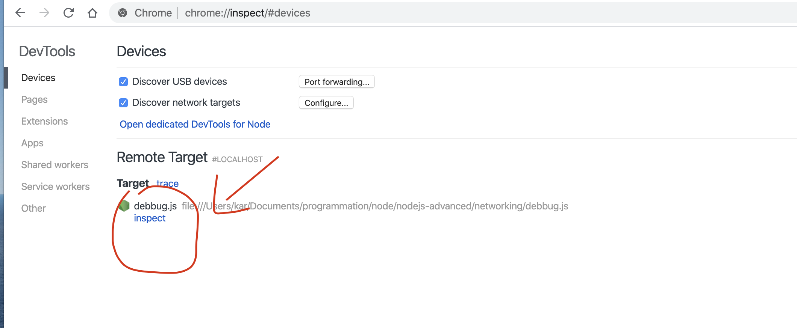
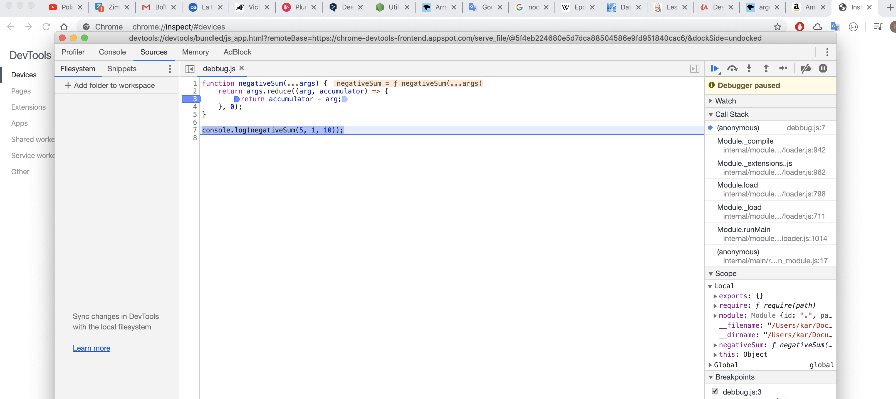

# 22 `debug`

`Node.js` posséde son propre debbuger :

```bash
node debug myscript.js
```

Déprécié maintenant c'est `inspect`

```bash
node inspect myscript.js
```

## Mettre un `break point`

Set Breakpoint `sb`

```bash
debug> sb(2)
  1 function negativeSum(...args) {
> 2     return args.reduce((arg, accumulator) => accumulator - arg, 0);
  3 }
  4 
  5 console.log(negativeSum(5, 1, 10));
  6 
debug> 
```

## continuer `cont` et observer la valeur des variables `repl`

```js
debug> repl
Press Ctrl + C to leave debug repl
> args
[ 5, 1, 10 ]
```

## `watch` pour observer une variable

```bash
debug> watch('arg')
debug> watch('accumulator')
debug> cont
break in debbug.js:3
Watchers:
  0: arg = 0
  1: accumulator = 5

  1 function negativeSum(...args) {
  2     return args.reduce((arg, accumulator) => {
> 3         return accumulator - arg;
  4     }, 0);
  5 }
debug> 
```

Pour continuer la boucle `cont`:

```js
debug> cont
break in debbug.js:3
Watchers:
  0: arg = 5
  1: accumulator = 1

  1 function negativeSum(...args) {
  2     return args.reduce((arg, accumulator) => {
> 3         return accumulator - arg;
  4     }, 0);
  5 }
```

## Chrome devtools

Dans le terminal :

```bash
node --inspect --inspect-brk debbug.js 

Debugger listening on ws://127.0.0.1:9229/11d3ea64-e685-406f-900b-dd04a712a19b
For help, see: https://nodejs.org/en/docs/inspector..
```

Dans chrome

```
chrome://inspect/#devices
```





