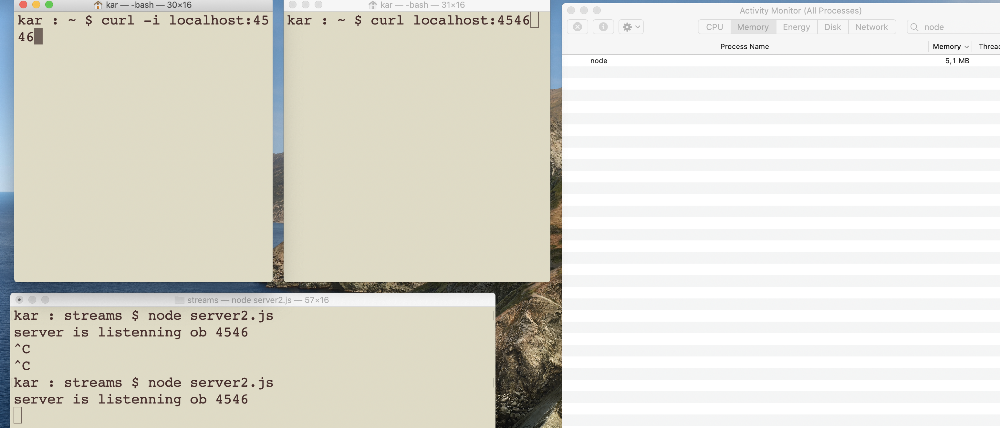
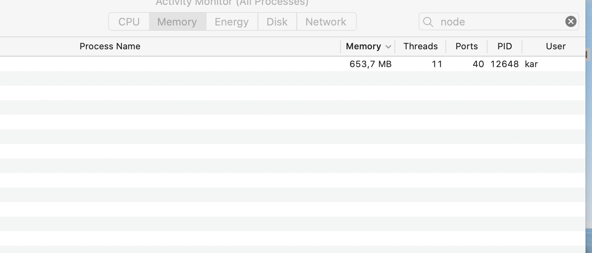
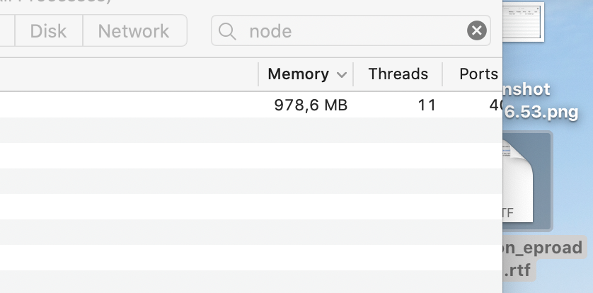
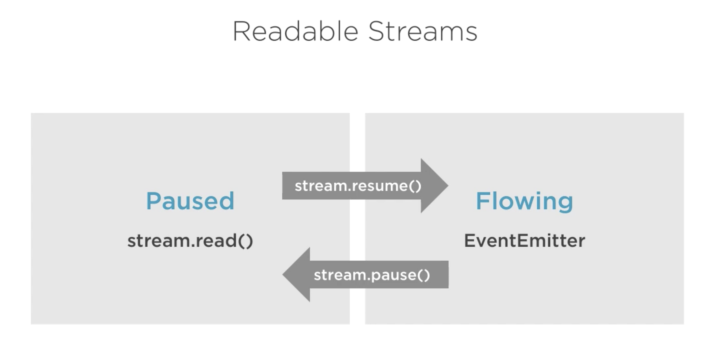

# 23 Streams

Le `stream` de `Node.js` est un peu comparable au `pipe` de Linux.

## `stream` implémentation dans `Node.js`

Beaucoup de module implémente l'interface de `stream`.

| Readable Stream              | Writable Stream                 |
| ---------------------------- | ------------------------------- |
| HTTP response, on the client | HTTP request, on the client     |
| HTTP request, on the server  | HTTP response, on the server    |
| fs read stream               | fs write stream                 |
| zlib streams                 | zlib streams                    |
| crypto streams               | Crypto streams                  |
| TCP socket                   | TCP socket                      |
| child process stdout, stderr | child process stdin             |
| process.stdin                | process.stdout,  process.stderr |

## qu'est-ce qu'un `streams`

Une collection de données non disponnible d'un coup (en une fois) et qui ne doit pas être gardée en mémoire.

##  `createWriteStream(filePath[, options])`

Nous allons d'abord créer un gros fichier :

`create-big-file.js`

```js
const fs = require("fs");

const writable = fs.createWriteStream("./bigFile.txt","utf8");

for(let i = 0; i < 10e6; i++) {
    writable.write("hello koko kiki \n");
}

writable.end();
```

#### `writable.write(data)`

Tout simplement pour écrire des données dans le fichier renseigné dans `createWriteStream`.

#### `writable.end()`

Ferme le `stream` en écriture.

```bash
ls -lh
total 360472
-rw-r--r--  1 kar  staff   162M  2 Apr 14:49 bigFile.txt
-rw-r--r--  1 kar  staff   183B  2 Apr 14:49 create-big-file.js
```

`-h` human : lisible pour un humain.

## Test sans `stream`

On va lire depuis un serveur un fichier lourd et voire l'occupation mémoire.

`server.js`

```js
const fs = require("fs");

const server = require("http").createServer();
const PORT = process.env.NODE_PORT || 8000;

server.on("request", (req, res) => {
    fs.readFile("./bigFile.txt","utf8",(err, data) => {
        if(err) throw err;

        res.end(data);
    })
})

server.listen(PORT, () => console.log(`server is listenning ob ${PORT}`))
```

On utilise ici `fs.readFile` qui ne produit pas un `stream`, le fichier rempli en un bloc la mémoire du serveur.

Situation de départ : `bigFile.txt` : `170MB` 



On lance une seule demande :



On monte à `653MB` d'occupation pour une seule demande !

Maintenant deux demandes :



`978MB` d'occupation, le serveur serait hs avec seulement quelques demandes en même temps pour un fichier de `170MB` seulement.

Avec seulement trois demandes simultanée, on est à `1.2GB`.

## Avec `stream`

Dans `Node.js`, `res` est aussi un `writable stream`, il est donc possible de lui passer un `stream readable` en entrée.

```js
const fs = require("fs");
const server = require("http").createServer();

server.on("request", (req, res) => {
    let nb = 0;
    res.writeHead(200, {
        "Content-Type": "text/plain"
    });
    
    const readable = fs.createReadStream("./bigFile.txt", {
        encoding: "utf8",
        highWaterMark: 1024*1024 // MegaBytes
    });
    readable.on("data", chunk => {
        console.log(nb++)
        res.write(chunk);   
    });

    readable.on("end", () => {
        res.end();
    });
});

const PORT = process.env.NODE_PORT || 8000;
server.listen(PORT, () => console.log(`server is listenning on ${PORT}`));
```

Ici, on utilise un `readable stream` pour passer le fichier en petits morceaux de `1MB`, taille du `buffer` défini par `highWaterMark`.

On utilise deux événements de `readable`, `"data"` à chaque fois que le `buffer` est prêt à être lu et `"end"` quand le fichier est entiérement lu.

Plus précisement voici ce que dit la documentation :

> L'événement `"data"` est émis lorsque le `stream` abandonne la propriété d'un `chunk` à un consommateur. Cela peut se produire lorsque le `stream` est commuté en `flowing mode` en appelant `readable.pipe()`, `readable.resume()`, ou en associant une `callback` au `listener` de l'événement `"data"`. L'événement `"data"` sera également émis chaque fois que la méthode `readable.read()` est appelée et qu'un `chunk` est disponible pour être renvoyé.
>

Avec la méthode plus haut, je n'obtiens pas de meilleur résultat (?)

## Avec `pipe`

```js
const fs = require("fs");
const server = require("http").createServer();

server.on("request", (req, res) => {
    res.writeHead(200, {
        "Content-Type": "text/plain"
    });

    const readable = fs.createReadStream("./bigFile.txt", {
        encoding: "utf8"
    });
    readable.pipe(res);
});

const PORT = process.env.NODE_PORT || 8000;
server.listen(PORT, () => console.log(`server is listenning on ${PORT}`));
```

Là par contre les résultats sont au rendez-vous, pour un fichier :


Pour deux fichiers :


Pour trois fichiers :


#### `readable.pipe(writable)`

Le `stream` en lecture est '*pipé*' avec un `stream` en écriture.

## Les différents types de `stream`

Il ya quatre différents types de `stream`:


| Readable                 | Writable             | Duplex                    | Transform                         |
| ------------------------ | -------------------- | ------------------------- | --------------------------------- |
| Est une source de stream | Est une destination  | stream dans les deux sens | Transforme les données au passage |
| fs.createReadStream      | fs.createWriteStream | net.Socket                | zlib.createGzip                   |

Tous les `stream` héritent de `EventEmitter`.

#### `src.pipe(dst)` est une façon simple d'utiliser les `stream`

Si les `stream` sont `duplex` on peut les *piper* comme en Linux :


Il faut choisir entre utiliser les `stream` avec les `event` ou avec `pipe`.

Il faut éviter de mixer les deux.

On peut soit implémenter les `stream` avec `require("stream")`, soit les utiliser avec `pipe` ou `events`.


Les deux événements les plus important de `readable stream` sont `"data"` et `"end"`.

Pour `writable stream`, ce sont `"drain"` et `"finish"`.

## `flowing mode` et `paused mode`

Au départ un `readable stream` est en `paused mode`.

Si on lui ajoute un `eventListener`, il passe en `flowing mode`.



