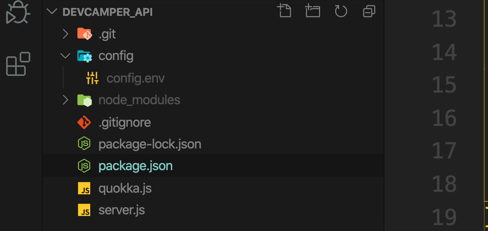

# 06 `Express`

## Création du projet

Dans un répertoire `devcamper_api`, on fait

```bash
npm init
```

Pour avoir notre fichier `package.json`

### Réglages de `script`

```json
"main": "server.js",
    "scripts": {
        "start": "NODE_ENV=production node server",
        "dev": "nodemon server"
    },
```

`NODE_ENV=production` crée une variable d'environnement accessible par le script `server.js`.

## installation des dépendances

```bash
npm i express dotenv
npm i -D nodemon # dépence de production uniquement
```

Deux dépendances, `dotenv` et `express` 

## `dotenv`

`dotenv` permet de gérer les variables d'environnement grâce à un fichier `.env`, ici on va créer l'arborescence `config/config.env`

`config.env`

```bash
NODE_ENV=development
PORT=5056
```

Ces variables sont accessibles via `process.env`.

## Création du serveur

`server.js`

```js
const express = require("express");
const dotenv = require("dotenv");

// Load env vars
dotenv.config({ path: "./config/config.env" });

const app = express();

const PORT = process.env.PORT || 8080;

app.listen(
    PORT,
    console.log(
        `Server running in ${process.env.NODE_ENV} mode on port ${PORT}`
    )
);
```

On charge le contenue de `config.env` :

####  `dotenv.config( { path: "./XXX/XXX" } )`

## `git`

On va d'abord créer un fichier `.gitignore` :

```bash
node_modules
config/config.env
```

Puis on va lancer les commandes :

```bash
git init
git add .
git commit -m "first commit"
```

##  Arborescence



