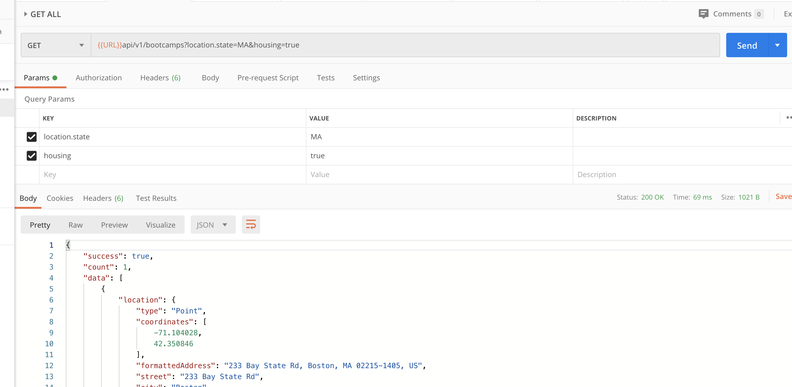
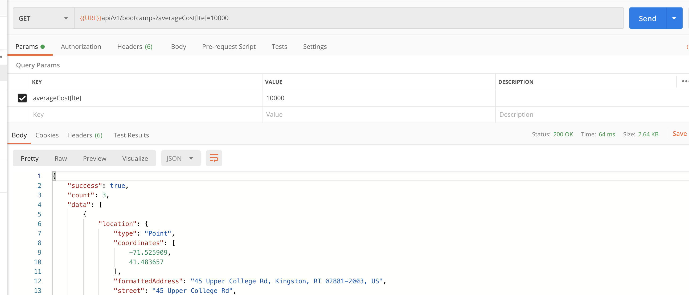
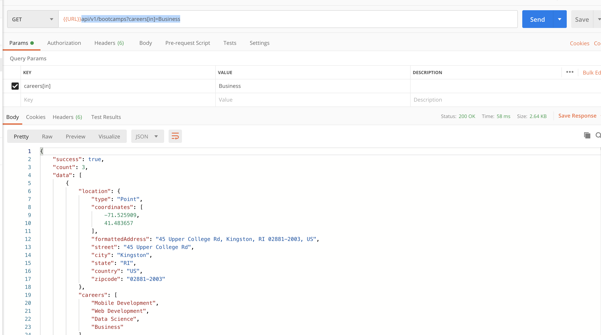

# 09 Filtering

## répondre à des requêtes de type

##  `api/v1/bootcamps?location.state=MA&housing=true`

Si dans le contrôleur on regarde `req.query` :

```js
const getBootcamps = asyncHandler(async (req, res, next) => {
    const bootcamps = await Bootcamp.find();

    console.log(req.query);

    res.status(200).json({
        success: true,
        count: bootcamps.length,
        data: bootcamps,
    });
});
```

On obtient :

```bash
{ 'location.state': 'MA', housing: 'true' }
```

On a déjà un objet prêt à être utilisé.

On peut simplement passer cet objet à `find` :

```js
const bootcamps = await Bootcamp.find(req.query);
```



Cela fonctionne, on obtient un seul bootcamp.

## `api/v1/bootcamps?averageCost[lte]=10000`

 `[lte]` : plus petit ou égal.       

Mais si on veut par exemple un champ plus petit ou égal à une valeur  :


Cela ne fonctionne plus.

Voyons ce qu'on reçoit avec `console.log(req.query)` :

```json
{ averageCost: { lte: '10000' } }
```

Il manque juste le `$` devant `lte` pour que la syntaxe de la requête soit correcte.

On va modifier notre contrôleur :

```js
const getBootcamps = asyncHandler(async (req, res, next) => {
    let query;

    let queryStr = JSON.stringify(req.query);
    queryStr = queryStr.replace(/\b(lt|lte|gt|gte|in)\b/g,match => `$${match}`);
    console.log(queryStr);

    const bootcamps = await Bootcamp.find();

    res.status(200).json({
        success: true,
        count: bootcamps.length,
        data: bootcamps,
    });
});
```

`\b` est une limite de mot dans une regex.

On obtient une requête syntaxiquement correcte :

```bash
{"averageCost":{"$lte":"10000"}}
```

## Le contrôleur modifié

`controllers/bootcamps.js`

```js
const getBootcamps = asyncHandler(async (req, res, next) => {
    let query;

    let queryStr = JSON.stringify(req.query);
    queryStr = queryStr.replace(/\b(lt|lte|gt|gte|in)\b/g,match => `$${match}`);
    console.log(queryStr);

    query = JSON.parse(queryStr);

    const bootcamps = await Bootcamp.find(query);

    res.status(200).json({
        success: true,
        count: bootcamps.length,
        data: bootcamps,
    });
});
```

Réponse :



Maintenant le `query` fonctionne correctement.

## Example complexe:

```bash
api/v1/bootcamps?averageCost[lte]=10000&location.city=Boston
```

Attention à la case ! `Boston` avec `B` majuscule.

```json
{
    "success": true,
    "count": 1,
    "data": [
        {
            "location": {
                // ...,
                "city": "Boston",
                // ...
            },
            // ...
            "averageCost": 10000,
            // ...
        }
    ]
}
```

---

```bash
api/v1/bootcamps?careers[in]=Business
```



