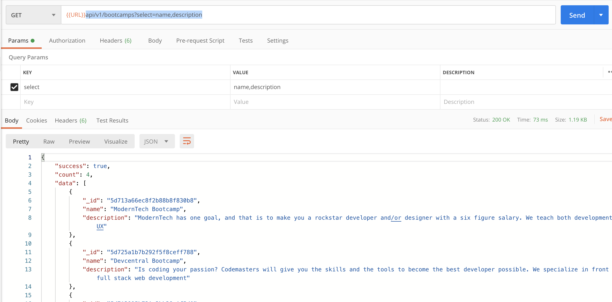
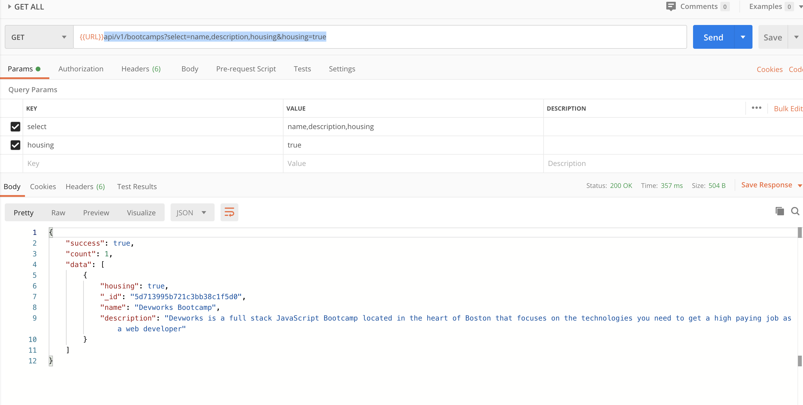
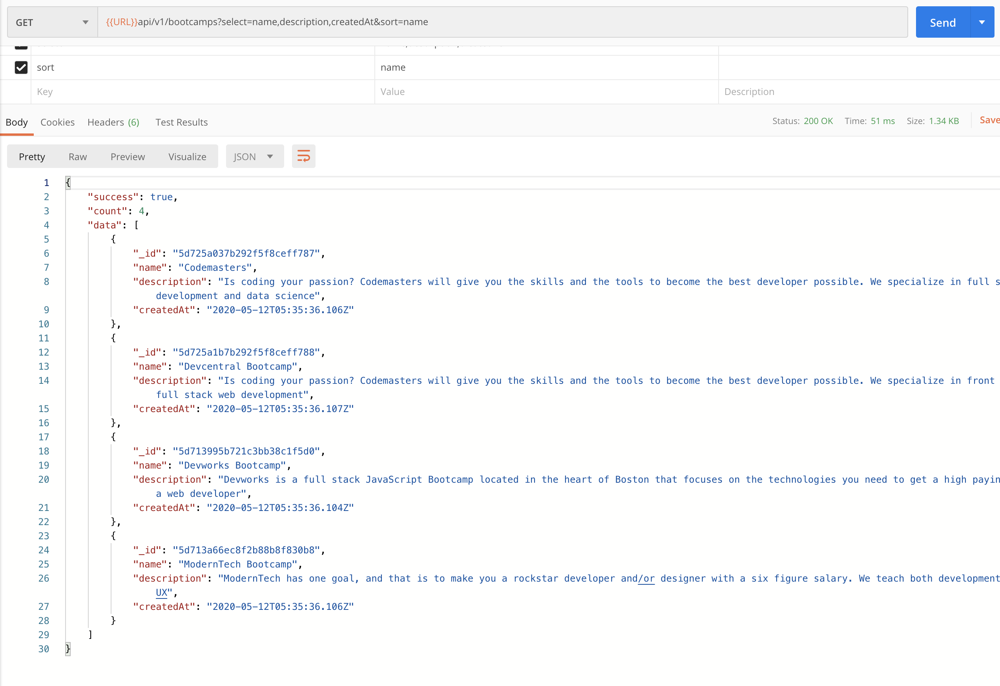
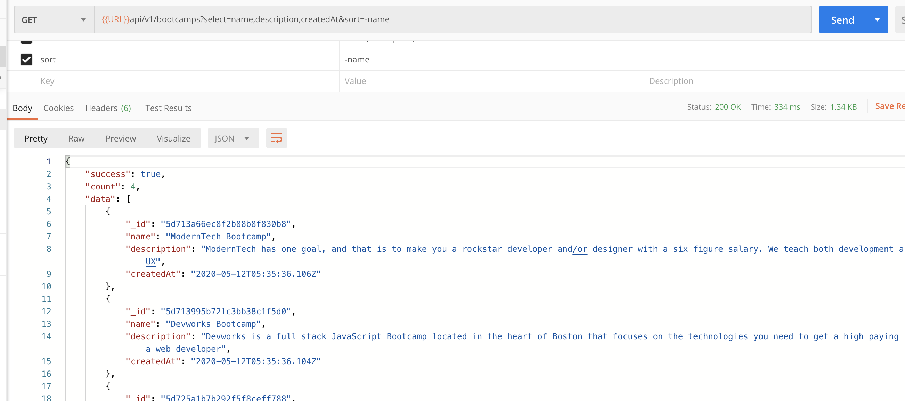

# `Select` et `sorting`

Pour choisir des champs particuliers dans le document.

## `api/v1/bootcamps?select=name,description`

`controllers/bootcamps.js`

```js
const getBootcamps = asyncHandler(async (req, res, next) => {
    console.log("req.query", req.query);
    let query;

    // Copy req.query
    const reqQuery = { ...req.query };

    // Fields to exclude
    const removeFields = ["select"];

    // Loop over removeFields and delete them from reqQuery
    removeFields.forEach((param) => delete reqQuery[param]);

    // Create query string
    let queryStr = JSON.stringify(reqQuery);

    // Create operators $gt, $gte, ...
    queryStr = queryStr.replace(
        /\b(lt|lte|gt|gte|in)\b/g,
        (match) => `$${match}`
    );

    // Finding ressource
    query = Bootcamp.find(JSON.parse(queryStr));

    // select fields
    if(req.query.select) {
        const fields = req.query.select.split(",").join(" ");
        query = query.select(fields);
    }

    // executing query
    const bootcamps = await query;

    res.status(200).json({
        success: true,
        count: bootcamps.length,
        data: bootcamps,
    });
});
```

On fait une copie de la requête, on enlève le `select`.

On transforme la valeur de la propriété `req.query.select` en transformant la virgule en espace pour pouvoir utiliser `Query.select`.

> Dans la documentation de Mongoose :
> ```js
> query.select('a b');
> ```
>
> On voit que les propriété sont séparées par un espace.

#### ! `select` est une méthode de `Query` pas de `Model`.

```js
query = query.select(fields);
```



## Sélection et filtrage

#### `api/v1/bootcamps?select=name,description,housing&housing=true`



## `sort` : trie

`controllers/bootcamps.js`

```js
// ...

// Fields to exclude
const removeFields = ["select", "sort"];

// ...

// Sort
if(req.query.sort) {
    const sortBy = req.query.sort.split(",").join(" ");

    query = query.sort(sortBy);
} else {
    query = query.sort("-createdAt");
}

// executing query
const bootcamps = await query;

// ...
```

Même logique que pour le `select` avec la méthode `sort`.

le signe `-` signifie descendant.

Par défaut (`else`) on trie par la date de création.

#### `api/v1/bootcamps?select=name,description,createdAt&sort=name`



### Maintenant descendant

#### `api/v1/bootcamps?select=name,description,createdAt&sort=-name`



