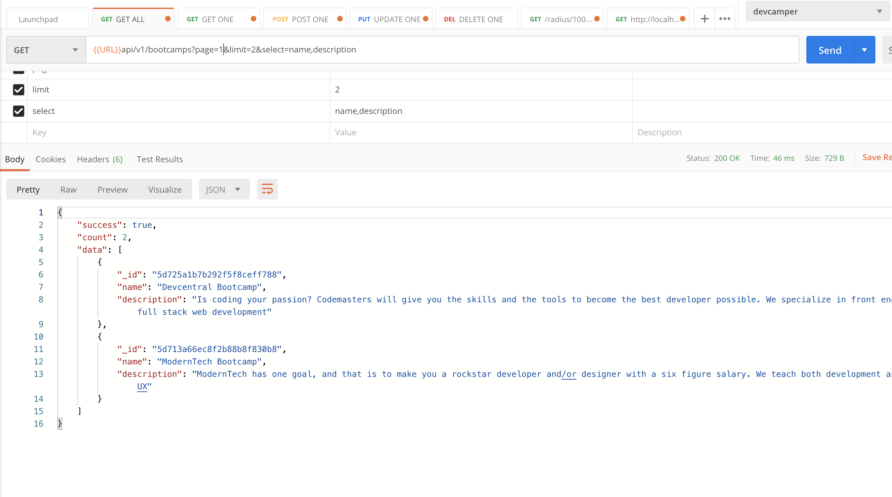
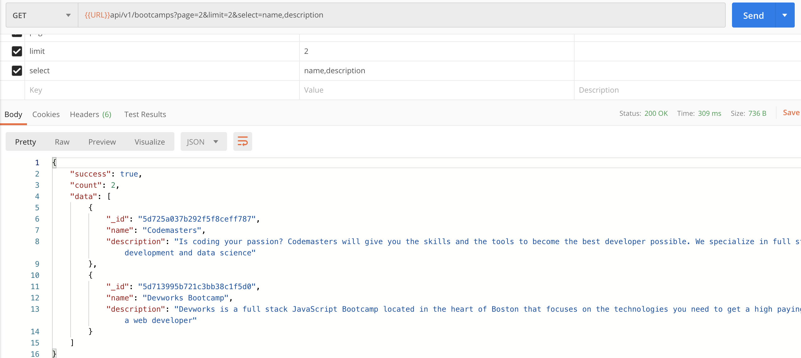
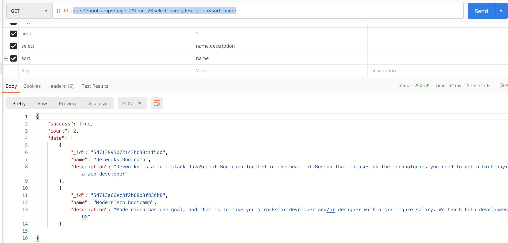

# 11 pagination

On veut pouvoir effectuer des requêtes de type :

#### `api/v1/bootcamps?page=2&limit=2&select=name,description`

`controllers/bootcamps.js`

```js
const getBootcamps = asyncHandler(async (req, res, next) => {
    // ...

    // Fields to exclude
    const removeFields = ["select", "sort", "page", "limit"];

    // ...

    // pagination
    const limit = parseInt(req.query.limit, 10) || 1;
    const page = parseInt(req.query.page, 10) || 10;
    const skip = (page - 1) * limit;


    query = query.skip(skip).limit(limit);

    // executing query
    const bootcamps = await query;

    // ...
});
```

Utilisation des méthodes de `Query` : `skip` et `limit`.



Et maintenant la `page 2` :



Et classé par nom :

#### `api/v1/bootcamps?page=2&limit=2&select=name,description&sort=name`



## Création d'un objet `pagination` pour le `frontend`

`controllers/bootcamps.js`

```js
const getBootcamps = asyncHandler(async (req, res, next) => {
    // ...

    // Fields to exclude
    const removeFields = ["select", "sort", "page", "limit"];

    // ...

    // pagination
    const limit = parseInt(req.query.limit, 10) || 25;
    const page = parseInt(req.query.page, 10) || 1;
    const startIndex = (page - 1) * limit;
    const endIndex = page * limit;
    const total = await Bootcamp.countDocuments();

    query = query.skip(startIndex).limit(limit);

    // executing query
    const bootcamps = await query;

    // pagination result
    const pagination = {};

    if (endIndex < total) {
        pagination.next = {
            page: page + 1,
            limit,
        };
    }

    if (startIndex > 0) {
        pagination.prev = {
            page: page - 1,
            limit,
        };
    }

    res.status(200).json({
        success: true,
        count: bootcamps.length,
        pagination,
        data: bootcamps,
    });
});
```

### `Bootcamp.countDocuments`

```js
const total = await Bootcamp.countDocuments();
```

nous renvoie le nombre total de documents.

Simplicité de l'utilisation de `await`.

`api/v1/bootcamps?page=1&limit=1&select=name`

```json
{
    "success": true,
    "count": 1,
    "pagination": {
        "next": {
            "page": 2,
            "limit": 1
        }
    },
    "data": [
        {
            "_id": "5d725a1b7b292f5f8ceff788",
            "name": "Devcentral Bootcamp"
        }
    ]
}
```

---

`api/v1/bootcamps?page=2&limit=1&select=name`

```json
{
    "success": true,
    "count": 1,
    "pagination": {
        "next": {
            "page": 3,
            "limit": 1
        },
        "prev": {
            "page": 1,
            "limit": 1
        }
    },
    "data": [
        {
            "_id": "5d713a66ec8f2b88b8f830b8",
            "name": "ModernTech Bootcamp"
        }
    ]
}
```

---

`api/v1/bootcamps?page=4&limit=1&select=name`

```json
{
    "success": true,
    "count": 1,
    "pagination": {
        "prev": {
            "page": 3,
            "limit": 1
        }
    },
    "data": [
        {
            "_id": "5d713995b721c3bb38c1f5d0",
            "name": "Devworks Bootcamp"
        }
    ]
}
```

