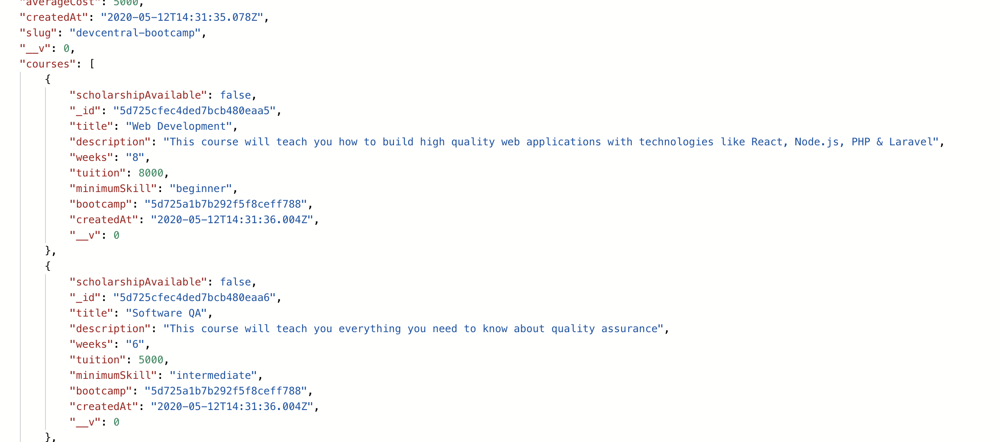
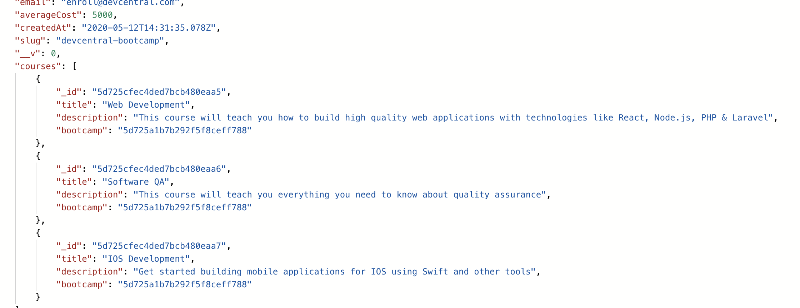

# 15 `virtual`

On veut avoir le `bootcamp` et les `courses` qui s'y rapportent.

On doit créer un attribut dit `virtual`.

## Modification du `Schema` de `Bootcamp`

`models/Bootcamp.js`

```js
const BootcampSchema = new mongoose.Schema({
    // ...
    createdAt: {
        type: Date,
        default: Date.now,
    },
}, {
    toJSON: { virtuals: true },
    toObject: { virtuals: true }
});
```

À la fin on ajoute un objet `options` pour pouvoir virtualiser.

Puis tout en bas de notre fichier :

```js
// reverse populate with virtuals
BootcampSchema.virtual('courses', {
    ref: "Course",
    localField: "_id",
    foreignField: "bootcamp",
    justOne: false
});

module.exports = mongoose.model("Bootcamp", BootcampSchema);
```

On crée se qui pourrait être une jointure en `SQL`.

On a un attribut `virtual` nommé `courses` qui sera un tableau des cours se rapportant au `bootcamp`.

## Modification du contrôleur

`controllers/bootcamps.js`

```js
const getBootcamps = asyncHandler(async (req, res, next) => {
    // ...
    // Finding ressource
    query = Bootcamp.find(JSON.parse(queryStr)).populate("courses");

    // ...
});
```

On peut ainsi exécuter un `reverse populate`.



On peut comme précédemment restreindre les champs souhaités :

```js
query = Bootcamp.find(JSON.parse(queryStr)).populate({
        path: "courses",
        select: "title description",
    });
```



