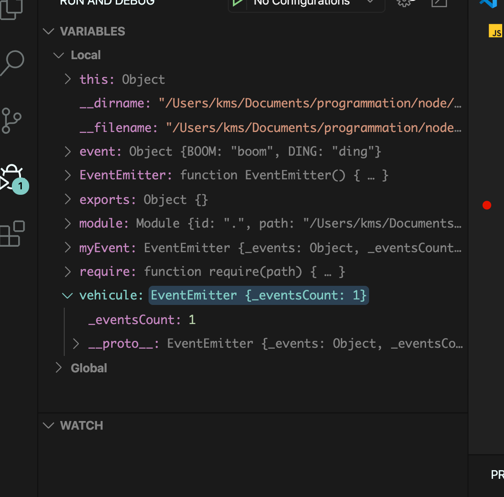

# 02 Event

Deux système d'événement existe dans `Node.js`.

## System Events

Il fait partie du `Core C++` de `Node.js`, est construit sur `libuv` et réagit aux événements du système :

- un fichier a été créé
- une requête a reçu une réponse
- etc.

## Custom Events

Il fait partie du `Javascript Core`, il est construit sur `Event Emitter`, il permet au développeur de créer ses propres événements. Il agit de manière synchrone.


Parfois les événement de `libuv` utilisent `Custom Events` en surcouche pour être manipulés dans `Javascript`.

### Mon propre `Event Emitter` 

```js
class EventEmitter {
    constructor() {
        this.listCallback = [];
    }

    emit(customEvent) {
        if (this.listCallback[customEvent]) {
            this.listCallback[customEvent].forEach(callback => callback());
        } else {
            console.log(`no event nammed ${customEvent}`);
        }
    }

    on(customEvent, callback) {
        this.listCallback[customEvent] = this.listCallback[customEvent] || [];
        this.listCallback[customEvent].push(callback);
    }
}

module.exports = EventEmitter;
```

### L'`Event Emitter` de Node.js

```js
const EventEmitter = require("events");

const myEvent = new EventEmitter();

myEvent.on("boom", () => console.log("boom"));
myEvent.on("boom", () => console.log("badaboum boom"));

myEvent.on("ding", () => console.log("ding"));
myEvent.on("ding", () => console.log("dong"));
myEvent.on("ding", () => console.log("ding dong"));

myEvent.emit("boom");
myEvent.emit("ding");
```

```bash
boom
badaboum boom
ding
dong
ding dong
```

## Magic String

Lorsqu'une chaîne de caractères prends un sens dans l'application comme les événements `"boom"` et `"ding"`, on appelle cela un `magic string`.
C'est une mauvaise pratique dans le sens où l'IDE aura du mal a trouver une erreur liée à un `magic string`.

À la place on va créer un fichier `config.js`

```js
module.exports = {
    event: {
        BOOM: "boom",
        DING: "ding"
    }
};
```

Puis dans `app.js`

```js
const EventEmitter = require("events");
// const event = require("./config").event;
const { event } = require("./config");  // assignation par décomposition

const myEvent = new EventEmitter();

myEvent.on(event.BOOM, () => console.log("boom"));
myEvent.on(event.BOOM, () => console.log("badaboum boom"));

myEvent.on(event.DING, () => console.log("ding"));
myEvent.on(event.DING, () => console.log("dong"));
myEvent.on(event.DING, () => console.log("ding dong"));

myEvent.emit(event.BOOM);
myEvent.emit(event.DING);
```

## `Object.create` et `prototype`

```js
const EventEmitter = require("events");
const { event } = require("./config");

const myEvent = new EventEmitter();

const vehicule = Object.create(myEvent);
// const vehicule = {};
// vehicule.__proto__ = myEvent;

vehicule.on(event.DING, () => console.log("tiut tiut"));

vehicule.emit(event.DING);

```




## Passer des données à un événement

```js
vehicule.on(event.DING, data => console.log("tiut tiut", data.cat));

vehicule.emit(event.DING, { cat: "minou" });
```

```bash
tiut tiut minou
```

En deuxième arguments de `.emit` on peut fournir une donnée.

On la récupère dans la fonction `callback` de `.on`.

## Hériter de `EventEmitter` avec une fonction constructeur

```js
const EventEmitter = require("events");
const util = require("util");

function Bot() {
    EventEmitter.call(this);
    this.name = "Bot";
}

util.inherits(Bot, EventEmitter);

Bot.prototype.say = function() {
    console.log(`Hey I'm ${this.name}`);
};

const b = new Bot();

b.say();

b.on("boom", function() {
    console.log(`What the f*** I'm ${this.name} and i ear BOOM`);
});

b.emit("boom");
```

```
Hey I'm Bot
What the f*** I'm Bot and i ear BOOM
```

On utilise ici `util.inherits`, c'est assez compliqué.

```js
EventEmitter.call(this);
```

Peut être vu comme :

```js
super(this)
```

On passe la valeur de `this` au constructeur du parent.

## Ralenti

```js
function Person(firstname, lastname) {
    this.firstname = firstname;
    this.lastname = lastname;
}

Person.prototype.say = function() {
    console.log(`Hello I'm ${this.firstname} - ${this.lastname}`);
};
```

On défini une fonction constructeur et on ajoute une méthode à son `prototype`.

```js
const p = {};

Person.apply(p, ["Michel", "Michelot"]);

// Person("Michel", "Michelot") {
//	p.fisrtname = "Michel";
//  p.lastname = "Michelot"
//}
```

On crée un objet vide `p`.

On exécute `Person` avec pour valeur de `this` l'objet `p` en lui passant `firstname` et `lastname`.

À cet étape `p` ressemble à ça ;

```js
{
  firstname: "Michel",
  lastname: "Michelot"
}
```

```js
p.__proto__ = Person.prototype;
```

Maintenant on a : 

```js
{
  firstname: "Michel",
  lastname: "Michelot",
  __proto__: Person.prototype
}
```

On peut donc appeler `say()`

```js
p.say() // Hello I'm Michel - Michelot
```

## Ralenti 2

```js
function Person(firstname, lastname) {
    this.firstname = firstname;
    this.lastname = lastname;
}

Person.prototype.say = function() {
    console.log(`Hello I'm ${this.firstname} - ${this.lastname}`);
};
```
On défini une fonction constructeur `Person`

```js
function Policeman(firstname, lastname, grade) 
    Person.call(this, firstname, lastname);
    this.grade = grade;
}
```
On appelle `Person.call`dans la focntion constructeur pour lier `this` avec les attributs de `Person`

```js
Policeman.prototype.bang = function() {
    console.log(
        `Hey I'm ${this.firstname} and my grade is ${this.grade} bang bang !`
    );
};

const pm = new Policeman("Bob", "Walker", "officer");

// pm.say();

pm.bang();
```

```
Hey I'm Bob,Walker and my grade is officer bang bang !
```

Cela fonctionne bien mais si on invoque une méthode du parent `Person` :

```js
pm.say();

pm.bang();
```

```
pm.say();
   ^

TypeError: pm.say is not a function
```

Il faut lier dans la chaîne de prototype `Person` à `Policeman` :

```js
// ...
Policeman.prototype.__proto__ = Person.prototype;

const pm = new Policeman("Bob", "Walker", "officer");

pm.say();

pm.bang();
```

```
Hello I'm Bob - Walker
Hey I'm Bob and my grade is officer bang bang !
```

## Nouvelle syntaxe

```js
const EventEmitter = require("events");

class Bot extends EventEmitter {
    name = "Bot";

    say() {
        console.log(`hello I'm ${this.name}`);
    }
}

const b = new Bot();

b.say();

b.on("bim", function() {
    console.log(`Hey I'm ${this.name} and I ear bim`);
});

b.emit("bim");
```

```
hello I'm Bot
Hey I'm Bot and I ear bim
```

C'est beaucoup plus limpide.

Si on ne fournit pas de constructeur un par défaut sera appelé :

```js
// constructeur par défaut
constructor() {}
// constructeur par défaut des classes dérivées
constructor(...args) { 
  super(...args);
}
```

