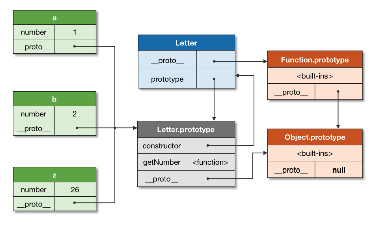

# 03 Programmation Orienté Object en `Javascript`

## Variable de classe `static`

### Avec une fonction constructeur

```js
function Bot(name) {
    this.name = name;

    Bot.count++; // on incrémente dans le constructeur
}

Bot.count = 0;  // déclaration et affectation de la variable statique de classe

Bot.prototype.total = function() {
    return Bot.count;
};

const a = new Bot("Al");
const b = new Bot("Bee");

b.total(); //? 2

const c = new Bot("Cid");

c.total(); //? 3
```

### Avec les `class`

```js
class Bot {
    static count = 0;
    
    constructor(name) {
        this.name = name;
        Bot.count++;
    }

    accedStatic() {
        return Bot.count;
    }
  
}

const a = new Bot("Al");
a.accedStatic(); //? 1

const b = new Bot("Bul");
b.accedStatic(); //? 2
```

#### ! C'est une syntaxe expérimentale qui ne fonctionne pas partout.

### Variable static de fonction

```js
function helloYou() {
    console.log("hello you !");

    helloYou.count ? 
      	helloYou.count++ : 
    		(helloYou.count = 1);
    console.log(helloYou.count);
}

helloYou();
helloYou();
helloYou();
```

```bash
hello you !
1
hello you !
2
hello you !
3
```

## Propriété privée et son accesseur 

```js
function Bot(name) {
    const secret = "this is a secret ...";
    this.name = name;
    this.getSecret = function() {
        return secret;
    }
}

const a = new Bot("Al");
a.getSecret(); //? this is a secret ...
```

C'est un cas où on utilise pas `prototype` pour définir la méthode.



Ce schéma montre que `oneObject.prototype` est un objet de la fonction constructeur qui sera passé comme prototype aux objets créé via cette même fonction.

## propriété privée nouvelle syntaxe `#myPrivate`

```js
class Bot {
    static count = 0;
    #secret = "one secret";

    constructor(name) {
        this.name = name;
        Bot.count++;
    }

    accedStatic() {
        return Bot.count;
    }

    getSecret() {
        return this.#secret;
    }
}

const a = new Bot("Al");
a.getSecret(); //? one secret
```

