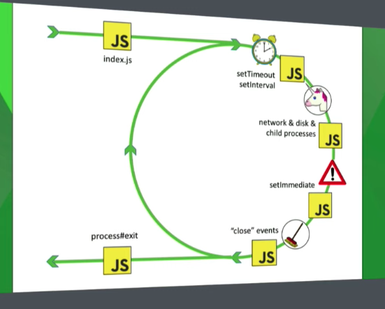
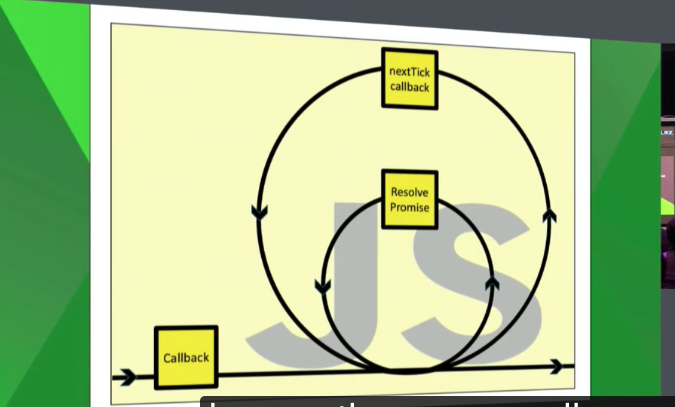
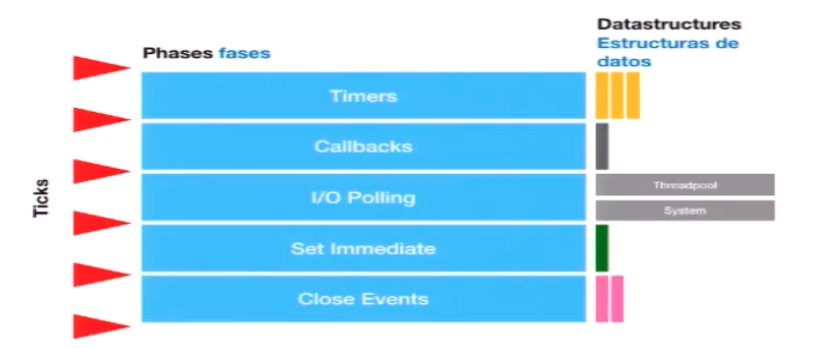
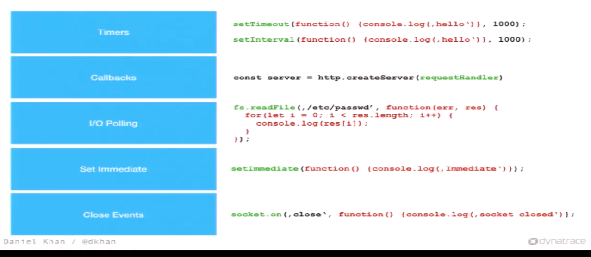

# 04 L'`event loop` de nodes.js



4 étapes

- setTimeout
- call system disque et réseau (libuv)
- setImmediate
- close "events"

Les `promise` et `nextTick` ont leur propre `loop` dans chaque boîte jaune plus haut :



`Node.js` tourne dans une seule `thread`

Toutes les entrées/sorties sont `asynchrones`

`libuv` fourni une `event loop` et un `thread pool`

Il y a `4 thread` possible dans le `thread pool`

Tout ce qui peut être traité de manière asynchrone déjà par le système sont simplement envoyé au système.

## `event loop` == phases



Les `Ticks` sont des inter-phases.



i/o polling = interrogation entrée/sortie

to poll = interrogé

next tick = prochaine case à coché (prochaine coche)

## Test de `event loop`

```js
const fs = require("fs");
const path = require("path");
const http = require("http");

function fibonacci(n) {
    if (n === 0) {
        return 0;
    } else if (n === 1) {
        return 1;
    } else if (n === 2) {
        return 1;
    } else {
        return fibonacci(n - 2) + fibonacci(n - 1);
    }
}

process.stdout.write("\n\n____________START______________\n\n");

// PROMISE

const p = Promise.resolve("PROMISE : p.then()");

p.then(data => {
    process.stdout.write("FIRST " + data + "\n\n");
});

// NEXT TICK
process.nextTick(() => {
    process.stdout.write("Next Tick 1: nextTick()\n\n");
});

// 1 IO POLLING
// Asynchronously reads the entire contents of a file
fs.readFile(path.join(__dirname, "data", "lorem.txt"), (err, res) => {
    process.stdout.write("1. THREADPOOL POLLING : readFile()\n");
    process.stdout.write(res + "\n\n");
});

// PROMISE
p.then(data => {
    process.stdout.write("SECOND " + data + "\n\n");
});

// IO POLLING 2
let rawData = "";

http.get("http://www.google.be", res => {
    res.on("data", chunk => {
        rawData += chunk;
    });
    res.on("end", () => {
        process.stdout.write("2. SYSTEM POLLING : get()\n");
        process.stdout.write(rawData.slice(0, 80) + "\n\n");
    });
});

// 3 SET IMMEDIATE
setImmediate(() => {
    process.stdout.write("3. SET IMEDIATE\n\n");
});

// 4. SET TIMEOUT
setTimeout(() => {
    process.stdout.write("4. SET TIMEOUT\n\n");
}, 0);

// PROMISE
p.then(data => {
    process.stdout.write("THIRD " + data + "\n\n");
});

// 5. ASYNC CALLBACK / USERLAND
process.stdout.write(
    "5. fibonnacci(20) " + fibonacci(20) + " ASYNC CALLBACK / USERLAND\n\n"
);

// 6. NEXT TICK
process.nextTick(() => {
    process.stdout.write("NEXT TICK 2 : nextTick()\n\n");
});

// PROMISE
p.then(data => {
    process.stdout.write("FOURTH " + data + "\n\n");
});
```

```bash
____________START______________

5. fibonnacci(20) 6765 ASYNC CALLBACK / USERLAND

Next Tick 1: nextTick()

NEXT TICK 2 : nextTick()

FIRST PROMISE : p.then()

SECOND PROMISE : p.then()

THIRD PROMISE : p.then()

FOURTH PROMISE : p.then()

4. SET TIMEOUT

3. SET IMEDIATE

1. THREADPOOL POLLING : readFile()
Lorem, ipsum dolor sit amet consectetur adipisicing elit. Quisquam molestiae at
odio?

2. SYSTEM POLLING : get()
<!doctype html><html itemscope="" itemtype="http://schema.org/WebPage" lang="nl-
```

On obtient :

1. Traitement long (mais dans le thread principal du code)
2. `nextTick()`
3. Promise `p.then()`
4. `setTimeout`
5. `setImmediate`
6. accès disque `readFile()`
7. accès réseaux `http.get()`

