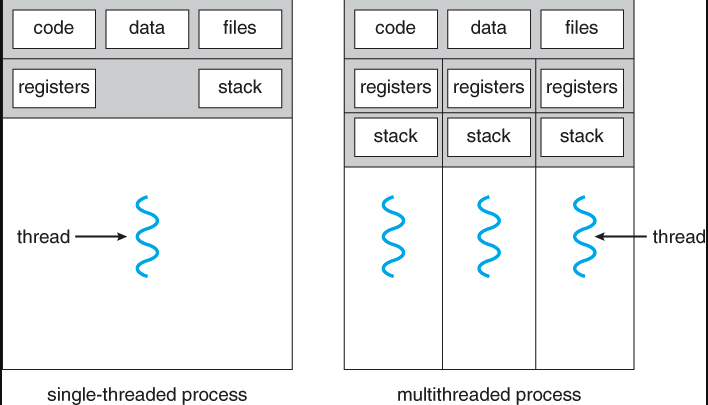
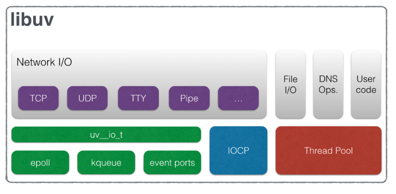

# 05 Code asynchrone et `Libuv`

Un code asynchrone est un code qui peut s'exécuté en parallèle, sur plusieurs `thread`.

Un code synchrone est une ligne droite ou chaque ligne est exécuté à la suite de l'autre => un seul `thread`.

### `Process` = `Processus` 

c'est un programme complet qui peut être multi thread et qui a son propre espace mémoire partagé par ses variables et isolé des autres `processus`.

### `thread` = `fil d'execution` = `unité de traitement`

C'est une utilisation basique du `cpu` avec sa `propre pile d'exécution` = `stack`.

Plusieurs `thread` peuvent exister dans un même `processus`, et se partagent les ressources.

`task` peut être synonyme de `process` ou de `thread`.

C'est une unité d'exécution.

## System Events - `libuv`

`libuv` est une librairie faisant parti du `Core C++`, elle permet de gérer les événement venant du système d'exploitation lier à la machine.

Elle est spécialement créée pour traiter les opérations de plus bas niveau. 

Toutes les opérations de `file system` , `network`, `database connexion` sont géré de manière non-bloquante pour `V8` en asynchrone par `libuv`.

`libuv` est écrit sur le modèle `event-driven` Entrée/sortie Asynchrone.

`libuv` est ecrit en `C` à 94,6 %

`I/O polling` = interrogation des entrées / sorties.

