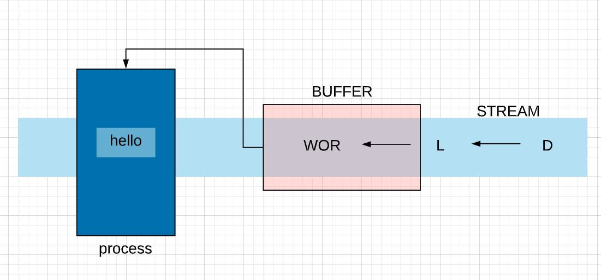
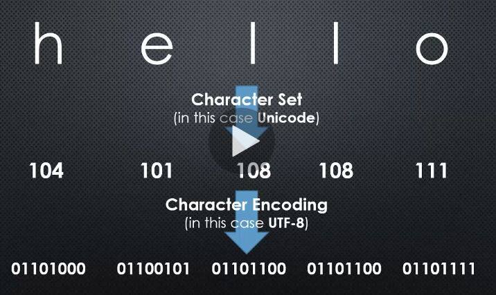
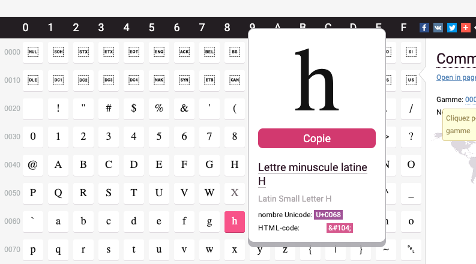

# 06 Buffers

## Streams et buffers

`buffer` = `mémoire tampon` c'est une zone mémoire temporaire permettant d'entreposer des données déplacées d'un endroit à l'autre.

Un `buffer` est intentionnellement limité en taille (pour des raisons de performances).

Les données arrivent dans le `buffer` qui une fois rempli, les renvoient à une autre place.

Le mouvement de ces données est le `stream`.

`stream` = séquence de données rendu disponible au cours du temps : un flux de données.



## Data binaire, encodage et Character set (jeux de caractères)

bit = binary digit

Base 2 = Binary = Binaire

`character set` = la représentation d'un caractère par un nombre.

`unicode` `ascii`


`character encoding` = comment un caractère est enregistré en binaire.

`utf-8` encodage sur 8 bits minimum.

`e` -> `101` -> `01100101` (`utf-8`)



`character set` -> Quel nombre on utilise pour représenter un caractère

`character encoding` -> combien de bits on utilise pour enregistrer le code numérique d'un caractère.

## Les `buffers` dans `Node.js`

`Buffer` fait partie de l'objet `global`.

Il n'y a donc pas besoin d'utiliser `require`.

### `Buffer.alloc`

L'utilisation de `new Buffer(string, encodage)` est dépréciée.

```js
// deprecated
// const buff = new Buffer("hello", "utf8"); // utf8 by default
const buff = new Buffer.alloc(4, "hello", "utf8"); // utf8 by default

console.log(buff);
```

```
<Buffer 68 65 6c 6c>
```

Le premier argument est la taille du buffer (en octet).

Ensuite on passe le contenu et l'encodage : `utf8`.

Pour les valeurs aller sur https://unicode-table.com/fr/.

Pour `h` on a :



`104` est la valeur décimale ce qui fait `01101000` en binaire et `0110` => `6` `1000` => `8`, ce qui fait `68` en hexadécimal.

### `buff.toString`

```js
console.log(buff.toString());
```

```
hell
```

Permet de retransformer le `Buffer` en texte.

### `buff.toJSON`

### `buff[2]`

On peut utiliser un `Buffer` comme un tableau.

```js
console.log(buff.toJSON());

console.log(buff[2]); // like an array
```

```js
{ type: 'Buffer', data: [ 104, 101, 108, 108 ] }
108
```

Pour récupérer la lettre `String.fromCharCode`

```js
console.log(String.fromCharCode(buff[3]));
l
```


### `buff.write`

enfin on peut réécrire dans le `Buffer` en sachant que les données précédentes sont écrasés.

```js
buff.write("pu");
console.log(buff.toString());
```

```
pull
```

`h` et `e` ont été écrasés par `p` et `u`, les deux `l` sont ceux du début.

## Typed Arrays ES6

```js
const buffer = new ArrayBuffer(8); // 8 bytes, V8 feature

const view = new Int32Array(buffer);

view[0] = 5;
view[1] = 23;

console.log(view);

view[2] = 77;

console.log(view);
```

```js
Int32Array [ 5, 23 ]
Int32Array [ 5, 23 ]
```

On voit que si on ajoute un nombre et que le tableau est déjà rempli, celui-ci n'est pas pris en compte.

Le `buffer` étant de 8 bytes, on peut stocker seulement deux nombres de 32bits chacun :

`8 bytes * 8 bits = 2 * 32 bits`.

### Exemple de troncature

```js
view[0] = 9.9876543;  // 9
view[1] = 0.4876543;  // 0
view[2] = -9.9876543;  // -9
```

