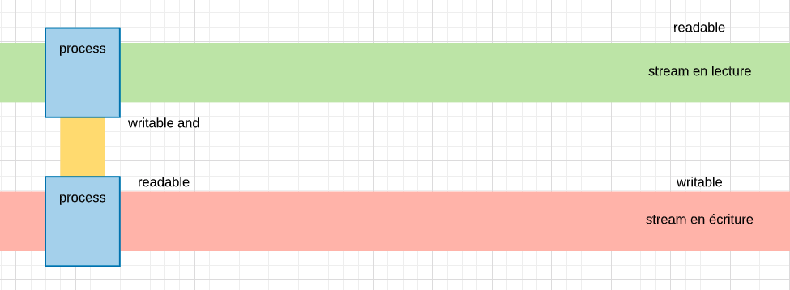

# 08 les `Streams`

#### Les `streams` sont des tableaux de données en accès au cours du temps.

`chunk` un morceau de donnée envoyer via un `stream`.

Les données sont découpées en `chunks` et envoyées dans le ` stream` (`streamed`).

Les `stream` sont construits sur les `EventEmitter` :

`node/lib/internal/streams/legacy.js`

```js
'use strict';

const {
  ObjectSetPrototypeOf,
} = primordials;

const EE = require('events');

function Stream(opts) {
  EE.call(this, opts);
}
ObjectSetPrototypeOf(Stream.prototype, EE.prototype);
ObjectSetPrototypeOf(Stream, EE);
```

Il y a plusieurs type de `stream` :

```js
Stream.Readable = require('_stream_readable');
Stream.Writable = require('_stream_writable');
Stream.Duplex = require('_stream_duplex');
Stream.Transform = require('_stream_transform');
Stream.PassThrough = require('_stream_passthrough');
```

Voici la chaîne de prototype de `stream`


C'est une succession d'abstraction (classes abstraites) permettant de construire ses propres `stream` afin de traiter avec des bases de données, des fichiers ou des données sur le réseau.

## Utilisation de `fs.createReadStream`

Si un fichier est petit, il peut être lu d'un seul coup suivant la taille du `Buffer`.

Mais s'il est trop gros, il sera lu morceau (`chunk`) par morceau, chaque `chunk` ayant la taille maximum du `Buffer`.

```js
const fs = require("fs");
const path = require("path");

const readable = fs.createReadStream(path.join(__dirname, "lorem.txt"));

// juste mais moins lisible : readable.on("data", console.log);
readable.on("data", chunk => console.log(chunk));
```

```
<Buffer 4c 6f 72 65 6d 20 69 70 73 75 6d 20 64 6f 6c 6f 72 20 73 69 74 20 61 6d 65 74 20 63 6f 6e 73 65 63 74 65 74 75 72 2c 20 61 64 69 70 69 73 69 63 69 6e ... 65486 more bytes>
<Buffer 6e 69 73 20 69 75 73 74 6f 3f 0a 51 75 61 73 20 6d 69 6e 75 73 20 63 75 6d 71 75 65 20 61 74 20 76 65 6c 20 61 75 74 65 6d 20 6c 61 62 6f 72 69 6f 73 ... 65486 more bytes>
<Buffer 20 6d 6f 6c 65 73 74 69 61 73 20 71 75 69 61 0a 65 76 65 6e 69 65 74 20 6f 64 69 74 3f 20 52 61 74 69 6f 6e 65 20 69 70 73 61 20 75 6e 64 65 20 71 75 ... 65486 more bytes>
# ...
<Buffer 70 74 61 74 65 73 20 76 65 6c 69 74 0a 64 65 6c 65 63 74 75 73 20 71 75 61 73 69 20 6d 69 6e 69 6d 61 20 61 73 70 65 72 6e 61 74 75 72 20 71 75 61 65 ... 36411 more bytes>
```

À chaque fois qu'un `Buffer` est rempli, il `emit` un `event` `"data"`, et on affiche le `Buffer`.

On voit que le dernier `Buffer` est plus petit, il contient le reste du texte.

```js
const readable = fs.createReadStream(path.join(__dirname, "lorem.txt"), {
    encoding: "utf8"
});

readable.on("data", chunk => console.log(chunk.length));
```

```bash
# ...
65536
36461
```

on voie que la taille du `Buffer` est de 65536 bytes = 64 KB (65536/1024).

On peut ajouter l'encodage dans l'objet option.

On peut régler la taille du `Buffer` dans les options de `createReadStream` :

### `highWaterMark`

Défini la taile du `buffer` en Bytes

```js
const readable = fs.createReadStream(path.join(__dirname, "lorem.txt"), {
    encoding: "utf8",
    highWaterMark: 1024 * 16 // 16 KB
});
```

## Un petit prompteur animé avec les `stream`

```js
const fs = require("fs");
const path = require("path");

const readable = fs.createReadStream(path.join(__dirname, "greet2.txt"), {
    encoding: "utf8",
    highWaterMark: 1
});

readable.on("data", chunk => {
    readable.count ? readable.count++ : (readable.count = 1);
    setTimeout(() => {
        console.log(chunk);
    }, 300 * readable.count);
});
```

`highWaterMark` à `1` me permet d'afficher les caractère un par un.

### Création d'une variable statique à `readable`

```js
readable.count ? readable.count++ : readable.count = 1;
```

Si `readable.count` existe, on l'incrémente de `1`, sinon on la crée et on lui attribut `1`.

À chaque fois que l'on reçoit un caractère on crée un `timer` avec un décalage de temps suffisant.

## Refactoring du prompteur

Utilisation de 

`readStream.read()` : lire le `stream`.

`readStream.pause()` : mettre en pause le `stream`.

`readStream.resume()` : reprendre le `stream`.

### Les événements de `readStream.on`

`"open"` à l'ouverture du stream.

`"data"` à chaque fois que le buffer est prêt à retourner un `chunk`.

`"readable"` dés que le `Buffer` est prête à être lu.

`"close"` à la fermeture du `stream`. 

### Création d'une fonction `wait`

`Date.now()` renvoie le nombre de millisecondes écoulées depuis le 1er janvier 1970.

```js
Date.now(); //? 1582281227226
```

`wait.js`

```js
function wait(seconds) {
    const now = Date.now();

    while (Date.now() < now + seconds * 1000) {}
}

module.exports = wait;
```

```js
const fs = require("fs");
const path = require("path");
const wait = require("./wait");

const readStream = fs.createReadStream(path.join(__dirname, "greet.txt"), {
    encoding: "utf8",
    highWaterMark: 1
});

readStream.on("open", () => {
    console.log("stream is started");
});

readStream.on("close", () => {
    console.log("stream is closed");
});

readStream.on("data", chunk => {
    console.log(chunk);
    readStream.pause();
    wait(2);
    readStream.resume();
});

readStream.read();

console.log("flux normal");
```

```bash
flux normal
stream is started
g
r
e
e
t
!
 
😻
stream is closed
```

On voit que tout le traitement du `stream` est asynchrone.

## `writable stream`

On peut aussi écrire un `stream` :

### `fs.createWriteStream`

```js
const fs = require("fs");
const path = require("path");

const readable = fs.createReadStream(path.join(__dirname, "greet2.txt"), {
    encoding: "utf8",
    highWaterMark: 1
});

const writable = fs.createWriteStream(path.join(__dirname, "greetwo.txt"));

readable.on("data", chunk => {
    readable.count ? readable.count++ : (readable.count = 1);
    setTimeout(() => {
        console.log(chunk);
        writable.write(chunk, err => console.log(err));
    }, 300 * readable.count);
});
```

La mémoire ne sera occupé que par un `byte` à la fois.

## Gestion des erreurs grâce au pipe

Ici un prompteur qui écrit dans un fichier

```js
const fs = require("fs");
const path = require("path");
const wait = require("./wait");

const readStream = fs.createReadStream(path.join(__dirname, "greet.txt"), {
    encoding: "utf8",
    highWaterMark: 1
});

const fileOutput = path.join(__dirname, "toto", "tintin.txt");

const writeStream = fs.createWriteStream(fileOutput, {
    encoding: "utf8"
});

readStream
    .on("data", chunk => {
        console.log(chunk);
        readStream.pause();
        wait(1);
        readStream.resume();
    })
    .pipe(writeStream)
    .on("error", err => console.log("erreur écriture 1 !!"));

readStream.read();
```

### Utilisation de l'événement `"readable"` qui `pull` les `chunk` : tire les morceaux

```js
const stream = createReadStream(join(__dirname, "greet2.txt"), {
    encoding: "utf8",
    highWaterMark: 1
});

// pull based
stream.on("readable", () => {
  	let chunk;
    while ((chunk = stream.read())) {
        wait(1);
        console.log(chunk);
    }
});

stream.on("end", () => {
    console.log("stream finished");
});
```

À chaque `stream.read` un nouveau morceau (`chunk`) est tiré.


## `pipe`

Un `pipe` connecte deux `streams` en écrivant dans l'un ce qu'il lit dans l'autre.

Dans `Node.js` on `pipe` d'un `Readable stream` vers un `Writable stream`.



Le `pipe` est le tuyau entre deux `stream`.

```js
const fs = require("fs");
const path = require("path");

const input = path.join(__dirname, "greet2.txt");
const output = path.join(__dirname, "output.txt");

const readStream = fs.createReadStream(input);
const writeStream = fs.createWriteStream(output);

readStream.pipe(writeStream);
```

On lit le fichier en `stream` avec `readStream` et on écrit ce `stream` dans un nouveau fichier avec `writeStream`.

### Utilisation de `zlib` pour la compression

```js
const fs = require("fs");
const path = require("path");
const zlib = require("zlib");

const input = path.join(__dirname, "greet2.txt");
const output = path.join(__dirname, "output.txt");
const compressed = path.join(__dirname, "greet2.txt.gz");

const readStream = fs.createReadStream(input);
const writeStream = fs.createWriteStream(output);
const compressedStream = fs.createWriteStream(compressed);

const gzip = zlib.createGzip();

readStream.pipe(writeStream);

// chaining method -> method return an object
readStream.pipe(gzip).pipe(compressedStream);
```

### Avec gestion des erreurs

```js
// chaining method -> method return an object
readStream
    .on("error", err => console.log("erreur :", err))
    .pipe(gzip)
    .pipe(compressedStream);
```

`gzip` est à la fois `readable` et `writable`.

### ! `pipe` en cas d'erreur peut créer des `memory leaks` fuite de mémoire, car il ne ferme pas les `stream`.

## Il faut utiliser `pipeline`.

```js
const fs = require("fs");
const zlib = require("zlib");
const { pipeline } = require("stream");

pipeline(
    fs.createReadStream("./centos.vdi"),
    zlib.createGzip(),
    fs.createWriteStream("./centos.vid.gz"),
    err => {
        err
            ? console.log("pipeline failed", err)
            : console.log("pipeline succed");
    }
);
```

Ou bien `util.promisify` avec `async` et `await`

```js
const fs = require("fs");
const zlib = require("zlib");
const stream = require("stream");
const util = require("util");

// transforme pipeline en promesse
const pipeline = util.promisify(stream.pipeline);

async function run() {
    try {
        await pipeline(
            fs.createReadStream("./centos.vdi"),
            zlib.createGzip(),
            fs.createWriteStream("./centos.vid.gz")
        );

        console.log("pipeline succed");
    } catch (err) {
        console.log("pipeline failed", err);
    }
}

run();
```

`util.promisify` prends une fonction qui suit le pattern commun de renvoyer une fonction `(err, value) => {}` `error first`, et lui fait renvoyer une `promise` (promesse).

On peut alors utiliser `try/catch` pour gérer les erreurs.