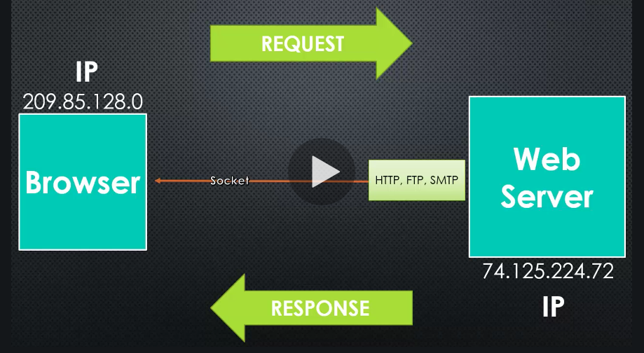
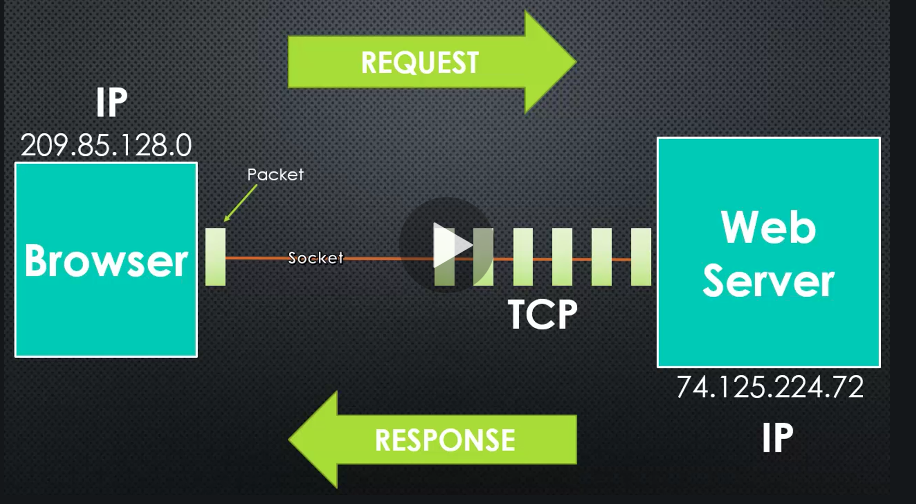
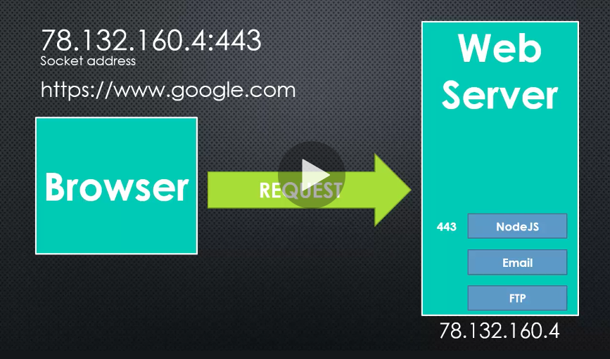
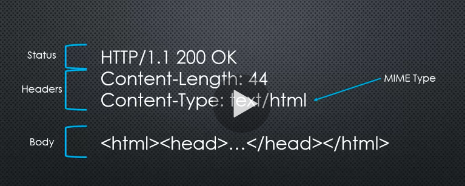

# 09 `HTTP`

## `TCP/IP`

`IP` : `I`nternet `P`rotocol -> permet d'identifier des machines sur le réseau

Un `socket` est une ligne à travers laquelle l'information circule.



La manière dont les informations sont envoyées est gérée par `TCP` : `T`ransmission `C`ontrol `P`rotocol.

`TCP` va découper l'information en paquets (`packet`) et les envoyés à travers le `socket`. 

`TCP` ressemble à un `stream`.



`web socket` c'est l'idée de garder un `socket` constamment ouvert, permettant ainsi au client et au serveur d'envoyer des `packet` quand ils le désirent.

`port` un nombre unique identifiant un programme. 

`socket address` : c'est la combinaison de l'`ip` et du `port` -> `78.123.100.55:443`



## `HTTP`  : `H`yper `T`ext `T`ransfert `P`rotocol

Une fois que les `packet` acheminé par `tcp` sont reconstruits ensembles, l'information, elle, est organisée via le protocole `http`.

### Anatomie d'une requête

```
POST /cgi-bin/process.cgi HTTP/1.1
User-Agent: Mozilla/4.0 (compatible; MSIE5.01; Windows NT)
Host: www.tutorialspoint.com
Content-Type: application/x-www-form-urlencoded
Content-Length: length
Accept-Language: en-us
Accept-Encoding: gzip, deflate
Connection: Keep-Alive

licenseID=string&content=string&/paramsXML=string
```

- ligne de commande
- les `headers`
- une ligne blanche
- le contenu

### Anatomie d'une réponse



- La ligne de status
- les `headers`
- une ligne blanche
- le corps, le contenu

### Type `MIME`

`MIME` : `M`ultipurpose `I`nternet `M`ail `E`xtensions.

C'est un standard qui spécifie le type de données qui est envoyé.

`application/json`, `text/html`, `image/jpeg`.

Initialement conçu pour définir quel type de pièce jointe (attachment) été envoyé avec les emails.

Permet avec `http` d'indiquer au serveur quel type de données il va recevoir, et celui-ci peut alors les interpréter correctement.

### faire unbe requête `http.get`

Pour effectuer une simple requête `GET`, il existe une méthode `.get(url, callback)`.

```js
const http = require("http");

// l'url est passée en premier argument du script
// argv[0] => '/usr/local/bin/node',
// argv[1] => '/Users/kar/Documents/programmation/node/learnyounode/httpProgram1.js'

const url = process.argv[2] || "http://www.google.be";

http
  .get(url, response => {
    response.setEncoding("utf8");
    response.on("data", console.log);
    response.on("error", console.error);
  })
  .on("error", console.error);
```

`response.setEncoding` permet de transformer les `Buffer` reçu par des chaînes de caractères.

