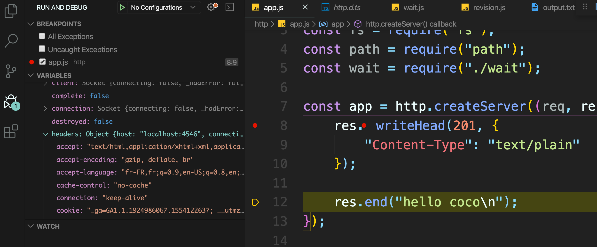

# 10 Construire un serveur web

## Un simple serveur web

Une fonction qui évite les références circulaires dans `JSON.stringify` :

`circular.js`

```js
module.exports = function circular() {
    const set = new WeakSet(); // set de référence
  
		// fonction de remplacement de JSON.stringify
  	// elle prend en argument un couple clé/valeur
    return function(key, value) { 
      
      	// faire attention aux référence null :
      	// typeof null -> 'object'
        if (typeof value === "object" && value !== null) {
          	// si la référence est déjà dans le set, renvoyer [[circular]]
          	// pour prévenir toutes références circulaires
            if (set.has(value)) {
                return "[[circular]]";
            } else {
                set.add(value);
            }
        }
				
      	// pour toutes les autres valeurs on les retourne simplement
        return value;
    };
};
```

`app.js`

```js
const http = require("http");
const circular = require("./circular");

const app = http.createServer((req, res) => {
    res.writeHead(203, {
      
// utilisation des guillemets car "-" n'est pas utilisable dans un nom js valide
        "Content-Type": "application/json",
      
      // ici pas besoin de guillemets
        encoding: "utf8"
    });
    res.end(JSON.stringify(req, circular()));
});

const PORT = process.env.NODE_PORT || 6666;

app.listen(PORT, console.log(`server is running on [${PORT}]`));
```

`writeHead` écrit le status et les `headers` de la réponse `http`.

Si on remonte dans les signatures `TS` on découvre que :

```js
class IncomingMessage extends stream.Readable
```

`res` est une instance de la classe `IncomingMessage`.

## Utilisation du debugger de VSCode



On peut comme ça facilement lire l'objet `request` ou `response`.

## Charger un `favicon`

```js
const http = require("http");
const fs = require("fs");

const app = http.createServer((req, res) => {
    if (req.url === "/") {/* ... */}

    if (req.url === "/favicon.ico") {

        const readIcoStream = fs.createReadStream("./favicon.ico");

        readIcoStream.on("open", () => {
            res.writeHead(200, {
                "Content-Type": "image/vnd.microsoft.icon"
            });
        });

        readIcoStream.on("data", chunk => {
            res.write(chunk);
        });

        readIcoStream.on("end", () => {
            res.end();
        });
    }
});

const PORT = process.env.NODE_PORT || 6666;
app.listen(PORT, console.log(`server is running on [${PORT}]`));
```

### `readIconStream.on`

Sur `"open"`  j'écris les `headers`, `mime type` : `image/vnd.microsoft.icon`.

Sur `"data"` j'envoie les morceaux lus par le `stream`.

Sur `"end"` je termine la `response`.

De cette manière, il n'y a pas besoin de mettre une balise `link` dans le html.