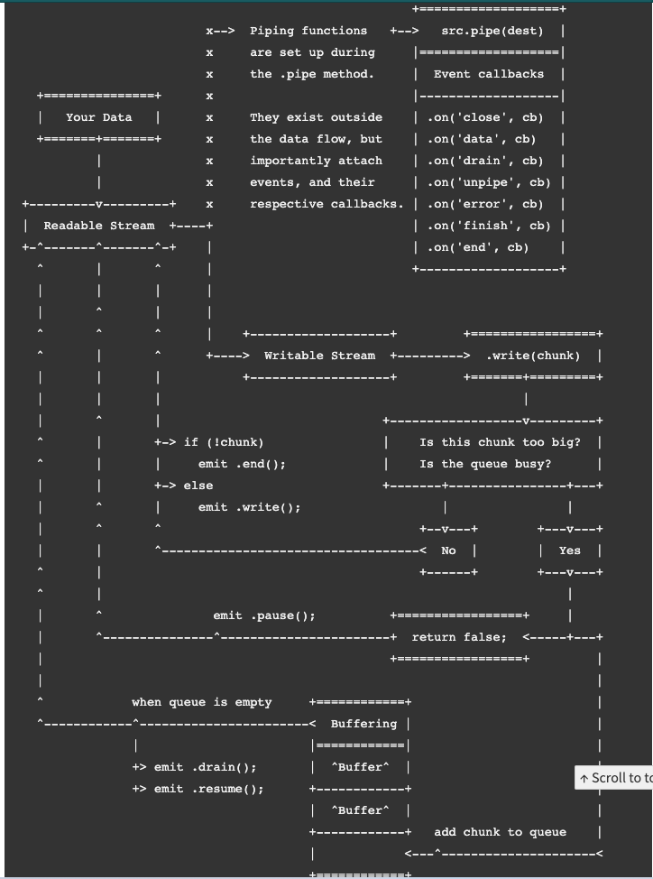

# 12 `stream` et performance

Un phénomène de `backpressure` (contre-pression) est important car si le `stream` en lecture est plus rapide que le `stream` en écriture, la mémoire risque d'être saturée.

Un mécanisme de `backpressure` est mis en place par `Node.js` dans `pipe`, si le `buffer` exéde le `highWaterMark` ou que la queue en écriture est occupé, `write()` retourne `false`.

Cela met en pause `readable`, quand le `buffer` est vide il envoie un événement `drain`.

La valeur par défaut de `highWaterMark` est de 16kb (16384 bits).



## Règles pour implémenter des `customs streams`

- ne jamais `.push()` si on ne le demande pas.
- ne jamais appeler `.write()` après qu'il ait retourné `false` (attendre `"drain"`).

- Faire attention à la version de `Node.js`.

### Mauvais exemple

```js
// Cela ne tient pas compte des mécanismes de backpressure 
// que Node.js a mis en place,
// et pousse inconditionnellement les données, indépendamment du fait que
// le stream de destination est prêt ou non.

readable.on('data', (data) =>
  writable.write(data)
);
```

### Régles spécifiques aux `writable stream`

`.write()` retourne `true` ou `false` suivant les conditions.

- Si `write queue` est occupé `.write()` retourne `false`.
- Si le `chunk` est trop gros, `.write()` retourne `false`, la limite est indiquée par `highWaterMark`.

## exemple d'utilisation de `"drain"`

Si un appelle à `stream.write()` retourne `false`, l'événement `"drain"` est lancé lorsque il redevient approprié de reprendre (`resume`) la lecture du `stream`.

Cela intervient quand le `stream readable` est plus gros (plus grand `buffer`) que le `stream writable`.

```js
const fs = require("fs");

const readable = fs.createReadStream("./story2.txt", {
    encoding: "utf8",
    highWaterMark: 3
});

const writable = fs.createWriteStream("./output.txt", {
    encoding: "utf8",
    highWaterMark: 1
});

readable.on("data", data => {
    console.log(data);
    const writeOk = writable.write(data);
    readable.pause();
    console.log(writeOk);
});
writable.on("drain", () => {
    console.log("drain of excedent data");
});
```

```bash
qui
false
drain of excedent data
```

En jouant avec le `highWaterMark` on crée un engorgement artificiel, grâce à `"drain"`, on peut créer un mécanisme de contre-pression `backpressure`.

## Servir un fichier `html`

```js
const http = require("http");
const fs = require("fs");

const server = http.createServer((req, res) => {
  	res.writeHead(200, { "Content-type": "text/html" });
  
    const html = fs.readFileSync("./index.html", "utf8");

    res.end(html);
});

server.listen(4546, console.log("server run at 4546"));
```

Dans ce cas l'appelle à `index.html` se fait de manière synchrone, il est possible de saturé la mémoire si ce fichier est très gros, il sera mis en une fois dans la mémoire.

L'utilisation des `streams` permet de répondre efficacement à ce problème en découpant le contenu en petit morceaux `chunk` (`16kb` par défaut).

```js
const server = http.createServer((req, res) => {
    res.writeHead(200, { "Content-type": "text/html" });

    fs.createReadStream("./index.html", "utf8").pipe(res);
});
```

