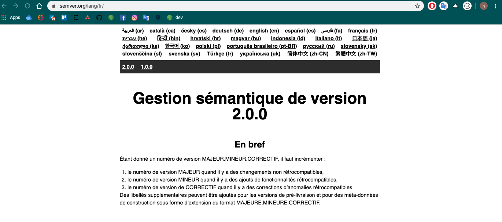

# 16 `NPM` `N`ode `P`ackage `M`anager

Automatise l'installation et la mise à jour de `packages` (de code).

`manager` = gestionnaire, gérant, celui qui gère.

`package` = code.

`npm` gère aussi les dépendances (code qui utilise un autre `package` de code).

## `semantic Versioning` (versions sémantiques)

Permet grâce à la signification des différents nombres d'avoir des informations sur la version.

`major.minor.patch` => `1.7.2`

`patch` on incrémente cette valeur si des bugs sont résolu. `bug fix`

`minor` ajout de fonctionnalités, pas de changement majeur.

`major` C'est un grand changement, le fonctionnement n'est plus le même (`breaking change`).

## semver.org

https://semver.org/lang/fr/



## `NPM` `N`ode `P`ackage `M`anager

C'est deux choses :

- `NPM` **registry** l'endroit où se trouve les packages (le code des autres développeurs).
- `NPM` **le logiciel** installé en même temps que `Node.js`

## `moment.js`

```bash
npm init
```

Va produire `package.json` automatiquement en posant quelques questions :

```json
{
  "name": "moment-test",
  "version": "1.0.0",
  "description": "moment test app",
  "main": "moment.js",
  "scripts": {
    "test": "echo \"Error: no test specified\" && exit 1"
  },
  "author": "hukar",
  "license": "ISC"
}
```

#### `--save` n'est plus nécéssaire, c'est le comportement par défaut.

```bash
npm install moment # --save est sous-entendu
```

```js
  "license": "ISC",
  "dependencies": {
    "moment": "^2.24.0",
    "uuid": "~7.0.1"
  }
}
```

Le `^` signifie que `npm` peut mettre à jour automatiquement pour les versions mineur et les patchs.

Le `~` signifie que `npm` peut seulement mettre à jour les patchs.

### `npm install`

Avec `npm` on peut se passer de sauvegarder son dossier `node_modules` (sur `github` par exemple), car on peut le recomposer avec la commande `npm install`.

### Utilisation de `moment.js`


On voit les résultats grâce à `quokka.js`.

### Dépendance de `dev` uniquement

```bash
npm install --save-dev nodemon
```

```json
    "license": "ISC",
    "dependencies": {
        "moment": "^2.24.0",
        "uuid": "^7.0.1"
    },
    "devDependencies": {
        "nodemon": "^2.0.2"
    }
}
```

#### Mettre à jour ses dépendances `npm update`.

