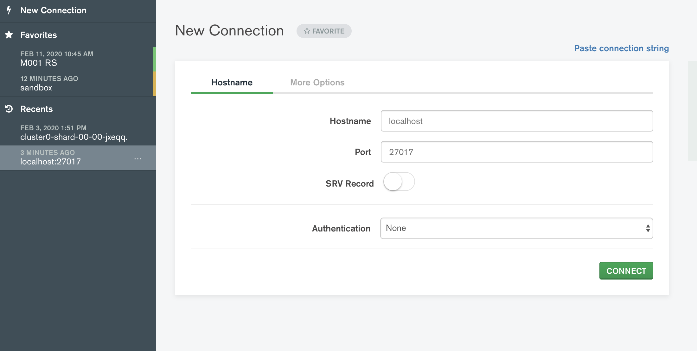
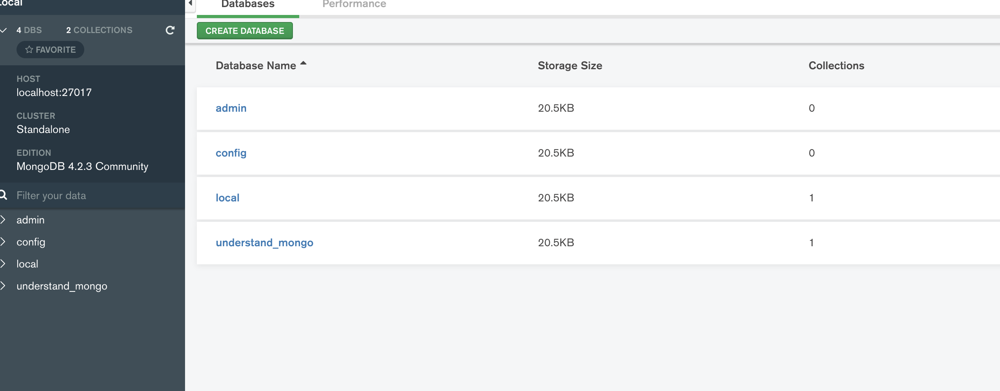

# 17 Database

## Utilisation du package `mysql`

```bash
npm i mysql
```

### Requête `sql`

```js
const mysql = require("mysql");

const con = mysql.createConnection({
    host: "127.0.0.1",
    user: "root",
    password: "root",
    database: "understand_node",
    port: "8889" # ne pas oublier le port
});

con.query(
    `select person.name, address.address 
        from person 
        join personAdress on person.id=personAdress.person 
        join address on address.num=personAdress.address`,
    (err, rows) => {
        if (err) {
            return console.log("error twit !", err);
        }

        console.log(rows);
    }
);
```

```bash
[
  RowDataPacket { name: 'john', address: 'vallée de la mort' },
  RowDataPacket { name: 'Jil', address: 'avenue des sapins' }
]
```

`mysql.createConnection(options)`

`connection.query(query: string, callback(err, datas))`

## NoSQL

Document Database => `MongoDB`.

Une base de données `NoSQL` prendra sensiblement plus de place, mais gagnera beaucoup en souplesse.

En associant les données et leur structure en un seul document, il est plus simple d'intégrer les changements.

### MongoDB

Installation avec `brew` :

```bash
brew update

brew tap mongodb/brew

brew install mongodb-community@4.2
```

Lancer `MongoDB` comme un service `brew` :

```bash
brew services start mongodb-community@4.2
```

```bash
$ mongo --version
MongoDB shell version v4.2.3
```

### Connection `MongoDB` `Compass`



Ici c'est une connection toute simple sans authentification.



De base il y a `admin`, `config` et `local`.

Pour créer une database, une collection ou ajouter un data, l'interface est très simple.

