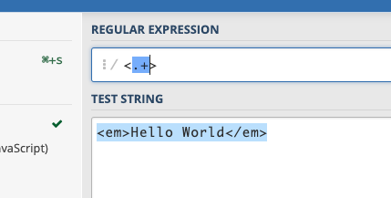
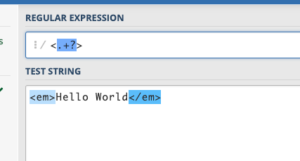

# 04 Template

## Mon moteur de template

### Aparté `regex` greedy and lazy

Gourmand et paresseux

### Greedy



###`/<.+>/i` 

`<` : le caractère `<` chevron ouvrant

`.` : n'importe quel caractère

`+` : une ou plusieurs fois

`>` : le caractère `>` chevron fermant

### lazy `?`

Pour rendre la regex paresseuse on utilise le symbole `?` :



## Mon code

```js
app.get(/.+\.html$/, (req, res) => {
    fs.readFile(__dirname + req.url, { encoding: "utf8" }, (err, file) => {
        if (err) {
            return console.log("erreur !!");
        }
        for (key of Object.getOwnPropertyNames(state)) {
            if (typeof state[key] !== "function") {
                file = file.replace(`{${key}}`, state[key]);
            }
        }

        res.send(file);
    });
});
```

`/.+\.html$/` utilisation d'une `regex` pour *matcher* une `url`.

`fs.readFile` va lire en une fois mon fichier `.html`, nécéssaire car avec des morceaux (`stream`), je pourrais rater mon placeholder `{varName}` s'il était coupé en deux entre deux `chunks`.

La `callback` suit le pattern **error first**.

`Object.getOwnPropertyNames` renvoie un tableau avec les propriété de l'objet seulement et pas de ses prototypes.

`for of` itére sur un itérable.

`typeof state[key] !== "function"` ne renvoie pas les noms de fonction.

`file.replace` ancien motif, nouveau motif.

## Template engine `ejs`

### Installer le paquet

```js
npm install ejs
```

### Définir le dossier de templates et le moteur

Par défaut c'est `views` le dossier des templates.

```js
// app.set("views", "./views");

app.set("view engine", "ejs"); // ici on définit l'extension des fichiers de template
```

### rendre le template `.render`

```js
app.get("/", (req, res) => {
    res.render("index", {
        title: "Hello ejs",
        content:
            "Once upon the time a little duck named Ducky Lucky _(<)/°< coin coin"
    });
});
```

### Le template en lui-même

`views/index.ejs`

```ejs
<!DOCTYPE html>
<html lang="en">
    <head>
        <meta charset="UTF-8" />
        <meta name="viewport" content="width=device-width, initial-scale=1.0" />
        <title>Document</title>
        <link rel="stylesheet" href="assets/style.css" />
    </head>
    <body>
        <h1><%= title %></h1>
        <% if (content) { %>
        <p><%= content %></p>

        <% } else { %>
        <p>No thing ... _<(<)/°-</p>
        <% } %>
    </body>
</html>

```

`<%= var %>` affiche une valeur.

`<% if (condition) { %>` permet d'écrire du javascript.

### Avec des paramètres `d'url`

```js
app.get("/person/:id/:name", (req, res) => {
    const { id, name } = req.params;
    const person = {
        id: id,
        name: name
    };

    res.render("person", { person: person });
});
```

