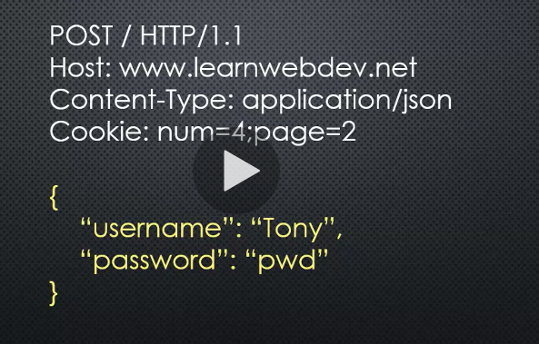

# 05 `Querystring` et `post parameter`

## `Querystring`

C'est la requête en `GET` incluse dans l'`url` avec `?`, `=` et `&`.


## `POST` parameter

On déplace les données de la requête dans le `body`.


#### `Content-Type: application/x-www-form-urlencoded`

On peut aussi renvoyer des objets javascript (`JSON`).



## Récupérer la `Querystring`

`url` :

```
http://localhost:4546/query?name=john&age=67
```

`middleware express` :

```js
app.get("/query", (req, res) => {
    res.send(req.query);
});
```

#### `req.query`

résultat :

```js
{
  "name": "john",
  "age": "67"
}
```

La `querystring` se retrouve parser dans l'objet `req.query`.

## Récupérer les paramètres d'une requête `POST`

Utilisation d'un `middleware` : `body-parser`

```bash
npm install body-parser
```

Incorpore dans notre `app.js`

```js
const bodyParser = require("body-parser");
```

On instancie un `middleware`  pour le type `application/x-www-form-urlencoded`:

```js
const urlencodedParsern = bodyParser.urlencoded({ extended: false });
```

utilisation pour toutes les routes :

```js
app.use(bodyParser.urlendcoded({ extended: false }));
```

Utilisation avec une route spécifique :

```js
app.post("/action", urlencodedParser, (req, res) => {
    res.setHeader("Content-Type", "application/json");

    res.send(req.body);
});
```


```json
{
  "name": "Tym",
  "age": "76"
}
```

Sans `urlencodedParser` :

```
req.body vaut undefined
```

### Avec `JSON`

Définir le `parser` pour toutes les routes

```js
app.use(bodyParser.json);
```

Ou pour une route spécifique comme en haut

```js
const jsonParser = bodyParser.json();
```

Dans la route :

```js
app.post("/json", jsonParser, (req, res) => {
    console.log(`name: ${req.body.name}`);
    res.send("ok");
});
```

On récupère :

```json
name: titi
```

## Utiliser `express`

On retrouve ces parser dans le cœur d'`express` depuis la version `4.16.0`.

```js
app.use(express.json());
app.use(express.urlencoded({ extended: false }));
```

