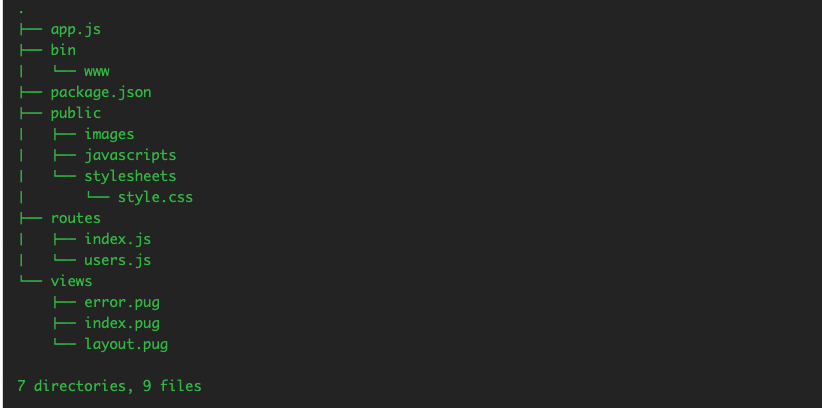

# 07 Structurer son application

## Utilisation du générateur `express`

```bash
npm i -g express-generator
```



```bash
express my-app # generate the app
```

## Nouveauté : utilisation du `router`

Dans `app.js`

```js
var indexRouter = require("./routes/index");
var usersRouter = require("./routes/users");
```

Puis on les utilisent en middleware :

```js
app.use("/", indexRouter);
app.use("/users", usersRouter);
```

Dans le répertoire `routes`

`index.js`

```js
var express = require('express');
var router = express.Router();

/* GET home page. */
router.get('/', function(req, res, next) {
  res.render('index', { title: 'Express' });
});

module.exports = router;
```

Les routes ne sont plus attachées sur `app` mais sur `router`.

## Organiser avec les contrôleurs

On crée un dossier `controllers` à l'intérieur duquel on peut séparer les logiques métiers :

- `apiController.js`
- `htmlController.js`

### `apiController.js`

```js
module.exports = function(app, jsonParser) {
    app.get("/api/person/:id", (req, res) => {
        // get that data from database
    });

    app.post("/api/person", jsonParser, (req, res) => {
        // save person in the database
    });

    app.delete("api/person/:id", (req, res) => {
        // delete person from database
    });
};
```

On exporte une fonction qui reçoit `app` en paramètre ainsi que le `parser` (`urlencodedParser` ou `jsonParser`).

Dans `app.js` :

```js
// les requires ...

const apiController = require("./controllers/apiController");
const htmlController = require("./controllers/htmlController");

// Du code ...

const urlencodedParser = bodyParser.urlencoded({ extended: false });
const jsonParser = bodyParser.json();

// les middlewares ...

apiController(app, jsonParser);
htmlController(app, urlencodedParser);

app.listen(PORT);
```

Il suffit d'importer les fonctions `apiController` et `htmlController` et de leurs passer la référence à `app` et aux `parser`.