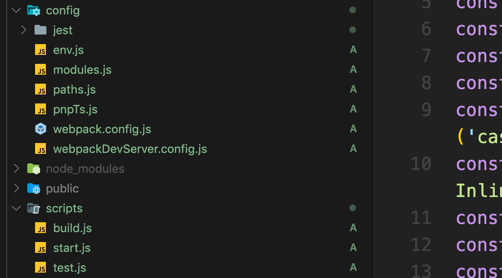
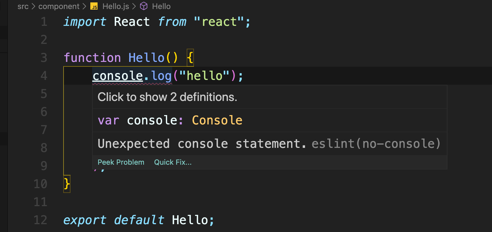

# 01 React Fundamentals

## Créer une application `React`

Le meilleur moyen (recommandé sur le site de React), est d'utiliser `create-react-app` avec `npx`

```bash
npx create-react-app my-app
```

###  `package.json`

```json
{
  "name": "first-app",
  "version": "0.1.0",
  "private": true,
  "dependencies": {
    "@testing-library/jest-dom": "^4.2.4",
    "@testing-library/react": "^9.4.0",
    "@testing-library/user-event": "^7.2.1",
    "react": "^16.12.0",
    "react-dom": "^16.12.0",
    "react-scripts": "3.3.0"
  },
```

On peut voire dans les `dependencies` `react` et `react-dom`, qui sont le coeur de **React**.

`react-script` lui permet la magie de **React** en masquant la mécanique.

```json
"browserslist": {
    "production": [
      ">0.2%",
      "not dead",
      "not op_mini all"
    ],
    "development": [
      "last 1 chrome version",
      "last 1 firefox version",
      "last 1 safari version"
    ]
  }
```

On peut voire à quoi correspond le `>0.2%` sur le site [https://browserl.ist/?q=%3E0.2%25](https://browserl.ist/?q=>0.2%)


## `eject`

*Ouvre* react-script pour le développeur de manière irreversible

Pour voire toute la configuration de `babel` et `webpack`, on peut éxécuter :

```bash
npm run eject
```

Cela crée deux dossiers en plus `config` et `scripts`.



## Ajouter `Sass`

Il faut l'installer manuellement via `npm`

```bash
npm install sass
```

```json
"dependencies": {
  "@testing-library/jest-dom": "^4.2.4",
  "@testing-library/react": "^9.4.0",
  "@testing-library/user-event": "^7.2.1",
  "react": "^16.12.0",
  "react-dom": "^16.12.0",
  "react-scripts": "3.3.0",
  "sass": "^1.23.7"
}
```

Il faut renomer l'extension `.css` en `.scss`

renomer l'import aussi :

```jsx
import "./App.scss";
```

On test :

```scss
$bgcolor: red;

.App-header {
    background-color: $bgcolor;
```

## Ajouter des règles `linter`

Bien sûr il doit être activer en tant que pluggin dans `VSCode`

Par défaut `eslint` est installé et pré-réglé par `create-react-app`

On peut créer dans le dossier `src` un fichier de configuration du `linter`:

`.eslintrc.json`

```json
{
    "rules": {
        "no-console": "error"
    }
}
```

On peut aussi utiliser une valeur numérique:

```json
{
    "rules": {
        "no-console": 2,
        "no-var": 1
    }
}
```

`0 = "off"`

`1 = "warning"`

`2 = "error"`

Ce fichier doit être placé dans le dossier `src`.

Il sera valable pour les fichiers et dossiers contenus dans `src`.



On voit ici le message d'erreur.

#### ! On doit se trouver à la racine du projet react pour que `eslint` fonctionne

Sinon on a un message d'erreur de type :

```bash
[Info  - 2:10:17 PM] Failed to load plugin 'import' declared in 'section-2/package.json » eslint-config-react-app': Cannot find module 'eslint-plugin-import' Require stack: - /Users/kms/Documents/programmation/react-hook/__placeholder__.js
```

`eslint` doit pouvoir trouver le fichier `package.json` à la racine.

On peut désactiver la règle pour une ligne :


On peut aussi désactiver une règle pour le document résumé :

```js
/* eslint-disable no-console */        // pour tout le document

    // eslint-disable-next-line no-console         // pour une ligne seulement
    console.log("hello");
    console.log("hello");
```

## `JSX`

`class` => `className`

`for` => `htmlFor`

`onclick` => `onClick`

##### Partout dans `React` c'est `camelCase`

### Une propriété qui n'est pas un string : interpolation = accolades

`attribut={ 4 + 6 }`

#### Transformation de `JSX` en objet react = `virtual dom`

```jsx
<div className={this.state.customClass}>
    <p>{this.props.someText}</p>

    <button onclick={this.doSomething}>click me !!</button>
</div>
```

Va donner en `React` (javascript) :

```js
React.createElement(
    "div",
    {
        className: this.state.customClass
    },
    React.createElement("p", null, this.props.someText),
    React.createElement(
        "button",
        {
            onClick: this.doSomething
        },
        "click me !!"
    )
);
```

## Style

en `jsx`:

```jsx
<h3 style={{ fontSize: "26px", color: "green" }}>Jul</h3>
```

Ou en passant une variable :

```jsx
const styleName = { fontSize: "33px", color: "green" };

// ...

{["jul", "jym", "jane"].map(name => (
  <h3 style={styleName} key={name}>
    {name}
  </h3>
))}
```

#### Overrider un style

```jsx
const styleName = {
    fontSize: "33px",
    color: "pink",
    border: "1px solid pink",
    padding: "12px",
    width: "80%"
};

const styleTitle = {
    color: "gray",
    borderStyle: "dashed",
    boredrColor: "yellow"
};

// ...

<h1 style={{ ...styleName, ...styleTitle }}>List of Name</h1>
```

Le `spread operator` est parfait pour cela.

Un attribut avec une nouvelle valeur trouver plus bas dans un objet litéral écrase la première valeur :

 ```js
const o = {
    a: 1,
    b: 2,
    c: 3,
    a: 4,
    b: 5,
    a: 6
};

o; //? { a: 6, b: 5, c: 3 }
 ```

Le mieux est d'utiliser les `css` ou `scss` classique pour une plus grande simplicité du fichier.

## Créer un composant

Squelette général :

```jsx
import React from "react";

function MyComponent(props) {
  return (<div> ... </div>);
}

export default MyComponent;
```

Exemple :

```jsx
import React from "react";

// on utilise l'assignation par décomposition
function Name({ style, name }) {
    return <h3 style={style}>{name}</h3>;
}

export default Name;
```

Dans le composant parent :

```jsx
import Name from "./Name";

// ...

{["jul", "jym", "jane"].map(name => (
  <Name style={styleName} name={name} key={name} />
))}
```

Le tag `Name` commence obligatoirement par une majuscule,` <name/>`  va lancer une erreur.

Le fichier lui, peut être en majuscule `Name.js` ou en minuscule `name.js`

À ce moment bien changer l'import :

```js
import Name from "./name" // en minuscule
```

En résumé seul le nom donné au futur tag doit **obligatoirement** être en **majuscule** pour ne pas le confondre avec des tags natifs de `HTML`

Syntaxe alternative :

```jsx
export default function({ style, name }) {
    return <h3 style={style}>{name}</h3>;
}

// ou avec les arrow function
export default ({ style, name }) => {
    return <h3 style={style}>{name}</h3>;
}
```
