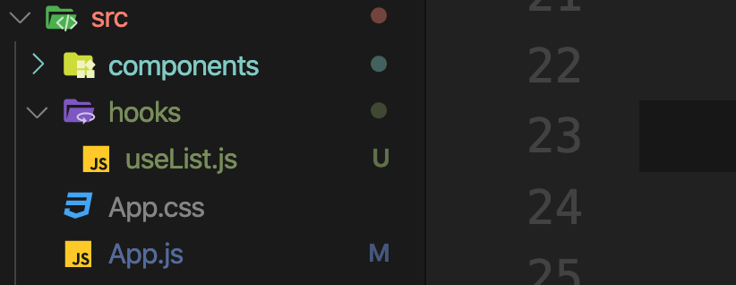

# 11 Les `customs hooks`

Cela peut être intérressant d'isoler de la logique des composants.

Pour ça nous allons réaliser un `custom hook` pour la gestion d'une liste.

## 1 Mise en place

Il faut créer un dossier `hooks` à l'intérieur duquel on crée un fichier `useList.js`.

Un `hook` commence toujours par `use`.



## 2 Contenu du `hook`

```jsx
import { useState } from "react";

function useList(init) {
    const [list, setList] = useState(init);

    return {
        list,
        removeItem(name) {
            setList(prevList => prevList.filter(item => item.name !== name));
        },
        saveItem(name, calories) {
            setList(prevList => [
                ...prevList,
                { name: name, calories: calories }
            ]);
        },
        modifyItem(oldName, newName) {
            setList(prevList =>
                prevList.map(item => {
                    if (item.name === oldName) item.name = newName;
                    return item;
                })
            );
        }
    };
}

export default useList;
```

## 3 Utilisation dans un autre composant

```jsx
// ...
import useList from "./hooks/useList";

const initList = [ /* ... */];

function App() {
  // On appelle notre hook custom
    const items = useList(initList);

    const removeItem = name => {
        items.removeItem(name);
    };

    const addItem = (name, calories) => {
        items.saveItem(name, calories);
    };

    const modifyName = (oldName, newName) => {
        items.modifyItem(oldName, newName);
        console.log(items.list);
    };

    return // plus bas ...
       
  	{ items.list.map( (item) => (<Item item={item}></Item>) ) }
```

