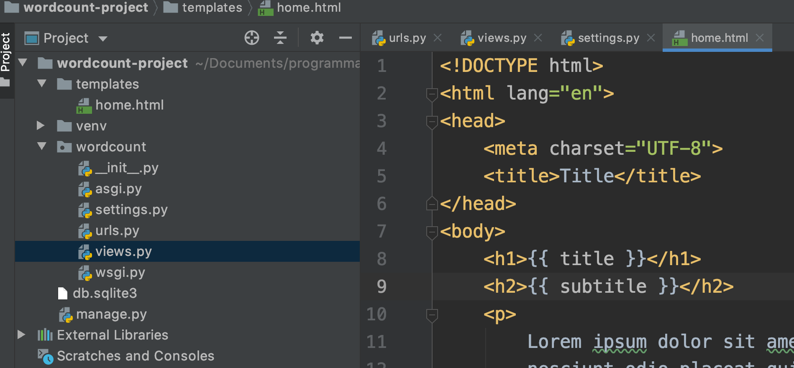

# 02 bis Les `templates` en plus simple

## 1. Définir le dossier `templates`

À la racine du projet créer un dossire `templates`



## 2. Renseigner ce dossiers dans `settings.py`

```python
TEMPLATES = [
    {
        'BACKEND': 'django.template.backends.django.DjangoTemplates',
        'DIRS': ['templates'],
        'APP_DIRS': True,
        'OPTIONS': {
            'context_processors': [
                'django.template.context_processors.debug',
                'django.template.context_processors.request',
                'django.contrib.auth.context_processors.auth',
                'django.contrib.messages.context_processors.messages',
            ],
        },
    },
]
```

## 3. Dans `views.py` utiliser `render`

```python
from django.http import HttpResponse
from django.shortcuts import render


def home(request):
    return render(request, 'home.html', 
                  {'title': 'Word Count', 'subtitle': 'amazing app'})
```

