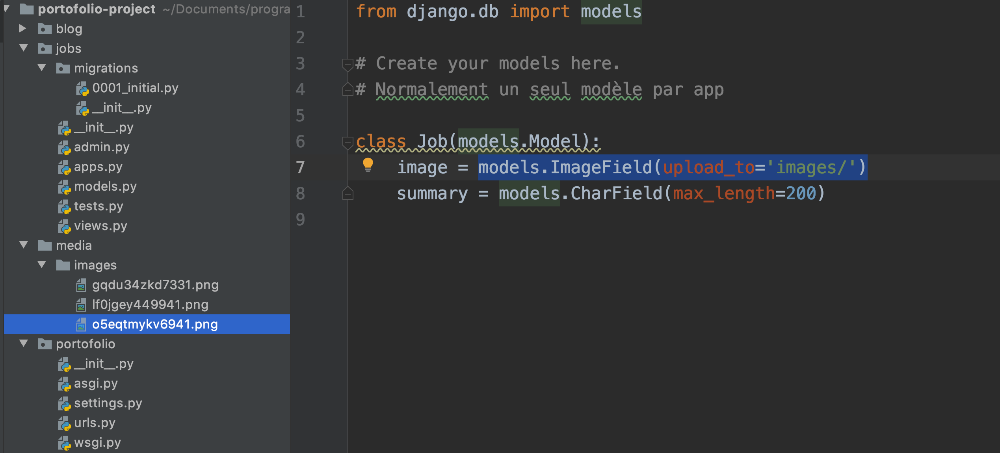
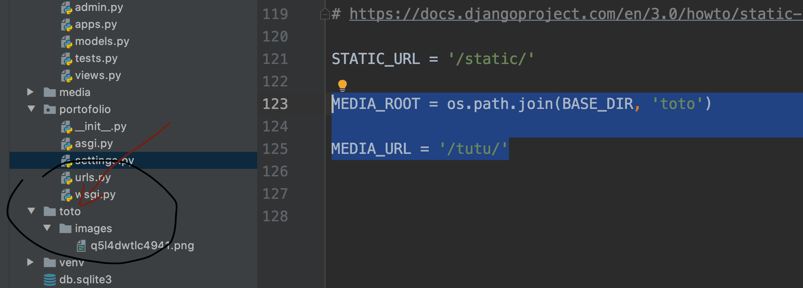

# 02 Le modèle

## 1. Référencer son `app` dans le projet

Cela se passe dans le fichier `settings.py`

```python
# Application definition

INSTALLED_APPS = [
    'jobs.apps.JobsConfig',
    'django.contrib.admin',
    'django.contrib.auth',
    'django.contrib.contenttypes',
    'django.contrib.sessions',
    'django.contrib.messages',
    'django.contrib.staticfiles',
]
```

## 2. Créer un modèle

Dans une app, on a un fichier `models.py`

Normalement on a un et un seule modèle par `app`

```python
from django.db import models


class Job(models.Model):
    image = models.ImageField(upload_to='images/')
    summary = models.CharField(max_length=200)
```

On hérite de `models.Model`

## 3. Créer une migration

On va utiliser une commande pour créer un fichier de migration :

```bash
./manage.py makemigrations
```

Attention au `s` à la fin de `makemigrations`

`0001_initial.py`

```python
# Generated by Django 3.0.2 on 2020-01-08 10:53

from django.db import migrations, models


class Migration(migrations.Migration):

    initial = True

    dependencies = [
    ]

    operations = [
        migrations.CreateModel(
            name='Job',
            fields=[
                ('id', models.AutoField(auto_created=True, primary_key=True, serialize=False, verbose_name='ID')),
                ('image', models.ImageField(upload_to='images/')),
                ('summary', models.CharField(max_length=200)),
            ],
        ),
    ]
```


## 4. Exécuter la commande `migrate` 

Pour appliquer la migration à la base de données on doit exécuter la commande :

```bash
./manage.py migrate
```

La Base De Donnée est ici réellement modifiée.


## Extra : Dossier Media

Dans `settings.py` à la fin du fichier, on a aussi définie une url pour les médias :

```python
MEDIA_ROOT = os.path.join(BASE_DIR, 'media')

MEDIA_URL = '/media/'
```

Cela va créer un dossier `media` dans notre projet dans lequel les dossiers référencés par `models.ImageField(upload_to='images/')` seront créés :



Il faut maintenant configurer l'`url` dans notre fichier de routing `urls.py`

```python
from django.contrib import admin
from django.urls import path, include
from django.conf.urls.static import static # import de static
from django.conf import settings # import de settings

urlpatterns = [
    path('admin/', admin.site.urls),
] + static(settings.MEDIA_URL, document_root=settings.MEDIA_ROOT)
```

#### `MEDIA_URL` va correspondre au nom dans l'`url`

#### `MEDIA_ROOT` sera le nom du dossier contenant les médias.

### Exemple

```python
MEDIA_ROOT = os.path.join(BASE_DIR, 'toto')

MEDIA_URL = '/tutu/'
```

Lorsqu'on va télécharger un fichier, on obtiendra un dossier `toto` :



L'`url` sera aussi changée :

