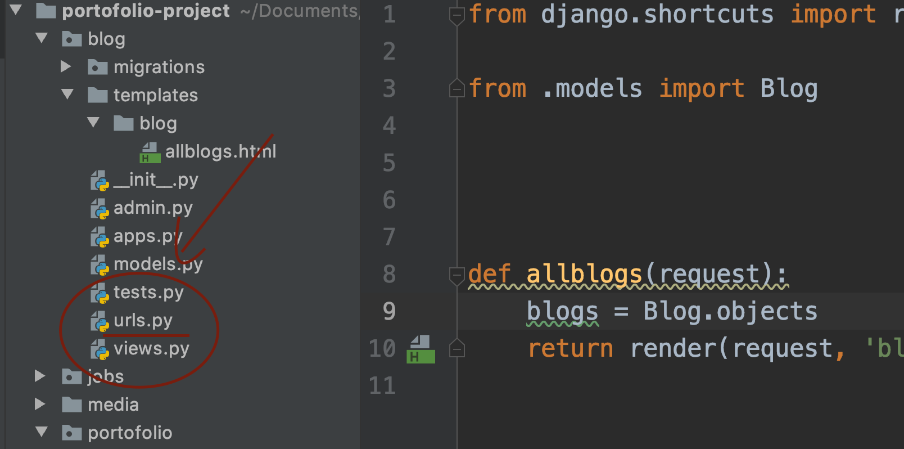

# 06 URL avancé : `include()`

On peut voulair séparer la gestion des `url` par module, on utilise alors la fonctiuon `include`

## 1. Créer un fichier `urls.py`

On doit créer un fichier `urls.py` à l'intérieur de son app :



## 2. On doit l'inclure dans `urls.py` général

```python
from django.contrib import admin
from django.urls import path, include # ici
from django.conf import settings
from django.conf.urls.static import static
import jobs.views

urlpatterns = [
    path('', jobs.views.home),
    path('blog/', include('blog.urls')), # et là
    path('admin/', admin.site.urls),
] + static(settings.MEDIA_URL, document_root=settings.MEDIA_ROOT)
```

On import `include` de `django.urls`

Dans le `path` on utilise `nom_app.urls`

## 3. On crée `nom_app/urls.py`

```python
from django.urls import path

from . import views

urlpatterns = [
    path('', views.allblogs, name="allblogs"),
]

```

