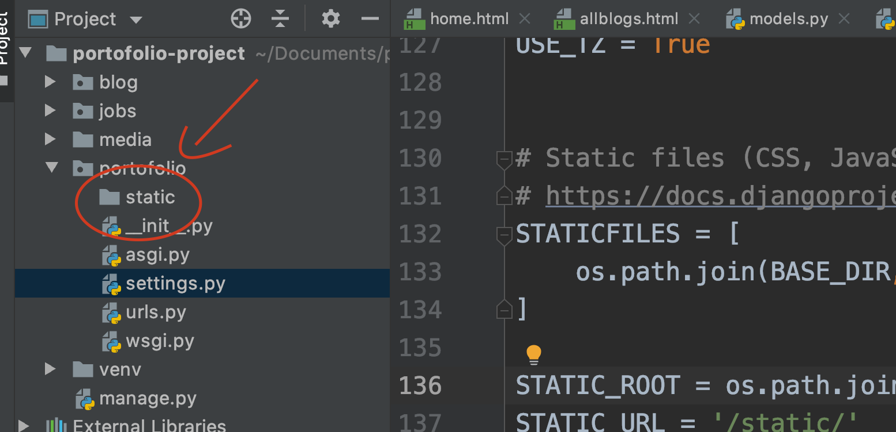

# Les fichiers statiques

## Créer un dossier de fichiers statiques

Le meilleur endroit est à la racine du projet :



## Définir les dossiers pour fichiers statiques

Cela se fait dans `settings.py`

```python
# Les fichiers considérés comme statique (à ajouter dans le dossier static)
STATICFILES_DIRS = [
    os.path.join(BASE_DIR, 'portofolio/static/')
]

# Ici le dossier des fichiers statiques et l'url
STATIC_ROOT = os.path.join(BASE_DIR, 'static ')
STATIC_URL = '/static/'
```


## Demander à django de collecter les fichiers statiques

```bash
./manage.py collectstatic
```

`django` va créer un répertoire `static` dans lequel il va collecter tous les fichiers statiques (ici ceux de `admin`)


On voit les fichiers qui été dans le dossier `/portofolio/static`

## Utilisation dans le template

Tout en haut dans le template :

```django
<!doctype html>
<html lang="en">
<head>
    
```

Puis quand on en a besoin :

```django
<a class="nav-item nav-link" 
   href="">
```

```django
<p></p>
```

