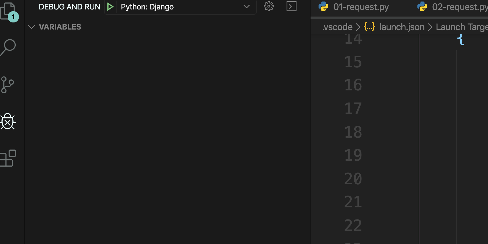

# 04 Django API première partie

## Installation

```bash
pip install django

pip install Pillow # pour les images
```

On fait un instantanné des dépendances et on installe `django` :

```bash
pip freeze > requirements.txt

django-admin startproject onelinestore
```

Ensuite on crée une migration et un utilisateur :

```bash
python manage.py migrate
python manage.py createsuperuser
```

## VSCode

On configure le debugger de `VSCode` pour django :

`launch.json`

```json
{
  "name": "Python: Django",
  "type": "python",
  "request": "launch",
  "program": "${workspaceFolder}/manage.py",
  "console": "integratedTerminal",
  "args": [
    "runserver",
    "--noreload",
    "--nothreading"
  ],
  "django": true
},
```

On modifie :

```json
{
  "name": "Python: Django",
  "type": "python",
  "request": "launch",
  "program": "${workspaceFolder}/first_API_django/onlinestore/manage.py", // ici
  "console": "integratedTerminal",
  "args": [
    "runserver"/* ,
    "--noreload",
    "--nothreading" */ // ici
  ],
  "django": true
},
```

`--nothreading` empêche le multithreading

`--noreload` empêche le rechargement automatique de la page

Puis il suffit ensuite d'appuyer sur la flèche :



## Création de `products`

```bash
python manage.py startapp products
```

### Dans `settings.py`

```python
INSTALLED_APPS = [
    'django.contrib.admin',
    'django.contrib.auth',
    'django.contrib.contenttypes',
    'django.contrib.sessions',
    'django.contrib.messages',
    'django.contrib.staticfiles',
    'products',
]
```

On renseigne notre `app` dans `settings.py`

### On crée un modèle `models.py`

```python
from django.db import models

class Manufacturer(models.Model):
    name = models.CharField(max_length=120)
    location = models.CharField(max_length=120)
    active = models.BooleanField(default=True)

    def __str__(self):
        return self.name


class Product(models.Model):
    manufacturer = models.ForeignKey(Manufacturer,
                                    on_delete=models.CASCADE,
                                    related_name="products")
    name = models.CharField(max_length=120)
    description = models.TextField(blank=True, null=True)
    photo = models.ImageField(blank=True, null=True)
    price = models.FloatField()
    shipping_cost = models.FloatField()
    quantity = models.PositiveSmallIntegerField()

    def __str__(self):
        return self.name
```

### On migre :

```bash
python manage.py makemigrations # avec un 's' à la fin
python manage.py migrate
```

## Le contrôleur `views.py`

### Utilisation des `views class`

```python
from django.views.generic.detail import DetailView
from django.views.generic.list import ListView

from .models import Product, Manufacturer


class ProductDetailView(DetailView):
    model = Product
    template_name = "products/product_detail.html"


class ProductListView(ListView):
    model = Product
    template_name = "products/product_list.html"
```

## Définition des routes

`products/urls.py`

```python
from django.urls import path
from .views import ProductDetailView, ProductListView

urlpatterns = [
    path("", ProductListView.as_view(), name="product-list"),
    path("products/<int:pk>", ProductDetailView.as_view(),
         name="product-detail")
]
```

On utilise `as_view()` avec les contrôleurs `class`

Dans `onlinestore/urls.py` le fichierc de base :

```python
urlpatterns = [
    path('admin/', admin.site.urls),
    path("", include("products.urls")),
] + static(settings.MEDIA_URL, document_root=settings.MEDIA_ROOT)
```

### Il faut définir `MEDIA_URL` et `MEDIA_ROOT`

Dans `settings.py` :

```python
MEDIA_ROOT = "uploads"
MEDIA_URL = "/media/"
```

Puis il faut créer les deux templates.

#### Rappel `"`

Il faut ajouter `.url` pour obtenir le `path` d'une image.