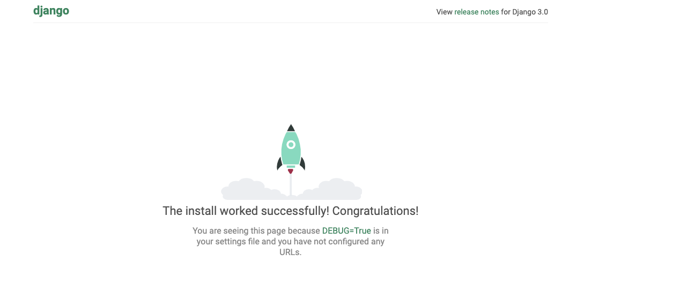

# 01 `Django` Introduction

```bash
which python
which python3
```

## Installer `Django`

Avant d'installer `Django`, on va créer un environnement virtuel pour encapsuler toutes les dépendances.

### Création du `Virtual Environment`

```bash
python3 -m venv nom_env # ici aussi appelé venv
```

`-m` : make

Équivalent à :

```bash
pip install virtualenv
virtualvenv venv
```

Utiliser plutôt `-m venv` qui fait directement parti de `python 3` alors que `virtualenv` est un package extérieur et nécéssite un `pip install`

### Activer l'environnement virtuel

```bash
kms: django-react $ source venv/bin/activate
(venv) kms: django-react $ 
```

On voit `(venv)` apparaître dans le terminal.

Si du coup je demande la version de `python` :

```bash
(venv) kms: django-react $ python --version
Python 3.8.1
# Normalement 2.7 sur Mac
```

#### Désactiver l'environnement virtuel

```bash
(venv) kms: django-react $ deactivate
kms: django-react $
```


### Installer `Django` dans l'environnement virtuel

Pour voire toutes les options de `django-admin` :

```bash
(myvenv) kar : django $ django-admin help

Type 'django-admin help <subcommand>' for help on a specific subcommand.

Available subcommands:

[django]
    check
    compilemessages
    createcachetable
    dbshell
    diffsettings
    dumpdata
    flush
    inspectdb
    loaddata
    makemessages
    makemigrations
    migrate
    runserver
    sendtestemail
    shell
    showmigrations
    sqlflush
    sqlmigrate
    sqlsequencereset
    squashmigrations
    startapp
    startproject
    test
    testserver

```

### `django-admin startproject`

```bash
(venv) kms: django-react $ django-admin startproject first .
```


Création d'un dossier `first` et d'un fichier `manage.py`

### Lancer `Django`

```bash
(venv) kms: django-react $ python manage.py runserver
```



## `manage.py`

```bash
(myvenv) kar : countwords-project $ ./manage.py help

Type 'manage.py help <subcommand>' for help on a specific subcommand.

Available subcommands:

[auth]
    changepassword
    createsuperuser

[contenttypes]
    remove_stale_contenttypes

[django]
    check
    compilemessages
    createcachetable
    dbshell
    diffsettings
    dumpdata
    flush
    inspectdb
    loaddata
    makemessages
    makemigrations
    migrate
    sendtestemail
    shell
    showmigrations
    sqlflush
    sqlmigrate
    sqlsequencereset
    squashmigrations
    startapp
    startproject
    test
    testserver

[sessions]
    clearsessions

[staticfiles]
    collectstatic
    findstatic
    runserver
```

Ce sont les options de `django-admin` plus quelques autres.