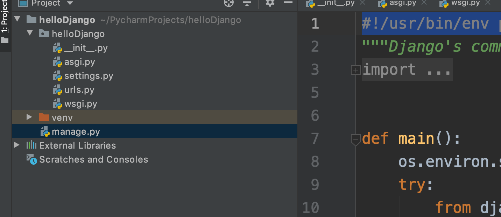
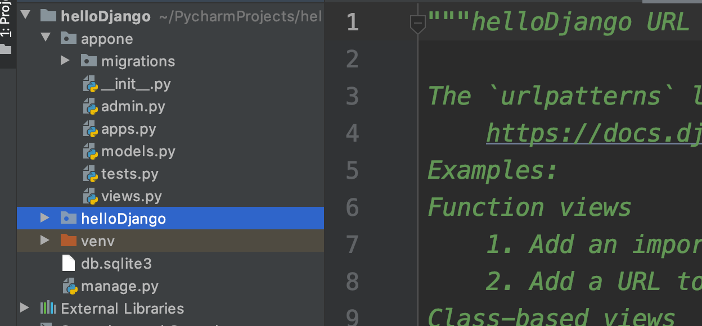

# url views

## installation

Dans PyCharm, on crée un `VirtualEnv`  et on tape dans le terminal:

```bash
pip install django

...
Successfully installed asgiref-3.2.3 django-3.0.1 pytz-2019.3 sqlparse-0.3.0
```

Maintenant pour créer un projet on va utiliser `django-admin` :

```bash
django-admin startproject nomProjet path
```

```bash
django-admin startproject helloDjango .
```

## Arborescence



Création du fichier `manage.py` qui est le point d'entrée de l'application python

Création du dossier au nom de l'application

## Lancer l'application

```bash
python manage.py runserver [127.0.0.1:8001]
```

Le choix du port est optionnel, par défaut c'est le port `8000`

## Les applications

`Django` organise les domaines d'un logiciel en application séparées et potentiellement réutilisable.

### Création d'une `app`

```bash
python manage.py startapp nomapp
```



### référencer l'`app` dans `setting.py`

```python
# Application definition

INSTALLED_APPS = [
    'django.contrib.admin',
    'django.contrib.auth',
    'django.contrib.contenttypes',
    'django.contrib.sessions',
    'django.contrib.messages',
    'django.contrib.staticfiles',

    'appone.apps.ApponeConfig', # ici
]
```

Pour l'instant je n'ai pas compris à quoi sert cette ligne, si je la retire tout marche pareil.

Si on retire cette ligne `Django` ne sait plus retrouver le template

Cette ligne permet à `Django` de connecter l'`app` au reste du programme

