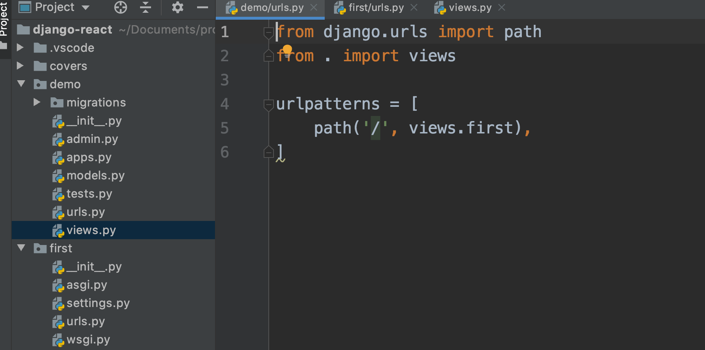

# 06 Urls



Pour lier les `url` de notre `app` à celle du projet on utilise `include`

`first/urls.py`

```python
from django.contrib import admin
from django.urls import path, include

urlpatterns = [
    path('adm/', admin.site.urls),
    path('demo/', include('demo.urls')),
]
```

En plus du fichier `urls.py` du projet, on va crée un fichier `urls.py` dans son `app` :

`demo/urls.Py`

```python
from django.urls import path
from . import views

urlpatterns = [
    path('', views.first),
]
```

`first` est une fonction définie dans `demo/views.py` :

```python
from django.http import HttpResponse


def first(request):
    return HttpResponse('hello first')
```

On utilise `HttpResponse` pour renvoyer une réponse vers le client.

## Le routage

Premièrement dans notre `views` de notre `app` on va définir une fonction (une action) :

`appone/views.py`

```python
from django.shortcuts import render
from django.http import HttpResponse

# Create your views here.

def hello(request):
    return HttpResponse("hello kiki")
```

Ensuite tout se passe dans `urls.py` :

```python
from appone import views as viewone
from apptwo import views as viewtwo

urlpatterns = [
    path('admin/', admin.site.urls),
    path('kiki/', viewone.hello),
    path('djangorock',viewtwo.djangorock)
]
```

#### Règles de routage

On peut ajouter des variables dans l'url, on va les récupérer dans la fonction de `views`

Dans la vue `views.py` on récupère la catégorie :

```python
def picture_detail(request, category):
    body = f"category={category}"
    return HttpResponse(body)
```

Dans les url `urls.py`, on va définir ce paramètre :

```python
urlpatterns = [
    # ...
    path('picture/<str:category>', viewtwo.picture_detail),
]
```

`<type:nom_parametre>`

On peut ajouter autant de paramètre que l'on souhaite. Le type doit correspondre ou une erreur est levée.

`views.py`

```python
def picture_detail(request, category, year=0, month=0):
    body = f"category={category}, year={year}, month={month}"
    return HttpResponse(body)
```

`urls.py`

```python
path('picture/<str:category>/<int:year>/<int:month>', viewtwo.picture_detail),
```

### Routage personnalisé

On crée un fichier `converters.py` dans son `app`.

```python
class TwoDigitDayConverter:
    regex = '[0-9]{2}'

    def to_python(self, value):
        return int(value)

    def to_url(self, value):
        return '%02d' % value
```

C'est une classe avec une `regex` et deux méthodes.

Ensuite dans le fichier `urls.py`

```python
# ...
from django.urls import path
from django.urls import register_converter # ici on importe le register

# ...
from apptwo import views as viewtwo
from apptwo import converters # on importe son converter

register_converter(converters.TwoDigitDayConverter, 'dd') # on nomme son type ici 'dd'

urlpatterns = [
    # ...
    path('picture/<str:category>/<int:year>/<int:month>/<dd:day>', viewtwo.picture_detail),
]
```

On voit que le type est `dd`

Dans `views.py`

```python
def picture_detail(request, category, year=0, month=0, day=0):
    body = f"category={category}, year={year}, month={month}, day={day}"
    return HttpResponse(body)
```

Maintenant si on introduit dans l'url `1`, `345`, `adf` on obtient une erreur.

Seul les urls de deux digit et composée de nombre entier sont acceptée `09`, `12` , `33`

### Fichier de routage à l'intérieur des app Django

On peut créer un fichier `urls.py` directement à l'intérieur d'une `app` :

```python
from django.urls import path
from django.urls import register_converter


from apptwo import views as viewtwo
from apptwo import converters

register_converter(converters.TwoDigitDayConverter, 'dd')

urlpatterns = [
    path('djangorock',viewtwo.djangorock),
    path('picture/<str:category>/<int:year>/<int:month>/<dd:day>', viewtwo.picture_detail),
]

```

Dans le `urls.py` du projet il nous reste :

```python
from django.contrib import admin
from django.urls import path, include

from appone import views as viewone

urlpatterns = [
    path('admin/', admin.site.urls),
    path('kiki/', viewone.hello),
    path('apptwo/', include('apptwo.urls'))
]
```

Avec `include` on va pouvoir associer les route de l'`app` `apptwo` avec les routes générales.